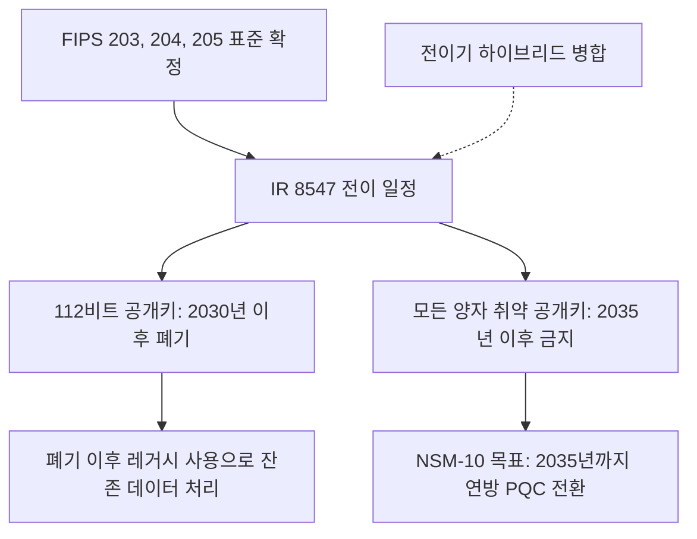

# @NIST2024 - IR 8547

> NIST가 양자 취약 공개키 알고리즘을 양자 내성 표준으로 옮기는 전이 일정과 그 골격을 제시한 내부 보고서(초안)다.

## 한 줄 요지
NIST IR 8547은 RSA, ECDSA, EdDSA, 유한체와 타원곡선 Diffie-Hellman, MQV 같은 양자 취약 공개키 알고리즘을 보안 강도별로 폐기(deprecate)와 금지(disallow)할 시점을 명시하고, 112비트 강도는 2030년 이후 폐기, 모든 양자 취약 공개키는 2035년 이후 금지라는 기한을 표로 정리한다.

## 핵심 내용

이 문서는 2024년 11월에 공개된 초안(Initial Public Draft)으로, [[FIPS 203]], [[FIPS 204]], [[FIPS 205]] 세 표준이 확정된 직후 전이의 다음 단계를 안내하는 역할을 한다. 핵심 전제는 알고리즘 표준화가 끝나도 그 알고리즘이 제품과 서비스, 인프라에 완전히 통합되기까지 통상 10년에서 20년이 걸린다는 점이다. 따라서 표준 확정 시점이 곧 전이 완료가 아니며, NIST는 폐기와 통제된 레거시 사용, 최종 제거로 이어지는 단계적 일정을 제시한다.

전이의 시급성은 [[Harvest Now Decrypt Later|지금 수집해 나중에 복호]] 위협에서 나온다. 적대 세력이 오늘의 암호문을 수집해 저장해 두었다가 양자기술이 성숙한 뒤 복호하면, 수명이 긴 민감 데이터가 소급 노출된다. 문서는 이 위협 모델을 전이를 지금 시작해야 하는 주된 이유로 못 박는다.

### 폐기와 금지의 정의

문서는 SP 800-131A의 승인 상태 용어를 그대로 따른다. 폐기(deprecated)는 알고리즘과 키 길이를 여전히 쓸 수 있으나 일정한 보안 위험이 있어, 데이터 소유자가 위험을 검토해 계속 사용할지 판단해야 하는 상태다. 금지(disallowed)는 해당 용도로 더 이상 허용되지 않는 상태다. 레거시 사용(legacy use)은 이미 보호된 정보를 처리하는 경우, 예를 들어 기존 암호문을 복호하거나 과거 서명을 검증하는 경우에 한해 허용되는 상태를 뜻한다.

전이 일정의 기준은 보안 강도다. 고전 컴퓨터에 대한 보안은 비트 강도(112, 128, 192, 256)로 표현하지만, 양자 내성 알고리즘은 성능 예측의 불확실성 때문에 다섯 단계의 보안 범주(Security Category 1에서 5)로 분류한다.

### 전이 일정의 골자

디지털 서명(Table 2)과 키 확립(Table 4)의 전이 시점은 보안 강도에 따라 갈린다. 112비트 강도를 제공하는 알고리즘은 2030년 이후 폐기되고 2035년 이후 금지된다. 128비트 이상 강도를 제공하는 알고리즘은 폐기 단계를 건너뛰고 2035년 이후 곧바로 금지된다. 대상은 서명 쪽에서 ECDSA, EdDSA, RSA, 키 확립 쪽에서 유한체 DH와 MQV, 타원곡선 DH와 MQV, RSA 키 확립 방식이다.

| 알고리즘 분류 | 보안 강도 | 전이 시점 |
|---------------|-----------|-----------|
| ECDSA, RSA (서명) | 112비트 | 2030년 이후 폐기, 2035년 이후 금지 |
| ECDSA, EdDSA, RSA (서명) | 128비트 이상 | 2035년 이후 금지 |
| 유한체 DH와 MQV, 타원곡선 DH와 MQV, RSA (키 확립) | 112비트 | 2030년 이후 폐기, 2035년 이후 금지 |
| 위 키 확립 방식 | 128비트 이상 | 2035년 이후 금지 |

이 표가 SP 800-57 Part 1의 기존 계획과 다른 점이 하나 있다. 종전 지침은 112비트 공개키를 2031년 1월 1일에 금지할 것으로 예고했으나, 양자 내성 알고리즘으로 옮기는 이 기간의 현실을 고려해 112비트 고전 서명을 금지가 아니라 폐기로 완화했다. 조직은 Table 3의 양자 내성 서명으로 옮겨가는 동안 해당 알고리즘과 매개변수를 계속 쓸 수 있다.

전이 일정 전체를 떠받치는 상위 목표는 국가안보각서 10(NSM-10)이 정한 2035년이다. NSM-10은 연방 시스템의 PQC 전환을 2035년까지 완료하는 것을 주 목표로 삼으며, IR 8547의 2035년 금지 기한은 이 목표와 정렬되어 있다. 다만 문서는 용도와 응용에 따라 전이 속도가 다를 수 있음을 인정한다. 장기 기밀 요구가 있는 시스템은 더 일찍, 레거시 제약이 큰 시스템은 더 천천히 옮겨갈 수 있다.

### 전이기의 하이브리드와 대칭 암호

문서는 전이기에 양자 취약 알고리즘과 양자 내성 알고리즘이 한동안 공존한다고 본다. 하이브리드 키 확립은 SP 800-56C의 일반 합성 방식으로 두 공유 비밀을 병합해 하나로 다루는 형태를 허용하고, 하이브리드 서명은 둘 이상의 구성 서명을 모두 검증해야 성립하는 이중 서명 형태를 인정한다. 하이브리드의 바람직한 성질은 구성 요소 가운데 하나라도 안전하면 도출된 키가 안전하다는 점이다. 다만 문서는 하이브리드를 영구 해법이 아니라 보통 임시 수단으로 보고, 이후 양자 내성 알고리즘만 쓰는 두 번째 전환으로 이어질 것으로 기술한다.

대칭 암호는 사정이 다르다. AES 같은 블록 암호와 해시 함수는 양자 공격에 상대적으로 덜 취약하므로, NIST는 PQC 전이의 일부로 이들 표준에서 벗어날 필요가 없다고 본다.

## 도출 개념
이 출처에서 별도 concept 노트로 추출할 만한 재사용 개념을 선링크로 남긴다.

- [[Cryptographic Deprecation and Disallowance]] 폐기, 금지, 레거시 사용으로 이어지는 NIST 승인 상태 용어 체계
- [[Post-Quantum Security Categories]] 비트 강도 대신 양자 내성 알고리즘을 분류하는 보안 범주 1에서 5
- [[NSM-10]] 2035년 연방 PQC 전환을 주 목표로 정한 국가안보각서
- [[FIPS 203]] 이 일정이 키 확립 대체 표준으로 가리키는 ML-KEM 표준
- [[FIPS 204]] 일반 서명 대체 표준 ML-DSA
- [[FIPS 205]] 해시 기반 무상태 서명 대체 표준 SLH-DSA

## 연결
- [[MOC - Post-Quantum Cryptography]] 이 문헌 노트를 표준과 전이 일정 항목으로 가리키는 상위 지도
- [[CNSA 2.0]] NSS를 대상으로 한 NSA의 전이 명령이자, 정부 전반 일정을 다루는 이 보고서의 자매 지침
- [[Mosca's Inequality]] 전이 시급성을 $X + Y > Z$로 정량화하는 부등식이며, IR 8547의 기한 설정이 따르는 논리
- [[Harvest Now Decrypt Later]] 이 보고서가 전이 시급성의 주된 근거로 드는 소급 복호 위협
- [[Crypto-Agility]] 폐기와 금지 기한을 실제로 지키게 만드는 알고리즘 교체 설계 원칙
- [[PQC 전이 감시]] 이 일정을 기준선으로 삼아 조직의 전이 진척을 지속 관리하는 책임 영역
