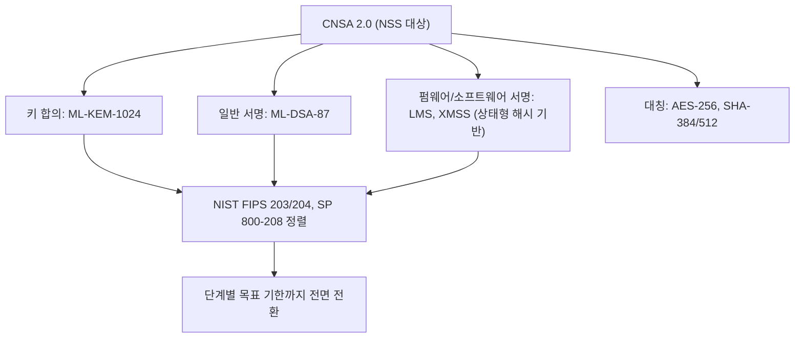

# CNSA 2.0

> 미국 국가안보국(NSA)이 국가안보시스템(NSS)에서 사용할 양자 내성 알고리즘과 그 전환 일정을 규정한 상용 암호 모음이다.

## 핵심
CNSA 2.0은 NSA가 국가안보시스템을 타겟으로 발표한 상용 국가안보 알고리즘 모음의 두 번째 판이다. 1세대 CNSA가 RSA, 타원곡선(ECDH, ECDSA) 같은 고전 공개키를 중심으로 했다면, 2.0은 이를 [[Shor's Algorithm|쇼어 알고리즘]]에 취약한 대상으로 보고 양자 내성 알고리즘으로 교체할 것을 의무화한다.

지정 알고리즘은 NIST 표준과 정렬되어 있다. 키 합의에는 [[Kyber (ML-KEM)|ML-KEM]]을 보안 강도 [[FIPS 203|ML-KEM-1024]] 수준으로 쓴다. 서명은 용도에 따라 갈린다. 일반 디지털 서명에는 [[Dilithium (ML-DSA)|ML-DSA-87]]을, 펌웨어와 소프트웨어 서명에는 상태형 해시 기반 서명인 LMS와 XMSS(NIST SP 800-208)를 지정한다. [[SPHINCS+ (SLH-DSA)|SLH-DSA]]는 같은 해시 기반 서명이자 NIST FIPS 205 표준이지만 무상태 방식이라 CNSA 2.0 지정에는 포함되지 않는다. 대칭키는 AES-256, 해시는 SHA-384 또는 SHA-512 같은 충분한 출력 길이를 요구한다. 비대칭 알고리즘을 모두 단일 양자 내성 알고리즘으로 통일하려는 방향이라는 점에서, 전이기에 고전 알고리즘과 PQC를 병합하는 [[Hybrid Key Exchange|하이브리드]] 권고와는 의도가 다르다.

CNSA 2.0이 다른 전이 지침과 구별되는 또 다른 특징은 시점을 못 박은 일정이다. 소프트웨어와 펌웨어 서명, 웹 브라우저와 클라우드 서비스부터 우선 적용하고, 이후 운영체제와 네트워킹 장비, 그리고 전용 장비까지 단계적으로 확대해 특정 목표 연도까지 사실상 단독 사용을 요구한다. 즉 양자 내성 알고리즘을 선택지가 아니라 기본값으로 만드는 강제 기한을 둔다.

## 왜 중요한가
CNSA 2.0은 정책 차원에서 PQC 전이를 강제하는 가장 구체적인 신호 중 하나다. NIST의 [[FIPS 203]], [[FIPS 204]]와 상태형 해시 서명 표준(NIST SP 800-208)이 알고리즘을 표준으로 확정했다면, CNSA 2.0은 그 알고리즘을 언제 어디에 의무적으로 배치할지를 명령으로 바꾼다. 이 때문에 NSS 공급망에 들어가는 제품은 단순히 PQC를 지원하는 수준을 넘어, 정해진 기한 안에 양자 내성 알고리즘으로 갈아탈 수 있는 [[Crypto-Agility|암호 민첩성]]을 갖추어야 한다.

기한을 못 박는 이유는 [[Harvest Now Decrypt Later|지금 수집 나중 복호]] 위협 때문이다. 적대 세력이 오늘 암호문을 수집해 두었다가 충분히 강력한 양자컴퓨터가 등장한 뒤 복호하면, 기밀 수명이 긴 국가안보 데이터는 소급해서 노출된다. 따라서 위협이 실현되기 전에 전환을 끝내야 하며, 이 시급성은 [[Mosca's Inequality|모스카 부등식]] $X + Y > Z$로 정량화되는 논리와 같다. 데이터 보호 수명 $X$와 전이에 필요한 시간 $Y$의 합이 양자 위협 도래 시점 $Z$를 넘으면 이미 늦은 것이다. CNSA 2.0의 일정은 이 부등식이 깨지지 않도록 $Y$를 강제로 끌어내리는 정책 장치로 볼 수 있다. 미국 정부 전반의 전환 일정을 다루는 [[NIST IR 8547]]과 함께 읽으면 표준화 이후의 실제 배치 압력을 가늠할 수 있다.

## 연결
- [[MOC - Post-Quantum Cryptography]] CNSA 2.0을 표준 항목으로 가리키는 상위 지도, 본 노트가 그 양방향 타겟
- [[Kyber (ML-KEM)]] CNSA 2.0이 키 합의 알고리즘으로 지정한 KEM(ML-KEM-1024)
- [[Dilithium (ML-DSA)]] CNSA 2.0이 일반 서명으로 지정한 격자 기반 알고리즘(ML-DSA-87)
- [[SPHINCS+ (SLH-DSA)]] NIST가 FIPS 205로 표준화한 해시 기반 무상태 서명, CNSA 2.0은 상태형 LMS와 XMSS를 지정하므로 포함되지 않는 대비 사례
- [[NIST IR 8547]] 정부 전반의 기존 공개키 전이 일정을 다루는 자매 지침
- [[Crypto-Agility]] CNSA 2.0 기한 준수를 가능케 하는 알고리즘 교체 설계 원칙
- [[Hybrid Key Exchange]] 전이기 병합 방식, CNSA 2.0의 단일 알고리즘 지향과 대비되는 접근
- [[Harvest Now Decrypt Later]] CNSA 2.0이 기한을 못 박는 근거가 되는 소급 위협
