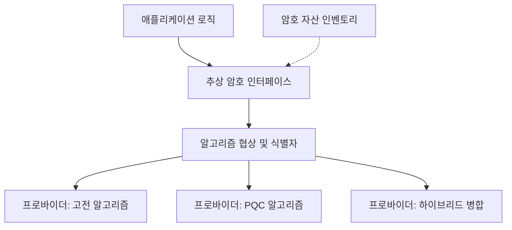

# Crypto-Agility

> 시스템이 의존하는 암호 알고리즘과 매개변수를 핵심 로직을 다시 짜지 않고 신속하고 안전하게 교체할 수 있도록 설계해 두는 원칙이다.

## 핵심
암호 민첩성은 특정 알고리즘에 시스템이 고착되는 상황을 피하기 위한 설계 속성이다. 핵심 발상은 단순하다. 애플리케이션 코드가 RSA나 ECDH 같은 구체적 알고리즘을 직접 호출하는 대신, 협상 가능하고 추상화된 인터페이스를 거쳐 암호 기능을 사용하도록 분리하는 것이다. 그러면 알고리즘이 깨지거나 표준이 바뀌어도 교체가 호출부 전체로 번지지 않고 추상화 경계 안쪽에서 끝난다.

이 원칙은 보통 다음 요소로 구체화된다. 첫째, 암호 자산 인벤토리다. 어떤 알고리즘이 어디에서 어떤 키 길이와 만료 시점으로 쓰이는지 추적하지 못하면 무엇을 바꿔야 하는지조차 알 수 없다. 둘째, 알고리즘 식별자와 협상 메커니즘이다. 프로토콜이 사용할 알고리즘을 런타임에 합의하도록 해 두면 양 끝점이 공통으로 지원하는 최신 알고리즘으로 자연스럽게 수렴한다. 셋째, 모듈식 구현과 명확한 추상화 계층이다. 암호 연산을 프로바이더 뒤로 숨겨 구현 교체가 호출 코드에 노출되지 않게 한다.

교체 비용을 정성적으로 보면, 알고리즘이 코드와 프로토콜과 키 관리에 깊이 박힐수록 전환 비용은 가파르게 증가한다. 민첩성을 미리 확보한 시스템에서는 교체가 설정 변경과 협상 결과의 문제로 축소되지만, 그렇지 않은 시스템에서는 의존 라이브러리, 인증서 형식, 직렬화 포맷까지 연쇄적으로 손을 대야 한다. 이 차이가 [[Hybrid Key Exchange|하이브리드]] 같은 전이 전략을 실제로 배치 가능하게 만드는 전제 조건이다.

## 구조

## 왜 중요한가
양자 내성 암호로의 전이가 일회성 교체가 아니라 반복되는 운영 책임이라는 점이 암호 민첩성을 필수로 만든다. [[Shor's Algorithm|쇼어 알고리즘]]이 위협하는 기존 공개키를 PQC로 바꾸는 1차 전환만으로 끝나지 않는다. NIST가 [[Kyber (ML-KEM)|ML-KEM]] 외에 코드 기반 [[HQC]]를 백업으로 추가했듯, 표준 자체가 계속 진화하고 특정 수학 가정이 약화될 가능성도 남아 있다. 따라서 한 알고리즘에서 다음 알고리즘으로 옮겨가는 능력 자체를 자산으로 갖추어야 한다.

시급성의 관점에서도 민첩성은 전이 일정을 현실적으로 만든다. [[Mosca's Inequality|모스카 부등식]] $X + Y > Z$에서 전환에 걸리는 시간 $Y$를 줄이는 가장 직접적인 수단이 바로 암호 민첩성이다. 교체가 빠를수록 데이터 보호 수명 $X$와 위협 도래 시점 $Z$ 사이의 여유가 늘어난다. 특히 오늘 수집되어 미래에 복호화될 수 있는 [[Harvest Now Decrypt Later|선수집 후복호 위협]] 아래에서는 전환 지연이 곧 소급 노출로 이어지므로, 민첩성은 단순한 편의가 아니라 위험 통제 수단이다. 이 원칙을 조직 수준에서 지속적으로 유지하는 책임이 [[PQC 전이 감시]] 영역의 핵심 관리 기준 가운데 하나다.

## 연결
- [[MOC - Post-Quantum Cryptography]] 이 개념이 속한 PQC 도메인의 상위 지도이며 전이 전략 항목에서 암호 민첩성을 가리킨다
- [[PQC 전이 감시]] 암호 민첩성을 항상 일정 수준 이상으로 유지하는 것을 관리 기준으로 삼는 Area
- [[Hybrid Key Exchange]] 민첩성이 확보되어야 실제 배치가 가능한 전이기 병합 방식
- [[Harvest Now Decrypt Later]] 전환 지연이 소급 노출로 이어지게 만들어 민첩성을 위험 통제 수단으로 격상시키는 위협
- [[Mosca's Inequality]] 전환 시간 $Y$를 줄여 전이 여유를 확보하는 지점에서 민첩성과 직접 연결되는 부등식
