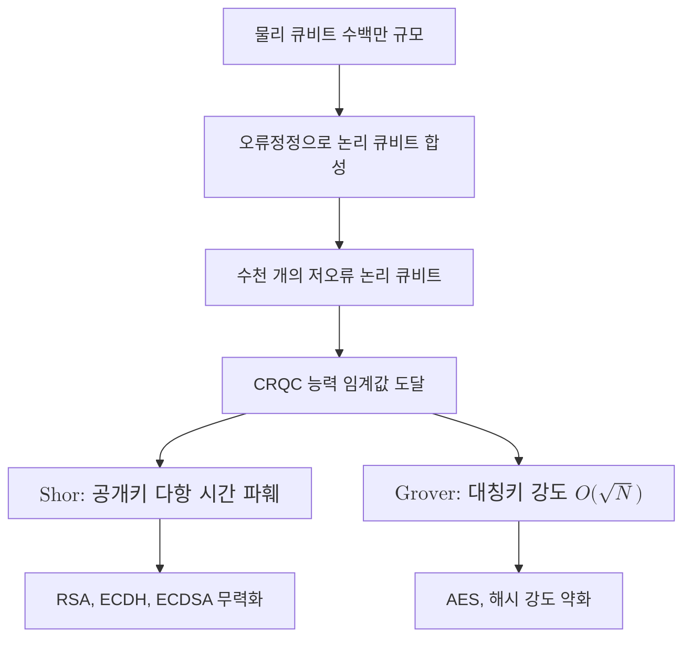

# Cryptographically Relevant Quantum Computer

> 현재 쓰이는 공개키 암호를 실제로 파훼할 만큼 충분히 크고 정확하며 오류정정된 양자컴퓨터를 가리키는, 전이 시급성을 정하는 위협 기준점이다.

## 핵심
CRQC는 특정한 하드웨어 모델 이름이 아니라 능력 임계값을 가리키는 용어다. 어떤 양자컴퓨터가 RSA, 타원곡선, 디피헬만 같은 실전 매개변수의 공개키 암호를 합리적인 시간 안에 깨뜨릴 수 있으면, 그 시점부터 그 기계를 CRQC로 부른다. 따라서 CRQC는 큐비트 개수 하나로 정의되지 않고, 다음 조건이 동시에 충족되어야 한다.

- 충분한 논리 큐비트: 2048비트 RSA를 [[Shor's Algorithm|쇼어 알고리즘]]으로 인수분해하려면 수천 개 규모의 논리 큐비트가 필요하다. 논리 큐비트 하나를 만들려면 [[Quantum Error Correction|오류정정]] 부호 때문에 수백에서 수천 개의 물리 큐비트가 소모되므로, 물리 큐비트 요구량은 수백만 규모로 커진다.
- 충분히 낮은 논리 오류율: 인수분해 회로는 매우 깊어서, 회로를 끝까지 실행하는 동안 오류가 누적되지 않을 만큼 논리 오류율이 낮아야 한다.
- 깊은 회로의 결맞음 유지: 양자 푸리에 변환과 모듈러 거듭제곱을 포함한 긴 회로를 [[Quantum Decoherence|결어긋남]]에 무너지지 않고 완주할 수 있어야 한다.

위협의 두 갈래는 성격이 다르다. 공개키 암호는 쇼어 알고리즘에 다항 시간으로 파훼되어 사실상 전멸한다. 반면 대칭키와 해시는 [[Grover's Algorithm|그로버 알고리즘]]에 의해 비정렬 탐색이 $O(\sqrt{N})$로 가속되어 보안 강도가 제곱근만큼 약화될 뿐이다. 이 때문에 CRQC가 등장해도 AES는 키 길이를 키워 살아남지만, RSA와 ECDH 계열은 대체가 불가피하다.

## 흐름

## 왜 중요한가
CRQC는 PQC 전이 전략에서 시계의 영점 역할을 한다. CRQC가 등장하는 시점이 곧 기존 공개키 암호가 무너지는 시점이고, 모든 전이 일정은 이 시점을 기준으로 역산된다. 그 정량적 표현이 [[Mosca's Inequality|모스카 부등식]]이다.

$$ X + Y > Z $$

여기서 $X$는 데이터가 비밀로 유지되어야 하는 기간, $Y$는 조직이 PQC로 전이하는 데 걸리는 기간, $Z$는 CRQC 등장까지 남은 기간이다. 부등식이 성립하면 지금 전이를 시작해도 이미 늦은 것이므로, $Z$의 추정값, 곧 CRQC 도래 시점 추정이 전이 시급성을 직접 좌우한다.

CRQC가 아직 없다는 사실이 안심의 근거가 되지 못한다는 점도 핵심이다. [[Harvest Now Decrypt Later|지금 수집해 나중에 복호]] 위협은 공격자가 오늘 오가는 암호문을 저장해 두었다가 CRQC가 등장한 이후에 소급해 복호하는 방식이라, CRQC 이전에도 이미 작동한다. 보안 수명이 긴 데이터일수록 노출 창이 넓다. 이런 이유로 NIST와 NSA는 CRQC 등장을 기다리지 말고 선제적으로 전이할 것을 권고하며, 전이기에는 단독 PQC가 아니라 [[Hybrid Key Exchange|하이브리드 키 교환]]으로 고전 알고리즘과 PQC를 병합해 배치하는 방식을 권장한다.

## 연결
- [[MOC - Post-Quantum Cryptography]] CRQC를 위협 기준으로 다루는 상위 지도이자 전이 전략의 진입점
- [[양자 위협 정세 감시]] CRQC 도래 시점, 곧 모스카 부등식의 $Z$를 지속 추정하고 갱신하는 책임 영역
- [[Shor's Algorithm]] CRQC가 공개키 암호를 다항 시간에 파훼하는 핵심 알고리즘
- [[Grover's Algorithm]] CRQC가 대칭키와 해시 보안 강도를 제곱근만큼 약화하는 알고리즘
- [[Harvest Now Decrypt Later]] CRQC가 등장하기 전에도 작동하는 소급 위협으로, CRQC 시점이 곧 복호 시점
- [[Mosca's Inequality]] CRQC 등장 시점 $Z$를 변수로 삼아 전이 시급성을 정량화하는 부등식
- [[Hybrid Key Exchange]] CRQC에 대비해 고전 알고리즘과 PQC를 병합하는 전이기 배치 방식
