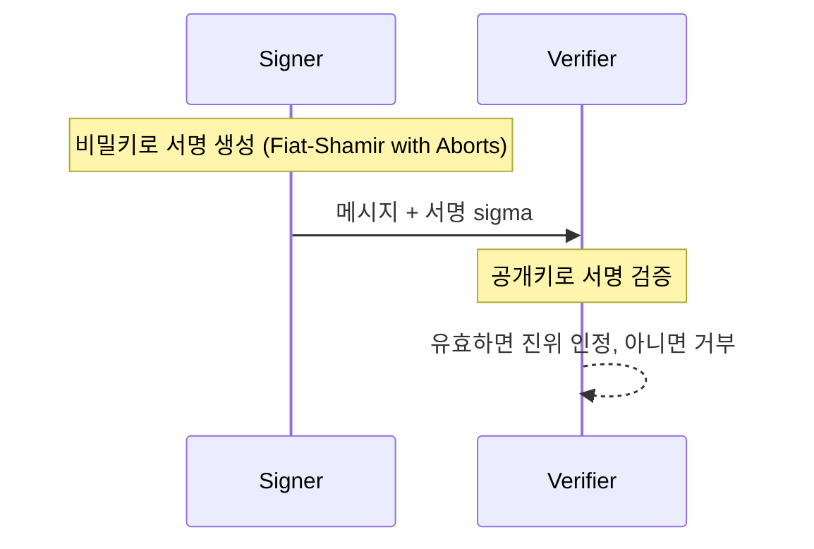

# Dilithium (ML-DSA)

> 격자(Module-LWE와 Module-SIS) 난해성에 기반한 EUF-CMA 안전 디지털 서명 방식으로, NIST가 FIPS 204(ML-DSA)로 표준화했다.

## 핵심
Dilithium은 메시지의 진위와 출처를 검증하는 디지털 서명 방식이다. 서명자는 비밀키로 서명을 생성하고, 누구나 공개키로 그 서명이 진짜인지 검증한다. 같은 격자 계열인 [[Kyber (ML-KEM)]]가 공유 비밀을 합의하는 KEM이라면, Dilithium은 서명을 담당하는 형제 표준이며 둘 다 안전성을 [[Module-LWE]] 문제의 난해성에서 끌어온다. Dilithium은 여기에 더해 짧은 벡터를 찾기 어렵다는 Module-SIS 가정도 사용한다.

설계의 핵심은 Fiat-Shamir with Aborts 방식이다. 비밀키를 노출하지 않으려고 서명 과정에서 거부 표본화(rejection sampling)를 거치는데, 후보 서명이 비밀 정보를 흘릴 위험이 있으면 그 후보를 버리고 다시 시도한다. 즉 서명 분포가 비밀키와 통계적으로 독립이 되도록 강제하는 것이 안전성의 관건이다.

위조 공격자의 우위는 다음 수준으로 제한된다고 본다.

$$ \mathrm{Adv}^{\text{EUF-CMA}}_{\mathcal{A}}(\lambda) \le \mathsf{negl}(\lambda) $$

여기서 EUF-CMA는 선택 메시지 공격 하에서의 존재적 위조 불가능성(Existential Unforgeability under Chosen Message Attack)을 뜻하며, 표준에서는 강화된 형태인 SUF-CMA에 가까운 보안을 목표로 한다. 보안 강도에 따라 ML-DSA-44, ML-DSA-65, ML-DSA-87 매개변수 집합을 제공하며, 숫자가 클수록 키와 서명이 커지고 안전 여유가 늘어난다.

## 흐름

## 왜 중요한가
[[Shor's Algorithm|쇼어 알고리즘]]은 RSA 서명과 ECDSA의 근거인 인수분해와 이산로그를 다항 시간에 풀어 기존 서명 체계를 무력화한다. Dilithium은 그 대체재로 NIST가 채택한 1순위 격자 기반 서명이며, FIPS 204로 확정되었다. 서명은 키 교환과 달리 소급 위협의 성격이 다르다. 오늘 만든 서명이 미래에 위조되는 문제보다, 미래에 CRQC가 등장한 뒤에 발급되는 서명의 신뢰가 깨지는 문제가 핵심이므로, 인증서 체인과 코드 서명, 펌웨어 서명처럼 수명이 긴 신뢰 앵커일수록 전이가 시급하다.

같은 격자 가정에 의존하는 [[Kyber (ML-KEM)]]와 Dilithium이 동시에 흔들릴 위험에 대비해, 해시 기반인 [[SPHINCS+ (SLH-DSA)]]가 보수적 백업 서명으로 함께 표준화되었고, 더 컴팩트한 서명이 필요한 곳에는 [[FN-DSA (Falcon)]]가 자리한다. 전이기에는 기존 서명과 Dilithium을 함께 검증하는 하이브리드 또는 이중 서명 배치가 권장된다.

## 연결
- [[Module-LWE]] Dilithium 안전성의 수학적 기반이며 Module-SIS 가정과 함께 쓰인다
- [[Kyber (ML-KEM)]] 같은 격자 계열의 KEM 형제 표준(FIPS 203)으로, 키 교환을 담당한다
- [[MOC - Post-Quantum Cryptography]] 이 개념이 속한 도메인 지도이며 FIPS 204 서명 항목으로 가리킨다
- [[PQC 전이 감시]] 이 서명 표준의 동향과 배치를 지속 추적하는 관리 영역
- [[SPHINCS+ (SLH-DSA)]] 격자 가정과 독립인 해시 기반 백업 서명 표준(FIPS 205)
- [[FN-DSA (Falcon)]] 같은 격자 기반이지만 더 컴팩트한 서명을 노리는 표준화 진행 방식
- [[Shor's Algorithm]] 기존 서명 체계를 파훼해 Dilithium 전이를 촉발하는 위협
