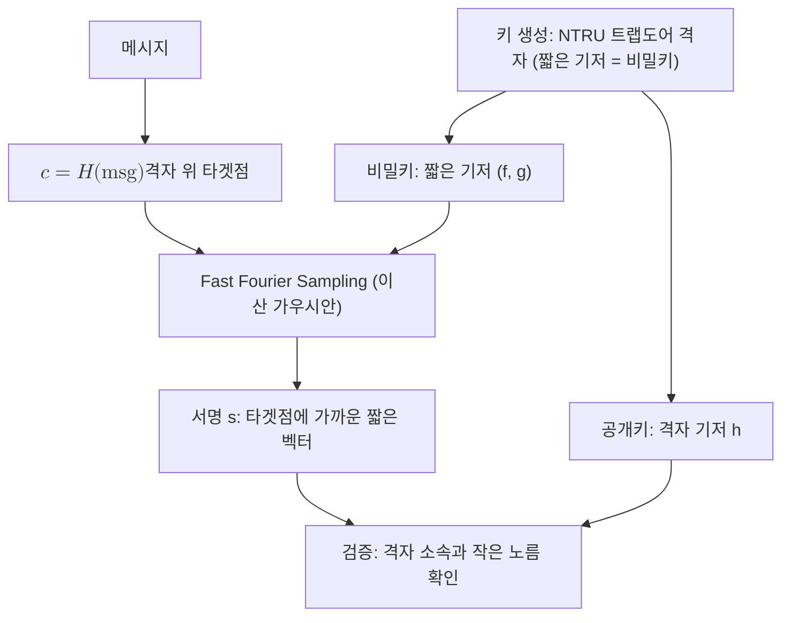

# FN-DSA (Falcon)

> NTRU 격자의 짧은 벡터 난해성에 기반한 해시-앤-사인(Hash-and-Sign) 방식의 컴팩트한 양자 내성 디지털 서명으로, NIST가 FN-DSA라는 이름으로 표준화(FIPS 206)를 진행 중이다.

## 핵심
FN-DSA는 NIST가 선정한 격자 기반 디지털 서명 알고리즘이며, 원래 이름은 Falcon이다. 명칭 FN-DSA는 FFT over NTRU lattices 기반의 DSA를 뜻한다. 안전성은 [[Module-LWE|격자]] 계열 중에서도 NTRU 격자에서 짧은 벡터를 찾는 문제(SIS와 NTRU 가정)의 난해성에서 나오며, 양자컴퓨터로도 효율적으로 풀기 어렵다고 본다.

설계의 핵심은 GPV(Gentry, Peikert, Vaikuntanathan) 해시-앤-사인 프레임워크와 NTRU 트랩도어 격자의 결합이다. 공개키는 다항식 환 $\mathbb{Z}_q[x] / (x^n + 1)$ 위에서 정의되는 NTRU 격자를 나타내고, 비밀키는 그 격자의 짧은 기저로서 트랩도어 역할을 한다. 서명자는 메시지 해시를 격자 위의 한 점으로 보낸 뒤, 트랩도어를 이용해 그 점에 가까운 격자점을 찾는다. 두 점의 차이가 곧 짧은 벡터인 서명이 된다. 이 근접점 탐색에는 이산 가우시안 분포를 따르는 표본추출이 쓰이며, 빠른 푸리에 변환(FFT)을 활용한 fast Fourier sampling으로 효율을 끌어올린다.

검증은 서명이 공개 격자에 속하면서 노름이 충분히 작은지를 확인하는 절차로 환원된다. 위조자가 유효한 서명을 만들려면 트랩도어 없이 격자의 짧은 벡터를 찾아야 하므로, 위조 성공 확률은 무시할 만한 수준으로 제한된다고 본다.

$$ \mathrm{Adv}^{\text{EUF-CMA}}_{\mathcal{A}}(\lambda) \le \mathsf{negl}(\lambda) $$

Falcon은 두 가지 매개변수 집합 Falcon-512와 Falcon-1024를 제공하며, 각각 NIST 보안 수준 1과 5에 대응한다. 가장 두드러진 특징은 서명과 공개키의 작은 크기다. 같은 보안 수준에서 [[Dilithium (ML-DSA)]]보다 서명이 작아, 대역폭과 저장 공간이 제약된 환경에 유리하다.

## 구조

## 왜 중요한가
[[Shor's Algorithm|쇼어 알고리즘]]은 RSA와 ECDSA 같은 기존 서명을 다항 시간에 무너뜨린다. NIST는 양자 내성 서명을 단일 알고리즘에 의존하지 않으려고 서로 다른 수학 기반을 함께 표준화하는 전략을 택했다. 격자 기반의 주력은 [[Dilithium (ML-DSA)]]이고, 해시 기반의 보수적 대안은 [[SPHINCS+ (SLH-DSA)]]이며, FN-DSA는 격자 기반이면서도 서명이 가장 작은 컴팩트 옵션을 담당한다.

이 위치 때문에 FN-DSA는 인증서, 펌웨어 서명, 제약된 프로토콜 헤더처럼 서명 크기가 곧 비용인 영역에서 매력적이다. 다만 부작용도 분명하다. 이산 가우시안 표본추출과 부동소수점 FFT 연산이 들어가므로 구현이 까다롭고, 부동소수점 처리의 비결정성이나 타이밍 누설은 부채널 공격의 표면이 될 수 있다. 영지식, 영신뢰 보안 관점에서 FN-DSA를 채택할 때는 상수 시간 구현과 표본추출의 검증이 필수 전제가 된다. 전이기에는 단독 배치보다 고전 서명과 PQC 서명을 함께 거는 [[Hybrid Key Exchange|하이브리드]] 접근과 [[Crypto-Agility|암호 민첩성]] 설계를 결합하는 것이 권장된다.

## 연결
- [[MOC - Post-Quantum Cryptography]] FN-DSA가 속한 PQC 도메인의 최상위 지도
- [[Dilithium (ML-DSA)]] 같은 격자 기반의 주력 서명 표준(FIPS 204), FN-DSA는 더 작은 서명을 제공하는 컴팩트 대안
- [[SPHINCS+ (SLH-DSA)]] 해시 기반의 보수적 서명 대안(FIPS 205), FN-DSA와 다른 수학 가정으로 표준 다변화를 이룸
- [[Module-LWE]] 같은 격자 난해성 계열의 수학적 토대(FN-DSA는 NTRU 격자에 기반)
- [[Hybrid Key Exchange]] 전이기에 고전 서명과 PQC 서명을 병합해 배치하는 방식
- [[Crypto-Agility]] FN-DSA 같은 신규 알고리즘으로의 교체를 가능케 하는 설계 원칙
- [[PQC 전이 감시]] FN-DSA 표준화 진척을 추적 항목으로 두는 관리 영역
