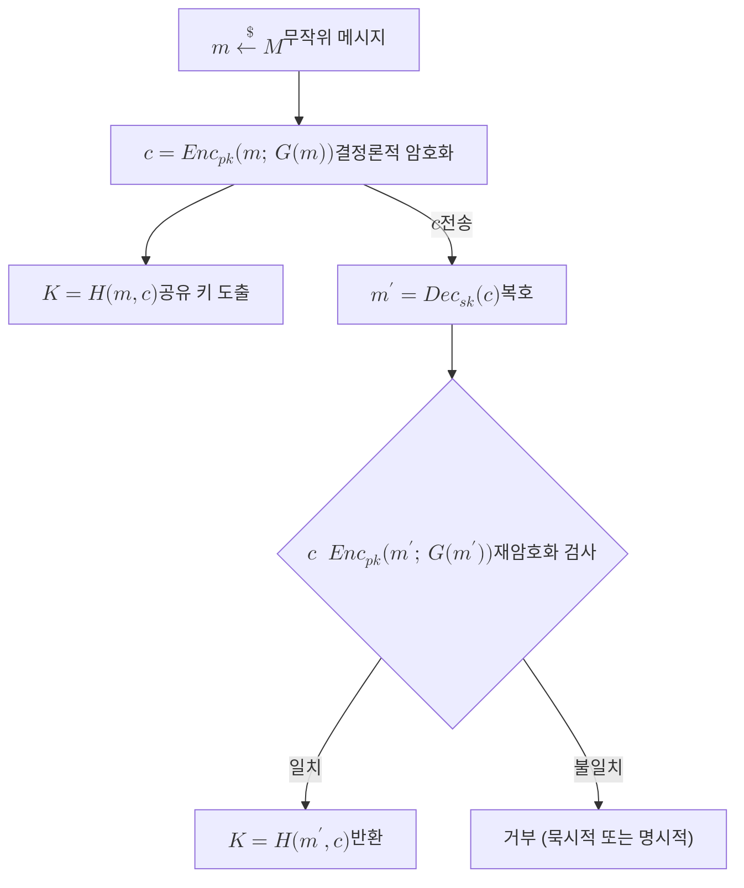

# Fujisaki-Okamoto Transform

> 선택 평문 공격에만 안전한 공개키 암호(IND-CPA PKE)를, 결정론적 재암호화로 암호문 정합성을 검증하게 만들어 선택 암호문 공격까지 막는 IND-CCA2 키 캡슐화 메커니즘으로 끌어올리는 일반 변환이다.

## 핵심

[[Key Encapsulation Mechanism|KEM]]을 설계할 때 부딪히는 근본 격차가 있다. 격자나 부호 같은 난해 문제 위에 세운 기본 공개키 암호는 대개 IND-CPA 수준의 안전성만 자연스럽게 보장한다. 즉 공격자가 평문을 골라 암호화를 관찰하는 수동 공격에는 강하지만, 임의의 암호문을 복호 신탁에 던져 답을 캐묻는 능동 공격(선택 암호문 공격)에는 취약하다. 실제 프로토콜에서 공격자는 능동적이므로, 운용에 필요한 목표는 IND-CCA2다. 후지사키 오카모토 변환은 이 격차를 메우는 표준 도구다.

변환의 발상은 암호문을 위조 불가능하게 묶는 것이다. 평문을 무작위로 뽑은 메시지 $m$으로 두되, 암호화에 쓰이는 난수를 외부에서 자유롭게 고르게 두지 않고 $m$ 자체에서 해시로 유도한다. 즉 난수 $r = G(m)$으로 고정해 암호화를 결정론적으로 만든다.

$$ c = \mathsf{Enc}_{pk}\big(m;\, G(m)\big) $$

이렇게 하면 같은 $m$은 항상 같은 $c$를 낳는다. 공유 대칭 키는 $m$과 암호문을 함께 입력으로 받는 또 다른 해시 $K = H(m, c)$로 도출한다. 핵심 장치는 복호 측의 재암호화 검사다. 복호자는 비밀키로 $m'$을 복원한 뒤, 곧바로 $\mathsf{Enc}_{pk}(m';\, G(m'))$을 다시 계산해 받은 $c$와 일치하는지 확인한다.

$$ m' \leftarrow \mathsf{Dec}_{sk}(c), \qquad c \overset{?}{=} \mathsf{Enc}_{pk}\big(m';\, G(m')\big) $$

일치하면 $K = H(m', c)$를 반환하고, 어긋나면 거부한다. 이 검사가 위조된 암호문이나 변형된 암호문을 걸러낸다. 공격자가 정당한 $c$를 조작해 신탁에 던져도, 조작된 암호문은 결정론적 재암호화를 통과하지 못해 거부되므로, 복호 신탁에서 의미 있는 정보를 빼낼 수 없다. 거부 처리 방식에는 두 갈래가 있다. 명시적으로 실패 기호 $\bot$을 돌려주는 명시적 거부와, 비밀키에 묶인 의사난수 값을 대신 돌려주어 실패 여부 자체를 숨기는 묵시적 거부다. [[Kyber (ML-KEM)|ML-KEM]]은 부채널을 통한 실패 누출을 줄이기 위해 묵시적 거부를 채택한 변형을 쓴다.

안전성 증명은 보통 두 단계로 나뉜다. 먼저 결정론적 암호화(흔히 $\mathsf{T}$ 변환으로 부른다)로 IND-CPA PKE를 한 번 안전성 가정(OW-CPA 또는 단방향성)을 만족하는 결정론적 PKE로 바꾸고, 다음으로 재암호화 검사와 키 유도(흔히 $\mathsf{U}^{\not\bot}$ 또는 $\mathsf{U}^{\bot}$ 변환)를 얹어 IND-CCA2 KEM을 얻는다. 증명은 해시 $G$와 $H$를 무작위 신탁으로 보는 랜덤 오라클 모형에서 이뤄지며, 양자 공격자를 가정하는 양자 랜덤 오라클 모형(QROM)에서도 성립하도록 정밀화되었다. 최종적으로 적격 공격자 $\mathcal{A}$의 우위는

$$ \mathrm{Adv}^{\text{IND-CCA2}}_{\mathcal{A}}(\lambda) \le \mathsf{negl}(\lambda) $$

수준으로 제한된다. 다만 격자나 부호 기반 PKE는 복호화가 드물게 실패할 수 있어, FO 변환의 안전성 손실은 이 복호 실패 확률 $\delta$에 직접 묶인다. 그래서 [[Kyber (ML-KEM)]]가 실패 확률을 무시 가능한 수준(FIPS 203 기준 ML-KEM-768은 약 $2^{-164}$)으로 설계하는 일이 단순한 정확성 문제가 아니라 IND-CCA2 안전성의 전제 조건이 된다.

## 흐름

## 왜 중요한가

후지사키 오카모토 변환은 PQC KEM 설계의 사실상 공통 골격이다. 격자, 부호, 그 밖의 어떤 가정 위에 세운 기본 암호든, 설계자는 IND-CPA만 보장하는 비교적 다루기 쉬운 PKE를 먼저 만든 뒤 이 변환으로 IND-CCA2 KEM까지 일괄적으로 끌어올린다. 덕분에 어려운 능동 공격 안전성을 매번 새로 증명하지 않고, 변환의 일반 정리에 위임할 수 있다. NIST 표준화 과정에서 살아남은 [[Kyber (ML-KEM)|ML-KEM]]과 코드 기반 [[HQC]]가 모두 변형된 FO 변환을 적용한다는 사실은 이 도구의 중심성을 보여준다.

이 변환이 PQC 시대에 특히 중요한 이유는 안전성 모형 자체가 양자 공격자를 가정해야 하기 때문이다. 고전 랜덤 오라클 모형에서의 원래 증명만으로는 양자 공격을 가정하는 환경에서 충분하지 않으므로, QROM에서 다시 증명이 정밀화되었다. 이 정밀화가 격자, 부호 기반 KEM의 IND-CCA2 안전성을 떠받치는 형식적 토대가 된다.

동시에 변환은 새로운 공격 표면을 남긴다. 복호 실패와 거부 처리가 부채널로 새면, 공격자가 실패 패턴을 모아 비밀키 정보를 복원하는 길이 열린다. 묵시적 거부, 일정 시간 구현, 복호 실패 확률의 엄격한 상한이 모두 이 위험을 누르기 위한 장치다. 이런 구현 수준의 위협을 지속 관리하는 책임이 [[PQC 전이 감시]] 영역과 [[Crypto-Agility|암호 민첩성]] 설계로 이어진다.

## 연결

- [[MOC - Post-Quantum Cryptography]] 이 개념이 속한 PQC 도메인의 상위 지도이자 진입점
- [[Key Encapsulation Mechanism]] FO 변환이 산출하는 결과물인 IND-CCA2 안전 KEM의 일반 정의
- [[Kyber (ML-KEM)]] 묵시적 거부 변형 FO 변환을 적용해 IND-CPA PKE를 IND-CCA2 KEM으로 올린 NIST 표준 KEM
- [[HQC]] 같은 FO 변환을 코드 기반 기본 암호에 적용한 백업 KEM
- [[Module-LWE]] Kyber의 기본 PKE가 IND-CPA 안전성을 끌어오는 격자 난해 문제, FO 변환의 입력이 되는 가정
- [[Crypto-Agility]] FO 기반 KEM이 흔들릴 때 알고리즘을 교체할 수 있게 하는 설계 원칙
