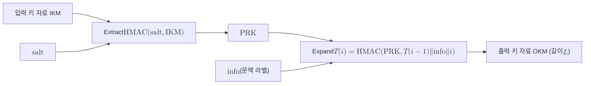

# HKDF

> HMAC을 기반 원시 함수로 삼아 입력 키 자료에서 균등하게 무작위한 키를 먼저 짜내고(Extract) 이를 원하는 길이의 키 자료로 펼치는(Expand) 추출 후 확장 구조의 키 유도 함수다.

## 핵심

HKDF는 두 단계로 동작한다. 1단계 추출은 엔트로피는 충분하지만 분포가 균등하지 않을 수 있는 입력 키 자료(IKM)를 받아, 짧고 고정 길이이며 의사난수에 가까운 중간 키 $\mathrm{PRK}$(pseudorandom key)로 압축한다. 2단계 확장은 그 $\mathrm{PRK}$를 씨앗으로 삼아 호출자가 지정한 길이 $L$만큼의 출력 키 자료(OKM)를 생성한다. 이 분리가 HKDF 설계의 핵심이며, 입력의 분포를 정돈하는 일과 정돈된 비밀을 여러 키로 펼치는 일을 서로 다른 보안 논거로 다룰 수 있게 해준다.

추출 단계는 다음과 같다. 여기서 $\mathrm{salt}$는 선택적 비밀 아닌 무작위 값이고, 없으면 해시 출력 길이만큼의 0 바이트 문자열을 쓴다.

$$ \mathrm{PRK} = \mathrm{HMAC\text{-}Hash}(\mathrm{salt},\ \mathrm{IKM}) $$

확장 단계는 $\mathrm{PRK}$와 문맥 정보 $\mathrm{info}$, 그리고 1바이트 카운터를 반복 입력하여 블록을 이어 만든다. $T(0)$은 빈 문자열이고 각 블록은 이전 블록을 되먹임으로 받는다.

$$ T(i) = \mathrm{HMAC\text{-}Hash}\!\left(\mathrm{PRK},\ T(i-1)\ \Vert\ \mathrm{info}\ \Vert\ i\right),\quad i = 1, 2, \dots, t $$

$$ \mathrm{OKM} = \left.\bigl(\,T(1)\ \Vert\ T(2)\ \Vert\ \cdots\ \Vert\ T(t)\,\bigr)\right|_{\text{앞 }L\text{바이트}},\quad t = \left\lceil \frac{L}{\mathrm{HashLen}} \right\rceil $$

여기서 되먹임 구조 덕분에 각 출력 블록이 직전 블록에 의존하므로, 단순히 카운터만 바꾸는 방식보다 출력 사이의 독립성이 강화된다. $\mathrm{info}$ 인자는 같은 $\mathrm{PRK}$에서 용도가 다른 여러 키를 안전하게 분기시키는 도메인 분리(domain separation) 라벨로 쓴다. 예를 들어 같은 핸드셰이크에서 암호화 키와 인증 키를 따로 뽑을 때 $\mathrm{info}$ 값을 다르게 주면 두 키가 계산상 독립이 된다.

추출과 확장을 분리한 이론적 근거는 추출기와 의사난수 함수를 따로 모델링하는 것이다. 추출 단계는 $\mathrm{IKM}$이 충분한 최소 엔트로피를 가지면 $\mathrm{PRK}$가 균등 분포와 구별되지 않음을 보장하는 무작위성 추출기로, 확장 단계는 $\mathrm{PRK}$를 키로 쓰는 의사난수 함수(PRF)로 본다. 그래서 입력이 디피헬만 공유점처럼 균등하지 않은 군 원소일 때도 안전한 키를 끌어낼 수 있다.

## 구조

## 왜 중요한가

하이브리드 키 교환에서 HKDF는 서로 다른 출처의 공유 비밀을 하나의 세션 키로 묶는 결합기 역할을 한다. [[Hybrid Key Exchange|하이브리드 키 교환]]은 고전 알고리즘과 PQC KEM을 동시에 돌려 각각 비밀 $z_1$과 $z_2$를 얻는데, 이 둘을 단순히 XOR하면 한쪽 입력이 공격자에게 노출될 때 무너질 수 있다. 대신 두 비밀을 이어 붙여 HKDF에 통과시키면, 입력 중 적어도 하나만 비밀이고 무작위여도 출력이 안전하다는 추출기의 성질이 그대로 결합 보안으로 이어진다.

$$ K = \mathrm{HKDF}\text{-}\mathrm{Expand}\!\left(\mathrm{HKDF}\text{-}\mathrm{Extract}(\mathrm{salt},\ z_1 \,\Vert\, z_2),\ \mathrm{info},\ L\right) $$

이런 구조 덕분에 TLS 1.3의 [[X25519MLKEM768]] 같은 하이브리드 키 교환 그룹은 ML-KEM-768의 공유 비밀과 X25519의 공유점을 연접해 키 스케줄에 넣고, HKDF 기반 추출과 확장을 거쳐 핸드셰이크 비밀과 트래픽 키를 차례로 유도한다. 연접 순서는 ML-KEM 비밀을 앞에 두는데, 이는 FIPS 준수를 위한 규약이다. 표준 측면에서 HKDF는 RFC 5869로 정의되고, NIST SP 800-56C Rev. 2가 키 합의 이후의 키 유도 절차로 채택하면서 하이브리드 결합 KDF의 권장 형태가 됐다. 입력 정돈과 키 분기를 한 함수로 깔끔히 분리해 다루므로, 알고리즘을 바꿔 끼우기 쉬운 [[Crypto-Agility|암호 민첩성]] 설계와도 잘 맞는다.

## 연결

- [[MOC - Post-Quantum Cryptography]] 이 개념이 속한 PQC 도메인의 상위 지도
- [[Hybrid Key Exchange]] 고전과 PQC 공유 비밀을 병합해 세션 키를 만드는 결합기로 HKDF를 사용하는 상위 맥락
- [[X25519MLKEM768]] 두 공유 비밀을 연접해 HKDF 키 스케줄로 세션 키를 유도하는 실제 TLS 하이브리드 그룹
- [[Crypto-Agility]] 키 유도를 표준화된 한 함수로 분리해 알고리즘 교체를 쉽게 만드는 설계 전제
- [[HMAC]] HKDF가 추출과 확장 모두에서 기반 원시 함수로 호출하는 메시지 인증 코드
