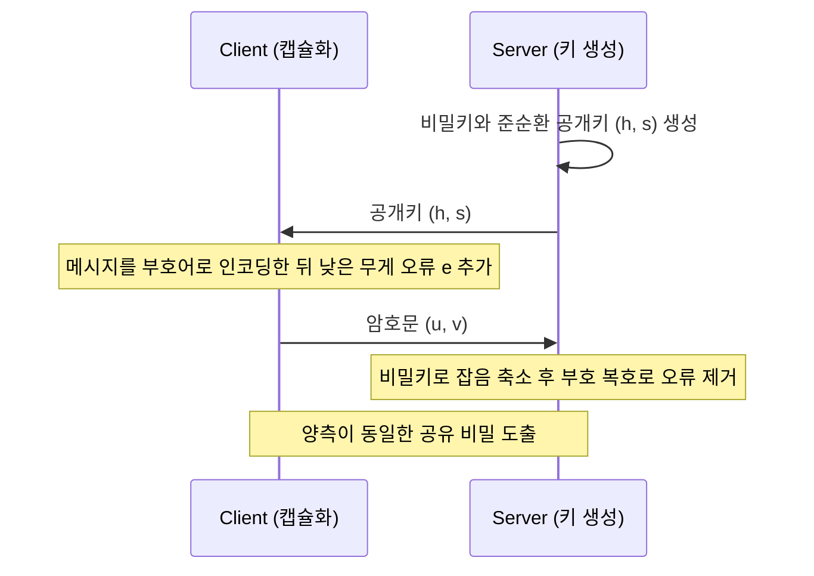

# HQC

> 준순환 부호의 복호 난해성(준순환 신드롬 복호 문제)에 기반한 IND-CCA2 안전 키 캡슐화 메커니즘(KEM)으로, NIST가 격자와 무관한 수학적 백업을 확보하기 위해 2025년 코드 기반 표준 후보로 선정했다.

## 핵심
HQC는 이름 그대로 해밍 거리(Hamming)와 준순환(Quasi-Cyclic) 구조에 의지하는 KEM이다. 두 통신 주체가 공개망에서 공유 비밀을 합의하려는 목적은 [[Kyber (ML-KEM)|ML-KEM]]과 같지만, 안전성의 출처가 다르다. ML-KEM이 격자의 [[Module-LWE]] 난해성에 뿌리를 둔다면, HQC는 부호 이론의 신드롬 복호 문제에 뿌리를 둔다. 무작위에 가까운 선형 부호에서 정해진 무게의 오류 패턴을 찾아내는 일이 일반적으로 NP 난해이며, 양자컴퓨터로도 효율적 해법이 알려져 있지 않다는 점을 보안 근거로 삼는다.

구조의 뼈대는 부호 위에 의도적으로 오류를 더하는 방식이다. 공개키는 준순환 구조를 가진 다항식 쌍 $(\mathbf{h}, \mathbf{s})$ 로 주어지며, 모든 연산은 환 $\mathbb{F}_2[X]/(X^n - 1)$ 위에서 이뤄진다. 캡슐화 측은 낮은 무게의 무작위 벡터 $\mathbf{r}_1, \mathbf{r}_2, \mathbf{e}$ 를 뽑아, 메시지를 공개 부호 $\mathcal{C}$ 의 부호어로 인코딩한 값에 잡음을 더한다. 암호문은 단일 벡터가 아니라 다항식 쌍 $(\mathbf{u}, \mathbf{v})$ 다.

$$ \mathbf{u} = \mathbf{r}_1 + \mathbf{h}\cdot\mathbf{r}_2, \qquad \mathbf{v} = \mathsf{Encode}_{\mathcal{C}}(\mathbf{m}) + \mathbf{s}\cdot\mathbf{r}_2 + \mathbf{e} $$

복호 측은 비밀키 $\mathbf{y}$ 로 $\mathbf{v} - \mathbf{u}\cdot\mathbf{y}$ 를 계산해 잡음 항을 충분히 작게 만든 뒤, 부호 $\mathcal{C}$ 의 복호 알고리즘으로 더해진 오류를 걷어내 $\mathbf{m}$ 을 복원한다. HQC가 효율적 복호가 가능한 부호로 흔히 연접 부호인 리드 뮬러 부호와 리드 솔로몬 부호를 사용하는 점이 핵심이다. 정당한 사용자는 비밀 정보로 잔여 오류 무게를 복호 능력 안으로 끌어내려 정확히 복원하지만, 공개키만 아는 공격자에게 남는 문제는 구조 없는 준순환 부호의 신드롬 복호로 환원되어 난해하게 남는다.

이렇게 만들어진 기본 방식은 그 자체로는 선택 평문 공격에만 안전한 PKE다. 여기에 Fujisaki-Okamoto 변환을 적용해 결정론적 재암호화로 암호문 정합성을 검증하게 하면, 선택 암호문 공격까지 막는 IND-CCA2 KEM으로 승급한다. 공격자 우위는 $\mathrm{Adv}^{\text{IND-CCA2}}_{\mathcal{A}}(\lambda) \le \mathsf{negl}(\lambda)$ 수준으로 제한된다고 본다. 보안 강도에 따라 NIST 레벨 1, 3, 5에 대응하는 매개변수 집합을 제공한다.

## 흐름

## 왜 중요한가
HQC의 의의는 다양성에 있다. [[Shor's Algorithm|쇼어 알고리즘]]이 RSA와 타원곡선 같은 기존 공개키를 다항 시간에 무너뜨리면서 PQC 전환이 불가피해졌지만, NIST가 일차로 표준화한 KEM인 [[Kyber (ML-KEM)|ML-KEM]]은 격자라는 단일 수학 구조에 의존한다. 만에 하나 격자 가정에 치명적 약점이 발견되면 그 하나의 사건이 다수의 배치를 한꺼번에 위협한다. NIST는 이 단일 실패점을 줄이려고 격자와 계열이 전혀 다른 코드 기반 KEM을 추가로 확보했고, 2025년 3월 그 자리에 HQC를 선정했다. HQC는 ML-KEM을 대체하려는 것이 아니라 수학적 백업으로 나란히 서서 위험을 분산한다.

코드 기반 암호 자체는 1978년 McEliece 방식까지 거슬러 올라갈 만큼 오래되어 분석이 풍부하다는 신뢰가 있다. 다만 고전 McEliece는 공개키가 수십만 바이트에서 메가바이트급으로 비대해 일반 통신에는 부담이 크다. HQC는 준순환 구조를 도입해 공개키와 암호문 크기를 크게 줄였다. 그 결과 ML-KEM보다는 키와 암호문이 다소 크지만 실용적 범위 안으로 들어왔고, 이 절충이 HQC가 백업 후보로 채택된 실질적 이유다. [[Grover's Algorithm|그로버 알고리즘]]이 대칭 원시 함수의 보안 강도를 제곱근만큼 약화시키는 효과는 매개변수 설계에 반영되어 있다.

전이기 배치에서는 HQC도 단독으로 쓰기보다 기존 알고리즘이나 다른 PQC와 묶는 [[Hybrid Key Exchange|하이브리드 키 교환]] 형태가 권장된다. 특히 격자 가정과 코드 가정을 함께 병합하면, 두 계열 중 한쪽이 깨지더라도 나머지 한쪽이 공유 비밀을 지키는 이중 안전망을 얻는다. 알고리즘을 무리 없이 교체하고 조합할 수 있게 하는 [[Crypto-Agility|암호 민첩성]] 설계가 이런 다양성 전략을 떠받친다.

## 연결
- [[MOC - Post-Quantum Cryptography]] HQC가 코드 기반 KEM 백업으로 자리하는 상위 지식 지도
- [[Kyber (ML-KEM)]] 격자 기반 1차 표준 KEM이며 HQC가 수학적으로 독립된 백업으로 보완하는 짝
- [[Module-LWE]] ML-KEM이 의존하는 격자 가정으로 HQC의 코드 가정과 대비되는 안전성 출처
- [[Hybrid Key Exchange]] 격자와 코드 가정을 병합해 단일 실패점을 줄이는 전이기 배치 방식
- [[Shor's Algorithm]] 기존 공개키를 파훼해 HQC 같은 PQC 대체재가 필요해진 근본 위협
- [[Grover's Algorithm]] 대칭 원시 함수 보안 강도를 약화시켜 HQC 매개변수 설계에 반영되는 위협
