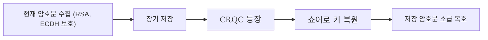

# Harvest Now Decrypt Later

> 공격자가 오늘의 암호문을 수집해 저장해 두었다가, 충분히 강력한 양자컴퓨터가 등장한 뒤에 소급해 복호하는 위협 모델.

## 핵심
Harvest Now Decrypt Later(HNDL)는 공격자가 암호를 지금 깨야 한다는 전제를 버린다. 대신 두 단계로 시간을 벌린다. 첫 단계에서 공격자는 공개망을 오가는 암호문과 키 교환 메시지를 가로채 그대로 장기 저장한다. 이때는 복호 능력이 없어도 무방하다. 둘째 단계에서 [[Cryptographically Relevant Quantum Computer|암호학적으로 유의미한 양자컴퓨터]](CRQC)가 등장하면, 저장해 둔 암호문을 꺼내 소급해 복호한다. 즉 오늘의 비밀이 미래의 계산 능력으로 깨진다.

이 위협이 성립하는 근거는 [[Shor's Algorithm|쇼어 알고리즘]]이다. RSA와 타원곡선 같은 현행 공개키 암호는 정수 인수분해와 이산로그 문제의 난해성에 안전성을 둔다. 쇼어 알고리즘은 두 문제를 모두 다항 시간에 풀어내므로, CRQC가 도착하는 순간 과거에 그 공개키로 보호된 통신이 한꺼번에 노출된다. 특히 키 교환 단계에서 교환된 공개 파라미터를 함께 저장해 두면, 공격자는 세션 키를 복원해 그 세션의 본문 전체를 복호할 수 있다.

핵심은 노출 시점이 미래가 아니라 수집 시점이라는 점이다. 어떤 데이터가 오늘 수집되어 저장되었다면, 그 데이터의 보안 수명이 CRQC 도래보다 길게 남아 있는 한 이미 위협받는 상태다. 이 노출 창의 개폐 조건을 정량화한 것이 [[Mosca's Inequality|모스카 부등식]]이다.

$$ X + Y > Z $$

여기서 $X$는 데이터가 비밀로 유지되어야 하는 기간, $Y$는 조직이 PQC로 전이하는 데 걸리는 기간, $Z$는 CRQC가 등장하기까지 남은 기간이다. $X + Y > Z$가 성립하면 지금 전이를 시작해도 이미 늦다. 보호 대상이 여전히 비밀이어야 하는 동안 CRQC가 먼저 도착하기 때문이다. HNDL은 바로 이 $X$가 큰 자산, 즉 수십 년 단위로 비밀이어야 하는 자산을 가장 먼저 위험에 빠뜨린다.

## 흐름

## 왜 중요한가
HNDL은 전이의 시급성을 미래가 아닌 현재의 문제로 끌어온다. CRQC가 아직 없다는 사실은 위안이 되지 못한다. 수집과 저장은 이미 일어날 수 있고, 복호만 CRQC의 도래를 기다리기 때문이다. 그래서 NIST IR 8547을 비롯한 전이 지침은 CRQC 출현 시점의 불확실성과 무관하게 지금 전환을 시작해야 한다고 강조한다.

방어의 핵심은 노출 창이 열리기 전에 암호문을 양자 내성 방식으로 보호하는 것이다. 전이기에는 단독 PQC 배치보다 [[Hybrid Key Exchange|하이브리드 키 교환]]으로 고전 알고리즘과 PQC를 병합해 배치하는 편이 권장된다. 두 방식 중 하나라도 안전하면 세션 키가 보호되므로, 오늘 수집된 암호문이 미래에 복호될 가능성을 설계 단계에서 차단한다.

이 위협은 영신뢰(Zero-Trust)와 격리 우선 보안 원칙과도 맞닿는다. 신뢰를 전제하지 않고 데이터의 전 수명 주기에 걸친 노출을 가정해야, 오늘 수집되어 미래에 복호될 경로를 사전에 끊을 수 있다. 위협의 현재 노출 정도와 CRQC 시점 추정을 지속 관리하는 책임은 [[양자 위협 정세 감시]] 영역이 맡는다.

## 연결
- [[MOC - Post-Quantum Cryptography]] 이 개념이 속한 도메인 지도이자 위협과 전이 전략 항목의 소급 위협 노드
- [[양자 위협 정세 감시]] HNDL 노출 창과 CRQC 시점을 지속 평가하는 관리 영역
- [[Mosca's Inequality]] 노출 창의 개폐 조건 $X + Y > Z$를 정량화하는 부등식
- [[Cryptographically Relevant Quantum Computer]] 소급 복호를 가능케 하는 위협 기준 능력
- [[Shor's Algorithm]] 저장된 공개키 암호문을 복호 가능하게 만드는 근본 알고리즘
- [[Hybrid Key Exchange]] 노출 창이 열리기 전 암호문을 보호하는 전이기 대응 방식
