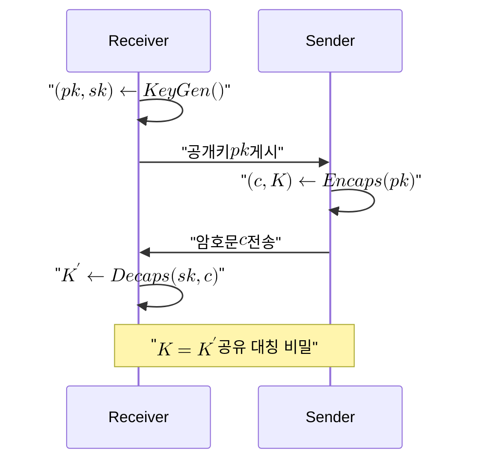

# Key Encapsulation Mechanism

> 공개키로 무작위 대칭 비밀을 캡슐화한 암호문을 만들고 대응하는 비밀키로 같은 비밀을 복원하는 일반 메커니즘으로, 능동 공격에도 견디는 IND-CCA2 안전성을 목표로 한다.

## 핵심

키 캡슐화 메커니즘(KEM)은 신뢰할 수 없는 공개망에서 두 주체가 같은 대칭 비밀을 안전하게 나눠 갖기 위한 추상 인터페이스다. 핵심은 "교환"이 아니라 "캡슐화"라는 점이다. 전통적 키 합의는 양측이 각자 기여분을 주고받아 비밀을 함께 만들지만, KEM에서는 한쪽이 무작위로 비밀을 생성하고 그것을 상대의 공개키로 봉인해 보낸다. 받는 쪽은 자신만 가진 비밀키로 봉인을 풀어 같은 값을 얻는다. 이 비대칭성 덕분에 KEM은 공개키 암호의 일반화된 모듈로 쓰이며, 격자, 코드, 동종사상 등 어떤 수학적 토대 위에서도 동일한 형태로 정의할 수 있다.

KEM은 세 알고리즘으로 구성된다. 키 생성 $\mathsf{KeyGen}$ 은 공개키와 비밀키 쌍을 만든다. 캡슐화 $\mathsf{Encaps}$ 는 공개키를 입력받아 암호문과 대칭 키를 함께 출력한다. 복호 $\mathsf{Decaps}$ 는 비밀키와 암호문으로부터 같은 대칭 키를 복원한다.

$$ (pk, sk) \leftarrow \mathsf{KeyGen}() $$

$$ (c, K) \leftarrow \mathsf{Encaps}(pk) $$

$$ K' \leftarrow \mathsf{Decaps}(sk, c) $$

정상 동작에서는 $K = K'$ 가 성립한다. 여기서 결정적으로 중요한 차이가 드러난다. 캡슐화는 봉인할 비밀 $K$ 를 함수가 내부에서 직접 뽑아낸다는 점이다. 송신자가 임의의 평문을 골라 암호화하는 일반 공개키 암호(PKE)와 달리, KEM은 송신자조차 비밀을 미리 지정하지 않고 메커니즘이 생성한다. 그 결과 KEM은 작고 무작위적인 비밀 하나만 안전하게 전달하면 되므로 인터페이스가 단순해지고, 전달된 $K$ 는 곧바로 AES 같은 대칭 암호의 세션 키로 쓰인다. 흔히 KEM과 대칭 암호를 묶어 KEM/DEM 구성이라 부르며, KEM이 키를, DEM(Data Encapsulation Mechanism)이 실제 데이터를 책임진다.

KEM이 노리는 보안 수준은 IND-CCA2, 즉 적응적 선택 암호문 공격에 대한 구별 불가능성이다. 공격자가 자신이 고른 다른 암호문들에 대해 복호 결과를 관찰할 수 있는 강한 상황에서도, 실제 캡슐화된 키와 균등 난수를 구별하지 못해야 한다. 적격 공격자 $\mathcal{A}$ 의 우위는 보안 매개변수 $\lambda$ 에 대해 무시 가능한 함수로 제한된다.

$$ \mathrm{Adv}^{\text{IND-CCA2}}_{\mathcal{A}}(\lambda) \le \mathsf{negl}(\lambda) $$

실제 설계는 두 단계를 거친다. 먼저 기반 난해 문제 위에서 비교적 약한 IND-CPA 안전 공개키 암호를 세우고, 이후 [[Fujisaki-Okamoto Transform|후지사키 오카모토 변환]]을 적용해 IND-CCA2 KEM으로 끌어올린다. 이 변환은 복호 과정에서 받은 암호문을 다시 캡슐화해 보고 일치하는지 검증하는 재암호화 검사를 넣어, 변조된 암호문을 거부하고 선택 암호문 공격을 차단한다. 격자 기반 KEM에서는 이 변환이 사실상 표준 도구다.

또 하나 KEM의 실용적 특성은 정확성이다. 격자 계열 KEM은 작은 오차 항이 누적되면 드물게 복호가 어긋나 $K \ne K'$ 가 될 수 있다. 그래서 표준은 복호 실패 확률을 무시 가능한 수준으로 억눌러 정확성과 안전성을 동시에 보장하도록 매개변수를 잡는다.

## 흐름

## 왜 중요한가

KEM은 인터넷 보안의 가장 아래층인 키 합의를 추상화한 부품이다. 오늘날 TLS, SSH, IPsec 같은 프로토콜은 세션마다 대칭 키 하나를 안전하게 세우는 일에 의존하는데, KEM은 바로 그 작업을 모듈화해 어떤 수학적 토대로든 갈아끼울 수 있게 만든다. 이 교체 가능성이 양자 내성 전환의 핵심이다. 기존의 디피 헬만 계열 키 교환은 [[Shor's Algorithm|쇼어 알고리즘]]을 갖춘 [[Cryptographically Relevant Quantum Computer|CRQC]] 앞에서 무너지지만, KEM이라는 동일한 인터페이스 뒤로 격자 기반 같은 양자 내성 알고리즘을 넣으면 상위 프로토콜을 크게 바꾸지 않고도 토대를 바꿀 수 있다.

NIST가 첫 양자 내성 표준으로 KEM을 골라 [[Kyber (ML-KEM)|Kyber]](FIPS 203)로 확정한 것도 이 위치 때문이다. Kyber는 [[Module-LWE|모듈 학습 오차]] 문제 위에 세운 구체적 KEM 인스턴스이며, KEM은 그 일반형이다. 따라서 KEM이라는 추상 계층을 이해하면, 격자 가정이 흔들릴 때를 대비해 코드 기반 [[HQC]] 같은 다른 인스턴스로 교체하는 것이 왜 자연스러운지 알 수 있다. KEM은 알고리즘이 아니라 자리이고, 그 자리에 무엇을 끼울지가 곧 [[Crypto-Agility|암호 민첩성]]의 문제가 된다.

전이기에는 KEM을 단독으로 쓰기보다 기존 키 교환과 병합하는 것이 권장된다. 양자 내성 가정에 대한 검증이 아직 누적되는 중이므로, 두 KEM의 출력을 결합한 [[Hybrid Key Exchange|하이브리드 키 교환]]으로 묶어 어느 한쪽이 깨져도 다른 쪽이 비밀을 떠받치게 한다. KEM의 인터페이스가 단순하고 합성하기 좋다는 성질이 이런 하이브리드 구성을 손쉽게 만들어 준다.

## 연결

- [[MOC - Post-Quantum Cryptography]] 이 개념이 속한 PQC 도메인의 상위 지도이자 진입점
- [[Kyber (ML-KEM)]] KEM 추상 인터페이스를 모듈 격자 위에서 구현한 대표 표준(FIPS 203)
- [[Module-LWE]] 대표 KEM 인스턴스인 Kyber의 안전성을 떠받치는 격자 난해 문제
- [[Fujisaki-Okamoto Transform]] IND-CPA 암호를 IND-CCA2 KEM으로 끌어올리는 표준 변환 도구
- [[Hybrid Key Exchange]] 전이기에 KEM을 기존 키 교환과 병합해 안전 마진을 확보하는 배치 방식
- [[HQC]] 격자 가정을 보완하는 코드 기반의 또 다른 KEM 인스턴스
- [[Crypto-Agility]] KEM이라는 자리에 끼울 알고리즘을 비용 없이 교체하게 하는 설계 원칙
- [[Shor's Algorithm]] 기존 키 교환을 파훼해 양자 내성 KEM으로의 전환을 촉발하는 위협
