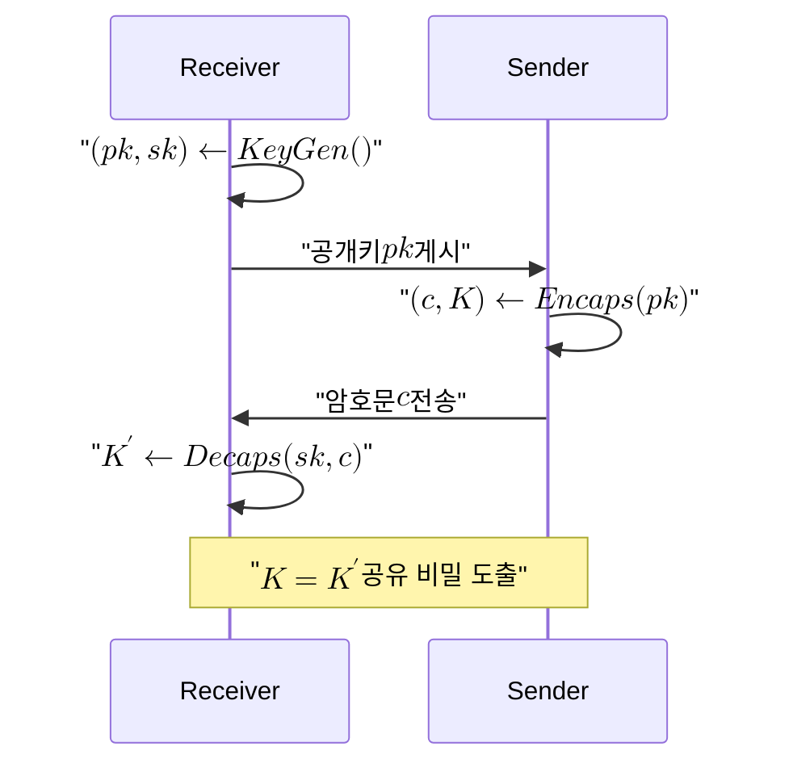

# Kyber (ML-KEM)

> 모듈 격자 학습 오차(Module-LWE) 문제의 난해성에 보안을 두는 IND-CCA2 안전 키 캡슐화 메커니즘으로, NIST가 FIPS 203(ML-KEM)으로 표준화한 첫 양자 내성 KEM이다.

## 핵심

Kyber는 공개망에서 두 통신 주체가 같은 대칭 비밀을 안전하게 공유하기 위한 [[Key Encapsulation Mechanism|KEM]]이다. 키 교환이 아니라 캡슐화라는 점이 중요하다. 수신자가 공개키를 게시하면, 송신자는 그 공개키로 무작위 대칭 키를 캡슐화한 암호문을 만들어 보내고, 수신자는 자신의 비밀키로 같은 대칭 키를 복원한다. 결과적으로 양측은 외부에 노출되지 않은 공유 비밀을 얻는다.

보안의 뿌리는 [[Module-LWE|모듈 학습 오차 문제]]의 난해성이다. 다항식 환 $R_q = \mathbb{Z}_q[x] / (x^n + 1)$ 위에서 정의된 모듈에 작은 오차 $\mathbf{e}$를 더한 샘플

$$ \mathbf{t} = \mathbf{A}\,\mathbf{s} + \mathbf{e} \pmod{q} $$

이 주어졌을 때, 비밀 $\mathbf{s}$를 복원하거나 균등 난수와 구별하는 일이 고전 컴퓨터와 양자컴퓨터 양쪽에서 모두 어렵다고 여겨진다. 이 가정 위에서 IND-CPA 안전한 공개키 암호를 세우고, [[Fujisaki-Okamoto Transform|후지사키 오카모토 변환]]을 적용해 능동 공격까지 막는 IND-CCA2 KEM으로 끌어올린다. 적격 공격자 $\mathcal{A}$의 우위는

$$ \mathrm{Adv}^{\text{IND-CCA2}}_{\mathcal{A}}(\lambda) \le \mathsf{negl}(\lambda) $$

수준으로 제한된다고 본다. 매개변수는 보안 강도에 따라 ML-KEM-512, ML-KEM-768, ML-KEM-1024 세 집합으로 나뉘며, 각각 NIST 보안 범주 1, 3, 5에 대응한다. 일반 권고 기본값은 ML-KEM-768이다.

복호화가 드물게 실패할 수 있다는 점도 격자 KEM의 특징이다. 오차 항이 누적되어 임계치를 넘으면 복원이 어긋날 수 있는데, FIPS 203은 이 복호화 실패 확률을 $2^{-138}$ 이하로 무시 가능하게 설계해 실용 안전성과 정확성을 함께 확보한다.

## 흐름

## 왜 중요한가

[[Shor's Algorithm|쇼어 알고리즘]]은 충분히 강력한 양자컴퓨터에서 RSA와 타원곡선 같은 기존 공개키 암호를 다항 시간에 무너뜨린다. 그 결과 인터넷의 키 합의 계층 전체가 [[Cryptographically Relevant Quantum Computer|CRQC]] 등장 이후 위태로워진다. Kyber는 이 위협에 대응해 NIST가 표준화한 첫 KEM이며, 전이의 사실상 기본 부품이 되었다.

다만 전이기에는 단독 배치가 권장되지 않는다. 격자 가정이라는 새 토대에 대한 검증이 누적되는 중이므로, 고전 알고리즘과 PQC를 동시에 만족시켜야 깨지는 [[Hybrid Key Exchange|하이브리드]] 형태로 묶어 어느 한쪽이 무너져도 다른 쪽이 보안을 떠받치게 한다. 실제 배치에서는 X25519와 ML-KEM-768을 병합한 X25519MLKEM768이 TLS 1.3 표준 조합으로 자리 잡았다. 이 모든 전이를 지속 관리하는 책임이 [[PQC 전이 감시]] 영역이며, Kyber는 그 영역의 전이 1순위 KEM이다.

또한 표준 KEM이 더 이상 단일점이 아니라는 점도 의의가 크다. 격자 가정 하나에 모든 것을 걸지 않도록 코드 기반 [[HQC]]가 수학적 백업으로 추가되어, ML-LWE 계열이 흔들려도 대체 경로가 남는다. [[Crypto-Agility|암호 민첩성]]을 갖춘 시스템이라면 이런 알고리즘 교체를 큰 비용 없이 흡수할 수 있다.

## 연결

- [[MOC - Post-Quantum Cryptography]] 이 개념이 속한 PQC 도메인의 상위 지도이자 진입점
- [[PQC 전이 감시]] Kyber를 전이 1순위 KEM으로 추적하고 배치를 관리하는 Area
- [[Module-LWE]] Kyber 안전성의 수학적 기반이 되는 격자 난해 문제
- [[Hybrid Key Exchange]] 전이기에 고전 키 교환과 Kyber를 병합하는 권장 배치 방식
- [[Dilithium (ML-DSA)]] 같은 격자 계열의 서명 표준(FIPS 204)으로 KEM과 서명에서 짝을 이룸
- [[HQC]] 격자 가정을 보완하는 코드 기반 KEM 백업
- [[Shor's Algorithm]] Kyber가 대체하려는 위협, 기존 공개키를 다항 시간에 파훼
- [[Crypto-Agility]] Kyber와 후속 알고리즘 사이의 교체를 가능케 하는 설계 원칙
- [[Key Encapsulation Mechanism]] Kyber가 구현하는 캡슐화 기반 키 확립의 일반 정의
- [[Fujisaki-Okamoto Transform]] IND-CPA 격자 암호를 IND-CCA2 KEM으로 끌어올리는 데 쓰는 변환
