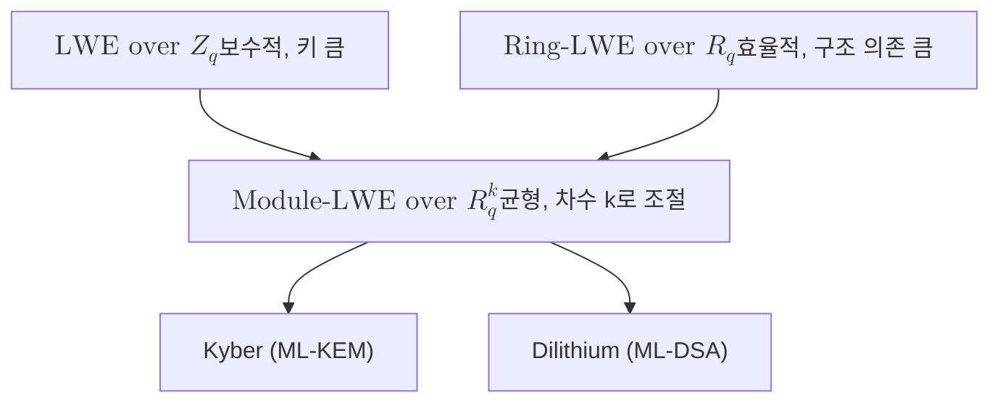

# Module-LWE

> 다항식 환 위의 작은 벡터로 일반화한 오류 학습(LWE) 문제로, 작은 오차가 섞인 선형 관계로부터 비밀 벡터를 복원하기 어렵다는 격자 난해성에 기반하며 Kyber와 Dilithium의 안전성 근거다.

## 핵심
Module-LWE는 격자 기반 암호의 핵심 난제인 오류 학습(Learning With Errors, LWE)을 다항식 환의 모듈 구조 위로 옮겨 효율과 안전성의 균형을 맞춘 문제다. 출발점인 평문 LWE는 정수 모듈러 환 $\mathbb{Z}_q$ 위에서 정의된다. 비밀 벡터 $\mathbf{s} \in \mathbb{Z}_q^n$ 와 무작위 행렬 $\mathbf{A}$, 그리고 좁은 분포에서 뽑은 작은 오차 $\mathbf{e}$ 에 대해 다음 형태의 표본이 주어진다.

$$ \mathbf{b} = \mathbf{A}\mathbf{s} + \mathbf{e} \pmod q $$

오차가 없다면 가우스 소거법으로 $\mathbf{s}$ 를 즉시 풀 수 있지만, 작은 오차 $\mathbf{e}$ 가 섞이는 순간 비밀 복원은 최악의 경우 격자 위 최단 벡터 문제(SVP)만큼 어려워진다고 믿어진다. 이것이 LWE의 난해성이며, 고전 컴퓨터와 양자컴퓨터 양쪽에서 효율적 해법이 알려져 있지 않다.

평문 LWE는 안전하지만 행렬 $\mathbf{A}$ 가 통째로 무작위라 키와 연산 비용이 크다. 이를 줄이려고 환(ring) 구조를 도입한 것이 Ring-LWE다. 여기서는 원소가 정수가 아니라 다항식 환 $R_q = \mathbb{Z}_q[x]/(x^n + 1)$ 의 원소이며, 하나의 다항식이 $n$ 개의 계수를 담아 표현이 압축되고 고속 푸리에 변환(NTT)으로 곱셈을 가속할 수 있다. 다만 Ring-LWE는 환 하나에 구조를 강하게 의존하므로, 그 환에 특화된 공격 가능성에 대한 우려가 남는다.

Module-LWE는 이 둘 사이의 절충이다. 스칼라 대신 $R_q$ 위의 작은 차원 $k$ 모듈을 사용한다. 비밀과 오차는 $R_q^k$ 의 원소이고 행렬 $\mathbf{A}$ 는 $R_q^{k \times k}$ 위에서 정의되어 다음과 같이 쓴다.

$$ \mathbf{b} = \mathbf{A}\mathbf{s} + \mathbf{e}, \qquad \mathbf{A} \in R_q^{k\times k},\ \mathbf{s}, \mathbf{e} \in R_q^{k} $$

모듈 차수 $k$ 를 키울수록 평문 LWE에 가까운 보수적 구조가 되고, $k$ 를 줄일수록 Ring-LWE의 효율에 가까워진다. 보안 강도를 매개변수 $k$ 하나로 조절하면서 동일한 환 $R_q$ 와 동일한 NTT 구현을 재사용할 수 있다는 점이 Module-LWE의 실용적 강점이다. Kyber가 ML-KEM-512, 768, 1024 세 등급을 같은 코드로 제공할 수 있는 이유가 바로 이 모듈 차수 조절에 있다.

## 구조

## 왜 중요한가
[[Shor's Algorithm|쇼어 알고리즘]]은 RSA와 타원곡선 암호가 의존하는 정수 인수분해와 이산로그를 다항 시간에 푼다. Module-LWE의 난해성은 이런 주기 찾기 구조에 환원되지 않으므로, 충분히 강력한 양자컴퓨터 앞에서도 견딘다고 여겨진다. 그래서 NIST는 격자 기반 표준의 수학적 토대로 Module-LWE를 채택했다. 키 캡슐화 표준 [[Kyber (ML-KEM)|Kyber]](FIPS 203)는 Module-LWE에, 디지털 서명 표준 [[Dilithium (ML-DSA)|Dilithium]](FIPS 204)은 Module-LWE와 Module-SIS(Module Short Integer Solution)에 안전성을 둔다. Module-LWR은 Saber 같은 다른 후보의 가정이며 이 두 표준에는 쓰이지 않는다.

Module-LWE의 가치는 단순한 난해성을 넘어 공학적 견고함에 있다. 평문 LWE의 보수성과 Ring-LWE의 효율 사이에서 매개변수 하나로 보안 등급을 조절하면서, 잘 정의된 환에서 NTT 가속을 활용해 빠른 구현을 얻는다. 이 균형 덕분에 격자 기반 암호가 실험실 제안을 넘어 실제 표준으로 자리잡을 수 있었다. 전이기에는 단독 배치보다 기존 알고리즘과의 [[Hybrid Key Exchange|하이브리드]] 형태로 함께 쓰여, Module-LWE 가정이 예기치 못한 공격을 받더라도 고전 알고리즘이 안전 마진을 제공하도록 설계하는 것이 권장된다.

## 연결
- [[MOC - Post-Quantum Cryptography]] 이 개념이 속한 PQC 도메인의 상위 지도이자 진입점
- [[Kyber (ML-KEM)]] Module-LWE 난해성에 안전성을 두는 KEM 표준(FIPS 203)
- [[Dilithium (ML-DSA)]] 같은 Module-LWE 계열 위에 세워진 서명 표준(FIPS 204)
- [[Shor's Algorithm]] 기존 공개키를 파훼하지만 Module-LWE에는 적용되지 않는 양자 위협
- [[Hybrid Key Exchange]] Module-LWE 가정의 위험을 줄이려 고전 알고리즘과 병합하는 전이기 배치
