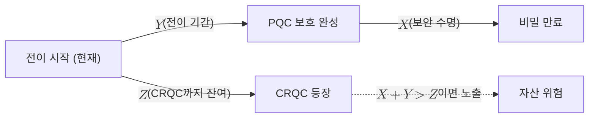

# Mosca's Inequality

> 데이터의 보안 수명과 PQC 전이 기간의 합이 CRQC 도래까지 남은 기간을 초과하면 그 자산은 이미 위험하다는, 양자 전이 시급성을 정량화하는 부등식.

## 핵심
Mosca 부등식은 Michele Mosca가 정식화한 판단 도구로, 세 시간 변수만으로 어떤 자산이 양자 위협에 노출되는지를 가른다. 노출 조건은 다음과 같이 표현된다.

$$ X + Y > Z $$

세 변수의 의미는 이렇다.

- $X$는 데이터가 비밀로 유지되어야 하는 기간, 즉 보안 수명이다.
- $Y$는 조직이 [[Hybrid Key Exchange|하이브리드]]를 거쳐 PQC로 전이를 완료하는 데 걸리는 기간이다.
- $Z$는 [[Cryptographically Relevant Quantum Computer|CRQC]]가 등장하기까지 남은 기간이다.

직관은 단순하다. 지금 전이를 시작하면 $Y$년 뒤에 보호가 완성되고, 그 시점부터 다시 $X$년 동안 비밀이 유지되어야 한다. 그런데 그 사이에 CRQC가 도착하면, 즉 $Z$가 $X + Y$보다 작으면, 보호가 끝나기 전에 위협이 먼저 닿는다. 따라서 $X + Y > Z$가 성립하는 순간 그 자산은 전이를 지금 시작하더라도 이미 늦은 상태다.

부등식이 주는 가장 날카로운 통찰은 위협이 CRQC 도래 시점이 아니라 그보다 훨씬 이른 시점부터 작동한다는 점이다. $X$가 큰 장기 비밀일수록 노출 조건을 먼저 충족하므로, [[Harvest Now Decrypt Later|지금 수집해 나중에 복호]] 공격의 대상이 된다. CRQC가 아직 없어도 오늘 수집된 암호문이 미래에 복호될 수 있기 때문에, 보안 수명이 긴 자산은 현재 시점에서 이미 위험 판정을 받는다.

## 흐름

## 왜 중요한가
양자 전이 논쟁은 흔히 "CRQC가 언제 오는가"라는 단일 질문으로 흐른다. Mosca 부등식은 이 질문을 세 변수로 분해해, 도래 시점이 불확실하더라도 의사결정이 가능하게 만든다. $Z$가 분포로만 추정되는 상황에서도 보수적인 이른 도래 시나리오를 $Z$에 넣으면 시급성을 정량적으로 판단할 수 있다.

이 부등식은 [[NIST IR 8547]] 같은 전이 일정 문서와 다수의 PQC 전환 가이드에서 시급성 산정의 표준 골격으로 쓰인다. 실무에서는 세 변수를 각각 살아 있는 추정으로 관리해야 한다. $X$는 자산별 보안 수명 산정에서, $Y$는 대응 측의 전이 진척에서, $Z$는 하드웨어 로드맵에서 갱신되며, 이 세 입력이 모이는 지속 관리 책임이 [[양자 위협 정세 감시]] 영역이다. 부등식이 시급성을 알려주면, 실제 대응은 알고리즘 교체를 빠르게 만드는 [[Crypto-Agility]] 설계와 전이기 [[Hybrid Key Exchange|하이브리드]] 배치로 이어진다.

## 연결
- [[MOC - Post-Quantum Cryptography]] 이 개념이 속한 도메인 지도이자 전이 전략의 진입점
- [[Harvest Now Decrypt Later]] $X$가 큰 장기 비밀이 CRQC 이전에도 노출되는 이유를 부등식이 설명
- [[Cryptographically Relevant Quantum Computer]] 부등식의 $Z$를 정하는 위협 기준
- [[양자 위협 정세 감시]] 부등식의 세 변수를 지속적으로 산정하고 갱신하는 책임 영역
- [[PQC 전이 감시]] 부등식의 $Y$(전이 기간)를 담당하는 대응 측 영역
- [[Crypto-Agility]] 부등식이 위험을 알린 뒤 $Y$를 줄이는 전이 설계 원칙
