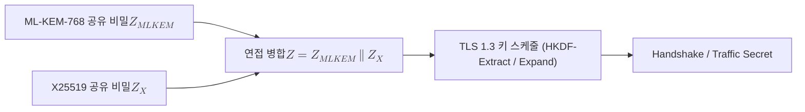

# X25519MLKEM768

> TLS 1.3에서 X25519 타원곡선 키 교환과 ML-KEM-768 격자 KEM을 함께 수행하고 두 공유 비밀을 이어 붙여 하나의 키 교환 입력으로 병합하는 하이브리드 지명 그룹이다.

## 핵심

X25519MLKEM768은 TLS 1.3 핸드셰이크의 `supported_groups` 협상 목록에 등장하는 하나의 코드포인트로, 두 가지 키 합의 방식을 한 번에 묶는다. 한쪽은 Curve25519 위의 [[ECDH]]인 X25519이고, 다른 한쪽은 모듈 격자 문제에 기반한 [[Kyber (ML-KEM)|ML-KEM-768]]이다. 이 그룹은 [[Hybrid Key Exchange]]를 TLS 위에 구체화한 결과물로, 고전 가정과 양자 내성 가정을 동시에 깔아 두어 어느 한쪽이 무너져도 세션이 살아남게 한다.

핸드셰이크에서 클라이언트는 두 방식의 공개 정보를 하나의 `key_share`에 연접해 보낸다. X25519의 32바이트 공개키가 앞에 오고 ML-KEM-768의 1184바이트 공개키(캡슐화 키)가 뒤에 붙는다. 서버는 X25519 쪽에서는 자신의 공개키를 만들어 응답하고, ML-KEM 쪽에서는 클라이언트의 캡슐화 키로 암호문을 만들어 보낸다. 양측은 각자 두 개의 공유 비밀을 얻는다.

연접 병합의 규칙은 단순하다. 두 공유 비밀을 비트열로 그대로 이어 붙인다.

$$
Z = Z_{\mathrm{MLKEM768}} \,\|\, Z_{\mathrm{X25519}}
$$

여기서 $Z_{\mathrm{MLKEM768}}$은 ML-KEM 캡슐화로 얻은 32바이트, $Z_{\mathrm{X25519}}$는 32바이트이며, 병합 결과 $Z$는 64바이트가 된다. 이 그룹의 정의에서 ML-KEM 비밀을 X25519 비밀보다 앞에 두도록 순서를 명시한 점이 중요하다. NIST SP 800-56C가 두 공유 비밀을 결합할 때 FIPS 승인 방식의 비밀을 먼저 두라고 요구하므로, FIPS 승인 대상인 ML-KEM 비밀이 앞에 온다. 순서가 고정되어 있어야 양측이 동일한 입력을 재현한다.

병합된 $Z$는 TLS 1.3 키 스케줄로 그대로 전달된다. TLS의 키 스케줄 자체가 [[HKDF]] 기반의 추출과 확장으로 이루어져 있으므로, 별도의 KDF 전처리 없이 연접한 비밀을 `(EC)DHE` 입력 자리에 넣는다. 즉 키 유도 흐름은 다음과 같이 이어진다.

이 연접 방식이 안전한 이유는 키 결합기로 쓰이는 HKDF의 추출 단계가 임의 길이 입력을 균일한 의사난수 키로 압축하기 때문이다. 두 공유 비밀 중 하나라도 공격자에게 알려지지 않은 충분한 엔트로피를 가지면, 결합 결과 역시 예측 불가능하다. 이것이 하이브리드 결합기가 가져야 할 핵심 성질로, 두 입력 중 강한 쪽의 보안을 그대로 물려받는다.

ML-KEM-768은 [[Kyber (ML-KEM)|ML-KEM]] 패밀리에서 NIST 보안 범주 3에 해당하는 매개변수 집합이고, X25519는 고전 환경에서 약 128비트 보안을 제공한다. 두 방식의 보안 수준을 비슷한 급으로 맞춘 조합이라 실무 배치의 기본값으로 널리 선택된다.

## 왜 중요한가

X25519MLKEM768은 PQC 전이의 첫 단계가 실제 인터넷 트래픽에 어떻게 안착했는지를 보여 주는 대표 사례다. 주요 브라우저와 서버, CDN이 이 그룹을 기본 또는 우선 협상 대상으로 채택하면서, 현재 상당량의 TLS 세션이 이미 양자 내성 요소를 품고 동작한다.

이 선택의 동기는 [[Harvest Now Decrypt Later]] 위협이다. 공격자가 지금 암호문을 저장해 두었다가 미래의 양자 컴퓨터로 해독하려는 시나리오에서, 순수 X25519 세션은 키 합의 비밀이 [[ECDH|타원곡선 이산로그]] 문제 하나에만 의존하므로 통째로 노출될 위험이 있다. 반면 ML-KEM-768을 병합해 두면 기록된 트래픽을 미래에 해독하려 해도 격자 문제를 추가로 깨야 하므로 장기 기밀성이 확보된다.

동시에 이 그룹은 즉시 ML-KEM 단독으로 갈아타지 않는 신중함을 담는다. ML-KEM은 표준화된 지 얼마 되지 않아 구현 결함이나 예기치 못한 분석 진전의 여지가 남아 있다. X25519를 함께 두면 ML-KEM에 문제가 생겨도 검증된 고전 알고리즘이 하한선을 떠받친다. 따라서 이 그룹은 보안의 하한을 낮추지 않으면서 양자 위협에 대한 상한 방어를 더하는, 전이기 특유의 절충을 한 코드포인트에 압축한 것이다.

## 연결

- [[Hybrid Key Exchange]] 이 그룹이 구체화하는 일반 원리로, 고전 가정과 양자 내성 가정을 병합해 한쪽 붕괴에 대비하는 전이 전략
- [[Kyber (ML-KEM)]] 그룹의 양자 내성 절반을 담당하는 격자 KEM이며, 여기서 쓰는 ML-KEM-768 매개변수 집합의 모체
- [[ECDH]] 그룹의 고전 절반인 X25519가 따르는 타원곡선 키 합의 방식으로, 검증된 하한 보안을 제공
- [[HKDF]] 연접한 두 공유 비밀을 단일 세션 키로 추출하고 확장하는 TLS 1.3 키 스케줄의 결합기
- [[Harvest Now Decrypt Later]] 이 그룹이 막으려는 핵심 위협으로, 지금 저장한 트래픽을 미래에 해독하려는 시나리오
- [[Module-LWE]] ML-KEM-768의 양자 내성을 떠받치는 하부 격자 문제
