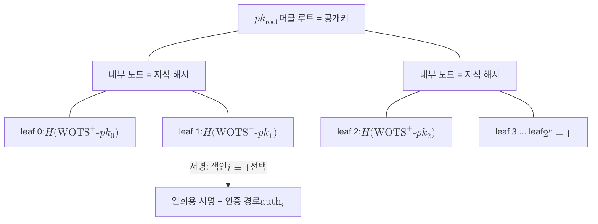

# XMSS

> [[WOTS+]] 일회용 서명들을 머클 트리 하나로 묶어 다회 서명을 가능하게 한 상태 기반(stateful) 해시 서명 메커니즘으로, IETF RFC 8391로 규격화되었다.

## 핵심
XMSS의 출발점은 일회용 서명이 가진 근본 한계다. [[WOTS+]] 같은 일회용 서명(OTS)은 키 한 쌍으로 단 한 번만 안전하게 서명할 수 있어, 같은 키로 두 번째 메시지를 서명하는 순간 비밀키가 노출된다. XMSS는 이 일회용 키를 $2^h$개 미리 만든 뒤, 각 키의 공개 부분을 잎(leaf)으로 삼아 이진 머클 트리(Merkle tree)로 압축한다. 트리의 최상단 루트 하나가 전체 공개키가 되므로, 수많은 일회용 공개키를 단 하나의 짧은 값으로 대표하게 된다.

서명할 때는 아직 쓰지 않은 잎 색인 $i$를 하나 골라 그 위치의 일회용 키로 메시지를 서명하고, 그 잎이 루트로 올라가는 경로를 함께 제시한다. 이 경로가 인증 경로(authentication path)이며, 잎에서 루트까지 올라가는 길에 형제 노드 해시 $h$개를 모은 것이다. 검증자는 색인 $i$의 일회용 공개키와 인증 경로를 차례로 해시해 루트를 재구성하고, 그 값이 공개키로 박힌 루트와 같은지 확인한다. 검증 관계는 다음으로 환원된다.

$$ \mathrm{Verify}(pk, m, \sigma) = 1 \iff \mathsf{Root}_{\text{recomputed}}\big(i, \mathrm{WOTS}^+\!\text{-}pk_i, \text{auth}_i\big) = pk_{\text{root}} $$

여기서 결정적인 제약이 드러난다. 같은 잎 색인을 두 번 쓰면 그 자리의 [[WOTS+]] 키가 재사용되어 안전성이 무너진다. 따라서 서명자는 어디까지 색인을 소비했는지를 반드시 기억해야 한다. 이 사용 색인이 곧 상태(state)이며, XMSS가 상태 기반 서명으로 분류되는 이유다. 색인을 안전하게 증가시키고 영속화하는 책임은 전적으로 구현체에 있다. 키를 백업했다가 복원하거나, 같은 키를 여러 장비에 복제하면 색인 충돌로 같은 잎을 재사용할 위험이 생긴다. 이 운영상의 위험성 때문에 [[NIST SP 800-208]]은 상태 기반 서명의 적용을 펌웨어 서명처럼 상태 관리가 통제되는 환경으로 한정한다.

보안 강도는 트리와 [[WOTS+]]가 공유하는 기반 해시 함수의 출력 길이 $n$에 직접 묶인다. XMSS는 충돌 저항성 대신 다중 타겟 제2 원상 저항성에 안전성을 환원하도록 설계되어, 충돌 공격이 해시를 위협해도 견디는 보수성을 갖는다. 양자 공격자가 [[Grover's Algorithm|그로버 알고리즘]]으로 원상을 탐색해도 비용은 $O(2^{n/2})$ 수준이므로 매개변수는 이 제곱근 가속까지 흡수하도록 잡는다. 한 키쌍이 감당하는 서명 수는 트리 높이 $h$로 정해지며 정확히 $2^h$개로 유한하다는 점도 일회용 서명의 본성을 그대로 물려받은 특징이다.

## 구조

## 왜 중요한가
XMSS는 양자 내성 서명 가운데 안전성 가정이 가장 단순하고 보수적인 축에 속한다. [[Shor's Algorithm|쇼어 알고리즘]]이 RSA와 타원곡선 서명을 다항 시간에 무너뜨리는 위협 아래에서, XMSS는 격자나 코드 같은 구조화된 난해성 가정에 전혀 기대지 않고 오직 해시 함수의 안전성 하나에만 의존한다. 그래서 격자 계열의 [[Dilithium (ML-DSA)]]나 [[FN-DSA (Falcon)]]의 안전성 가정이 미래에 흔들리더라도 무너지지 않는 수학적 백업 역할을 한다. [[Crypto-Agility|암호 민첩성]] 관점에서 독립 가정의 서명을 갖춰 두는 다양화 전략의 한 축인 셈이다.

또한 XMSS는 그 자체로 쓰이기도 하지만, 더 큰 구조의 부품으로서 의미가 크다. 무상태 서명인 [[SPHINCS+ (SLH-DSA)]]는 XMSS 트리를 여러 층으로 쌓은 [[Hypertree]]를 골격으로 삼는다. 즉 XMSS는 SPHINCS+의 각 서브트리를 이루는 기본 단위다. 두 방식의 갈림길은 상태 관리에 있다. XMSS는 사용 색인을 영속적으로 관리해야 하는 상태 기반이고, [[SPHINCS+ (SLH-DSA)]]는 색인을 의사난수로 선택해 상태 저장 부담을 없앤 무상태다. 상태 관리가 통제 가능한 폐쇄 환경에서는 XMSS가 더 짧은 서명과 빠른 검증으로 유리하고, 키 백업과 복제가 일어나는 일반 환경에서는 무상태 쪽이 안전하다. 이 트레이드오프가 두 표준을 함께 두는 이유다.

## 연결
- [[MOC - Post-Quantum Cryptography]] 이 개념이 속한 도메인 지도이자 상위 진입점
- [[SPHINCS+ (SLH-DSA)]] XMSS 트리를 서브트리로 재사용하는 무상태 해시 서명으로, 상태 관리 유무에서 갈리는 형제 표준
- [[WOTS+]] XMSS의 각 잎을 구성하는 일회용 서명 원시 함수
- [[Hypertree]] XMSS 트리를 다층으로 쌓아 서명 용량을 확장하는 상위 구조
- [[Grover's Algorithm]] 해시 기반 서명의 보안 강도 매개변수를 $O(2^{n/2})$로 결정짓는 양자 공격
- [[Crypto-Agility]] 독립 가정의 백업 서명을 갖춰 단일 가정 붕괴에 대비하는 설계 원칙
- [[NIST SP 800-208]] 상태 기반 해시 서명의 적용 범위와 운영 요건을 규정하는 표준 문헌(출처 노트 작성 지점)
