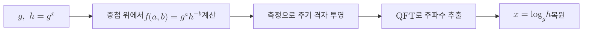

# Discrete Logarithm Problem

> 어떤 군에서 생성원의 거듭제곱이 주어진 원소와 같아지는 지수를 찾는 문제로, 고전적으로는 어렵지만 [[Shor's Algorithm|쇼어 알고리즘]]으로 다항 시간에 풀린다.

## 핵심

순환군 $G$와 그 생성원 $g$, 그리고 한 원소 $h \in G$가 주어졌을 때, 이산로그 문제는 다음을 만족하는 정수 지수 $x$를 찾는 것이다.

$$ g^x = h \quad \text{in } G $$

이때 $x = \log_g h$를 이산로그라 부른다. 정방향 계산인 $g^x$는 반복 제곱법으로 빠르게 수행되지만, 역방향인 지수 복원은 일반적인 큰 군에서 효율적인 고전 알고리즘이 알려져 있지 않다. 바로 이 비대칭성, 즉 한 방향은 쉽고 반대 방향은 어려운 일방향성이 공개키 암호의 토대가 된다.

문제의 난이도는 군의 선택에 따라 달라진다. 두 가지 대표 설정이 쓰인다.

- 유한체 곱셈군 위의 DLP. 큰 소수 $p$에 대해 $\mathbb{Z}_p^{\ast}$에서 $g^x \equiv h \pmod{p}$를 푸는 문제이며, 고전 공격에는 지수 계산법(index calculus) 계열의 준지수 시간 알고리즘이 존재한다.
- 타원곡선 군 위의 DLP(ECDLP). 타원곡선의 점 $P$에 대해 $xP = Q$를 만족하는 스칼라 $x$를 찾는 문제이며, 지수 계산법이 일반적으로 적용되지 않아 같은 보안 강도를 더 짧은 키로 달성한다.

고전 최선의 공격 비용은 군의 위수 $n$에 대해 다음과 같이 정리된다. 일반 군에서는 Pollard rho 같은 충돌 기반 방법이 한계이며, 이는 키 길이에 지수적인 부담을 준다.

$$ T_{\text{classical}} \approx O(\sqrt{n}) \quad \text{(generic group)} $$

이 비용이 충분히 크다는 가정이 [[Diffie-Hellman Key Exchange|디피헬만 키 교환]]과 [[ECDH]] 같은 프로토콜의 안전성 근거다. 공격자가 공개된 $g$와 $h$로부터 비밀 지수 $x$를 복원할 수 없어야 공유 비밀이 보호된다.

## 구조

이산로그 문제는 본질적으로 숨은 주기를 찾는 문제로 환원된다. 함수 $f(a, b) = g^a h^{-b}$를 생각하면, $h = g^x$이므로 $f$는 $(a, b)$ 격자 위에서 $a - bx \equiv 0 \pmod{n}$ 방향으로 주기성을 갖는다. 쇼어 알고리즘은 이 주기 구조를 [[Quantum Fourier Transform|양자 푸리에 변환]]으로 추출해 지수 $x$를 복원한다.

고전 영역에서 어려움을 주던 군의 크기는 양자 영역에서는 큐비트 수에 로그적으로만 영향을 미친다. 따라서 군을 키워 안전성을 높이는 고전적 전략이 양자 공격자 앞에서는 무력화된다.

## 왜 중요한가

이산로그 문제는 오늘날 인터넷 공개키 인프라의 큰 축을 떠받친다. TLS 핸드셰이크의 키 합의에 널리 쓰이는 ECDH, 디지털 서명의 ECDSA, 전통적인 디피헬만 합의가 모두 이 문제의 난해성에 안전성을 기대고 있다. RSA가 정수 인수분해에 기대듯, 타원곡선 암호 생태계 전반은 ECDLP에 기댄다.

문제는 [[Shor's Algorithm|쇼어 알고리즘]]이 인수분해뿐 아니라 이산로그도 다항 시간에 푼다는 점이다. 충분한 규모의 결함 허용 양자컴퓨터가 등장하면 위 군 기반 공개키들이 한꺼번에 무너진다. 이 위협은 지금 암호화되어 전송된 트래픽을 미리 수집해 두었다가 미래에 복호하는 [[Harvest Now Decrypt Later|수확 후 복호]] 시나리오와 결합해 현재진행형 위험이 된다. 그 결과 군 기반 가정에 의존하지 않는 [[MOC - Post-Quantum Cryptography|양자 내성 암호]]로의 전이가 핵심 과제로 떠올랐다.

## 연결

- [[Shor's Algorithm]] 이산로그 문제를 다항 시간에 푸는 양자 알고리즘으로, 이 노트가 다루는 난해성 가정을 직접 무너뜨린다
- [[Quantum Fourier Transform]] 쇼어 알고리즘이 숨은 주기를 추출하는 핵심 부품으로, 이산로그를 주기 찾기로 환원했을 때 해를 뽑아내는 도구다
- [[ECDH]] 타원곡선 위 이산로그 문제(ECDLP)의 난해성에 안전성을 거는 키 합의 프로토콜이다
- [[Diffie-Hellman Key Exchange]] 유한체 곱셈군 위 이산로그 난해성에 기댄 고전적 키 합의 방식이다
- [[Harvest Now Decrypt Later]] 지금 수집한 트래픽을 미래의 양자 공격으로 복호하는 위협으로, 이산로그 기반 암호의 전이를 시급하게 만든다
- [[MOC - Post-Quantum Cryptography]] 이산로그와 인수분해 가정을 대체하려는 양자 내성 암호 전반의 지도다
