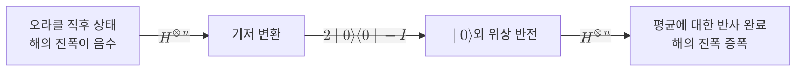

# Grover Diffusion Operator

> Grover 반복의 두 반사 가운데 균등 중첩 상태를 기준으로 모든 진폭을 평균값에 대해 뒤집어, 오라클이 표시한 해의 진폭을 키우는 연산자다.

## 핵심
확산 연산자는 [[Grover's Algorithm|그로버 알고리즘]]의 한 반복을 이루는 두 단계 중 두 번째 단계다. 첫 단계인 오라클이 해 $\lvert \omega \rangle$의 위상만 음수로 뒤집고 나면, 확산 연산자가 그 부호 변화를 진폭의 크기 차이로 바꾼다. 정의는 균등 중첩 상태 $\lvert s \rangle = \frac{1}{\sqrt{N}}\sum_{x} \lvert x \rangle$에 대한 반사로 주어진다.

$$ U_s = 2\lvert s \rangle\langle s \rvert - I $$

이 연산자가 "평균에 대한 반사"라고 불리는 이유는 계산기저에서 각 진폭에 미치는 작용을 보면 드러난다. 상태 $\sum_x a_x \lvert x \rangle$에 $U_s$를 적용하면 각 진폭은 전체 평균 $\bar{a} = \frac{1}{N}\sum_x a_x$를 축으로 뒤집힌다.

$$ a_x \;\longmapsto\; 2\bar{a} - a_x $$

즉 평균보다 작은 값은 평균 위로, 평균보다 큰 값은 평균 아래로 옮겨진다. 오라클을 거친 직후 해의 진폭은 음수이므로 평균에서 가장 멀리 떨어져 있고, 따라서 이 반사로 가장 크게 솟아오른다. 나머지 비해 항들은 평균 근처에 모여 있으므로 조금씩만 줄어든다. 두 효과가 합쳐져 해의 진폭만 선택적으로 증폭된다.

확산 연산자는 [[Hadamard Gate|아다마르 게이트]]를 써서 회로로 분해된다. $\lvert s \rangle = H^{\otimes n}\lvert 0 \rangle^{\otimes n}$이므로 $\lvert s \rangle\langle s \rvert = H^{\otimes n}\lvert 0 \rangle\langle 0 \rvert H^{\otimes n}$이고, 이를 대입하면 다음 분해가 나온다.

$$ U_s = H^{\otimes n}\,\bigl(2\lvert 0 \rangle\langle 0 \rvert - I\bigr)\,H^{\otimes n} $$

가운데의 $2\lvert 0 \rangle\langle 0 \rvert - I$는 $\lvert 0 \rangle^{\otimes n}$을 제외한 모든 기저 상태의 위상을 뒤집는 조건부 위상 반전이며, 다중 제어 게이트로 구현된다. 양옆을 아다마르 층이 감싸 기저를 옮겼다가 되돌리는 구조다. 부호를 통째로 바꾼 $-U_s = I - 2\lvert s \rangle\langle s \rvert$를 쓰기도 하는데, 전역 위상 차이만 있을 뿐 측정 확률은 동일하다.

## 구조

기하학적으로 확산 연산자는 해 부분공간과 비해 부분공간이 펼치는 2차원 평면 안에서 $\lvert s \rangle$ 축에 대한 반사다. 오라클의 위상 반전이 비해 축에 대한 반사이므로, 두 반사를 이어 적용하면 두 축 사이 각도의 두 배만큼의 회전이 된다. 이것이 한 번의 Grover 반복이 상태 벡터를 해 방향으로 고정 각도만큼 돌리는 이유이며, [[Amplitude Amplification|진폭 증폭]]은 이 두 반사 구조를 임의의 초기 분포와 판별 조건으로 일반화한다.

## 왜 중요한가
확산 연산자가 없으면 오라클만으로는 아무 일도 일어나지 않는다. 위상은 측정 시 확률에 영향을 주지 않으므로, 해에 음의 부호를 붙이는 것만으로는 관측 확률이 변하지 않기 때문이다. 확산 연산자는 그 보이지 않는 위상 정보를 측정 가능한 진폭의 크기 차이로 변환하는 장치다. Grover 가속의 실질적 동력이 바로 이 단계에 있다.

또한 확산 연산자는 문제에 의존하지 않는다는 점이 중요하다. 오라클은 풀려는 탐색 문제마다 달라지지만, 확산 연산자는 균등 중첩만을 기준으로 하므로 후보 개수 $N$만 정해지면 형태가 고정된다. 덕분에 같은 확산 회로를 어떤 탐색 문제에도 재사용할 수 있고, 이 보편성이 Grover의 기본 틀이 [[Amplitude Amplification|진폭 증폭]]이라는 일반 기법으로 확장되는 출발점이 된다. 확산 연산자를 균등 중첩이 아닌 임의의 상태 $\lvert \psi \rangle$에 대한 반사 $2\lvert \psi \rangle\langle \psi \rvert - I$로 바꾸면, 비균등 초기 분포에서도 같은 증폭 원리가 작동한다.

## 연결
- [[Grover's Algorithm]] 확산 연산자가 한 반복의 두 번째 단계로 등장하는 모(母)알고리즘
- [[Amplitude Amplification]] 평균에 대한 반사를 임의 상태에 대한 반사로 일반화한 상위 기법
- [[Hadamard Gate]] $H^{\otimes n}$ 층이 확산 연산자를 회로로 분해하는 핵심 구성 요소
- [[Quantum Superposition]] 균등 중첩 $\lvert s \rangle$가 확산 연산자의 반사 축을 정의함
