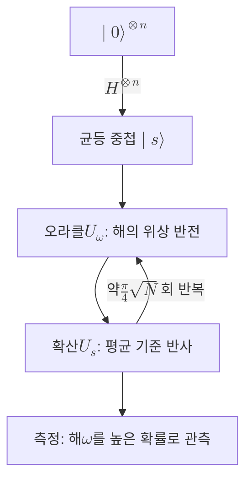

# Grover's Algorithm

> 구조 없는 탐색 문제에서 $N$개 후보 가운데 표시된 해를 약 $O(\sqrt{N})$번의 질의로 찾아내는 양자 알고리즘으로, 고전 선형 탐색 대비 제곱근 가속을 준다.

## 핵심
Grover 알고리즘은 정렬도 구조도 없는 탐색 공간에서 조건을 만족하는 항목을 찾는 문제를 다룬다. 후보가 $N = 2^n$개이고 그중 해가 하나라면, 고전적으로는 평균 $N/2$번, 최악의 경우 $N$번을 확인해야 한다. Grover는 같은 문제를 약 $\frac{\pi}{4}\sqrt{N}$번의 질의로 푼다. 이 제곱근 가속은 [[Shor's Algorithm|쇼어 알고리즘]]의 지수 가속에는 미치지 못하지만, 어떤 비구조적 탐색에도 적용된다는 점에서 적용 범위가 넓다.

알고리즘은 먼저 모든 후보에 대한 균등 [[Quantum Superposition|중첩]]을 만든다. $n$개 큐비트에 Hadamard를 적용해

$$ \lvert s \rangle = \frac{1}{\sqrt{N}} \sum_{x=0}^{N-1} \lvert x \rangle $$

를 준비한다. 이 상태는 모든 후보를 동일한 진폭으로 담는다. 이후 Grover 반복(iteration)을 거듭하며 해의 진폭만 키운다. 한 번의 반복은 두 단계로 이루어진다.

첫째, 오라클 $U_\omega$가 해 $\lvert \omega \rangle$의 위상만 뒤집는다.

$$ U_\omega \lvert x \rangle = (-1)^{f(x)} \lvert x \rangle, \qquad f(x) = \begin{cases} 1 & x = \omega \\ 0 & x \neq \omega \end{cases} $$

여기서 $f$는 후보가 해인지 여부를 판정하는 판별 함수다. 오라클은 해를 찾아 주지 않고, 해의 진폭에만 음의 부호를 붙인다.

둘째, [[Grover Diffusion Operator|확산 연산자]] $U_s = 2\lvert s \rangle\langle s \rvert - I$가 평균 진폭을 기준으로 모든 진폭을 반사한다. 오라클이 음수로 만든 해의 진폭은 이 반사를 거쳐 평균보다 크게 솟아오르고, 나머지는 조금씩 줄어든다. 두 단계를 합친 한 번의 Grover 반복은 해의 진폭을 점진적으로 증폭한다. 이 진폭 증폭(amplitude amplification)이 알고리즘의 동력이며, [[Amplitude Amplification]]은 이를 일반화한 기법이다.

기하학적으로 보면 상태는 해 부분공간과 비해 부분공간이 펼치는 2차원 평면 안에서만 회전한다. 한 번의 반복은 그 평면에서 고정 각도 $\theta$만큼의 회전이며, $\sin\theta = \frac{1}{\sqrt{N}}$이다. 초기 상태에서 해 방향까지 회전시키는 데 필요한 반복 횟수는

$$ k \approx \frac{\pi}{4}\sqrt{N} $$

로, 여기서 $O(\sqrt{N})$의 질의 복잡도가 나온다. 해가 $M$개로 여럿이면 반복 횟수는 $\frac{\pi}{4}\sqrt{N/M}$로 줄어든다.

주의할 점은 회전이 멈추지 않는다는 것이다. 최적 횟수를 지나쳐 반복을 더 하면 해의 진폭이 다시 작아진다. 따라서 측정 직전의 반복 횟수를 정확히 맞추는 것이 중요하며, 무작정 많이 돌리면 오히려 성공 확률이 떨어진다.

## 흐름

## 왜 중요한가
Grover 알고리즘은 양자 가속의 한쪽 끝을 정의한다. 비구조적 탐색에서 제곱근 가속이 최적이라는 사실이 증명되어 있어, 이보다 빠른 양자 알고리즘은 일반적으로 존재할 수 없다. 그래서 Grover는 단일 알고리즘을 넘어, 정렬되지 않은 탐색이 부분 문제로 등장하는 수많은 작업의 가속을 위한 기본 도구로 쓰인다.

암호 영역에서 Grover의 의미는 크다. 대칭키나 해시의 비밀값을 찾는 무차별 대입은 본질적으로 비구조적 탐색이므로, Grover는 키 공간 $2^k$를 약 $2^{k/2}$의 노력으로 훑을 수 있게 만든다. 결과적으로 대칭키의 유효 보안 강도가 절반으로 약화되어, AES-128은 약 64비트 수준으로 떨어진다. 이 때문에 양자 시대를 대비한 권고는 AES-256 사용과 해시 출력 길이의 2배 확대로 정리된다. 다만 이는 [[Shor's Algorithm|쇼어 알고리즘]]이 공개키 계열을 사실상 전멸시키는 것과는 성격이 다르다. Grover는 강도를 약화할 뿐 무력화하지는 않으므로, 매개변수를 키우는 것으로 대응이 가능하다. 이 비대칭이 [[MOC - Post-Quantum Cryptography|양자 내성 암호]] 전이가 공개키에 집중되는 이유이며, [[양자 위협 정세 감시]]에서 위협 메커니즘을 두 갈래로 나누어 추적하는 근거이기도 하다.

또한 Grover의 가속이 제곱근에 그친다는 점은 실무적으로 중요하다. 키 공간을 절반으로 줄이는 효과조차 실현하려면 깊은 회로를 끝까지 오류 없이 돌릴 수 있는 대규모 결함 허용 양자컴퓨터가 필요하다. 현재의 NISQ 단계 하드웨어로는 의미 있는 규모의 Grover 탐색이 어렵고, 이 점이 대칭키 위협이 공개키 위협보다 덜 시급하게 평가되는 또 하나의 이유다.

## 연결
- [[Shor's Algorithm]] 같은 양자 알고리즘이지만 지수 가속으로 공개키를 파훼하며, 제곱근 가속에 그치는 Grover와 위협 성격이 대비됨
- [[Quantum Superposition]] 균등 중첩과 진폭의 간섭이 진폭 증폭의 물리적 토대를 제공
- [[Amplitude Amplification]] Grover 반복을 일반 초기 분포와 임의 판별 조건으로 확장한 일반화 기법
- [[Grover Diffusion Operator]] 평균 진폭 기준 반사를 수행해 해의 진폭을 키우는 한 반복의 두 번째 단계
- [[MOC - Post-Quantum Cryptography]] 대칭키 강도 약화가 PQC 전이에서 매개변수 확대로 대응되는 위협 항목으로 등록됨
- [[양자 위협 정세 감시]] 대칭키와 해시 보안 강도를 제곱근만큼 약화하는 위협 경로로 추적되는 대상
