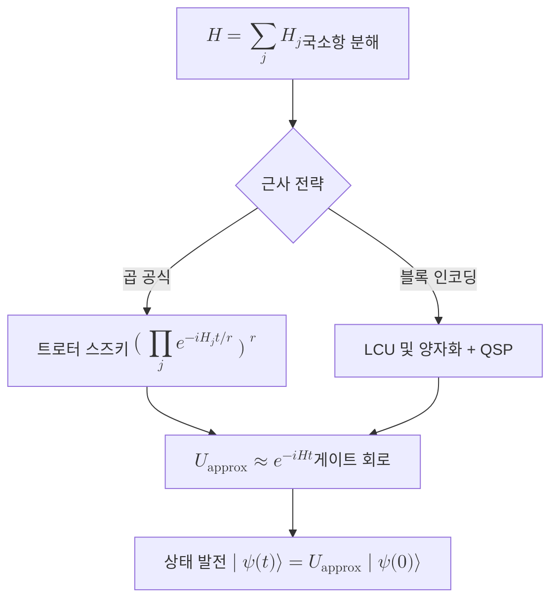

# Hamiltonian Simulation

> 어떤 양자계의 해밀토니안 $H$가 주어졌을 때, 시간 발전 연산 $e^{-iHt}$를 양자컴퓨터에서 자원 효율적으로 근사 구현하는 알고리즘 부류다.

## 핵심
양자계의 동역학은 [[Schrödinger Equation|슈뢰딩거 방정식]]이 지배하며, 시간에 무관한 [[Hamiltonian|해밀토니안]] $H$에 대해 상태는 다음과 같이 발전한다.

$$
\lvert \psi(t) \rangle = e^{-iHt}\,\lvert \psi(0) \rangle
$$

여기서 $U(t) = e^{-iHt}$는 [[Unitary Evolution|유니터리 연산]]이다. 해밀토니안 시뮬레이션의 과제는 이 $U(t)$를 양자 게이트들의 곱으로 충분히 정밀하게 근사하는 회로를 구성하는 것이다. 입력은 해밀토니안의 기술과 발전 시간 $t$, 그리고 허용 오차 $\epsilon$이고, 출력은 $\lVert U_{\text{approx}} - e^{-iHt} \rVert \le \epsilon$을 만족하는 게이트 열이다.

핵심 난점은 일반 행렬 지수 $e^{-iHt}$가 고전적으로 직접 계산하기 어렵다는 데 있다. $n$개의 입자나 큐비트로 이루어진 계의 힐베르트 공간 차원은 $2^n$으로 지수적으로 커지므로, $H$를 그대로 대각화해 지수화하는 방식은 입자 수가 늘면 곧바로 한계에 부딪힌다.

실용적 알고리즘은 해밀토니안이 국소항의 합으로 분해된다는 사실, 즉 $H = \sum_{j=1}^{m} H_j$를 활용한다. 여기서 각 $H_j$는 소수의 큐비트에만 작용해 개별 지수 $e^{-iH_j t}$는 쉽게 게이트로 구현된다. 다만 항들이 일반적으로 교환하지 않으므로 ($[H_j, H_k] \neq 0$) 단순히 곱으로 쪼갤 수 없고, 다음 분해 전략들이 쓰인다.

- 트로터 스즈키 분해(Trotter-Suzuki). 1차 근사로 $e^{-iHt} \approx \big(\prod_{j} e^{-iH_j t/r}\big)^{r}$를 쓰며, 단계 수 $r$을 키워 교환자에서 오는 오차를 줄인다. 1차 공식의 오차는 한 스텝당 $O\big((t/r)^2\big)$ 규모이고, 고차 스즈키 공식으로 시간 의존성을 더 좋게 만들 수 있다.
- 선형 결합 유니터리(LCU, Linear Combination of Unitaries)와 양자 신호 처리(QSP, Quantum Signal Processing) 및 양자화(Qubitization). 해밀토니안을 블록 인코딩한 뒤 다항식 변환으로 $e^{-iHt}$를 구현하며, 오차 $\epsilon$에 대해 $O(\log(1/\epsilon))$의 거의 최적 의존성을 얻는다.

게이트 복잡도는 항의 수 $m$, 항 노름의 합 같은 해밀토니안 세기, 발전 시간 $t$, 정밀도 $\epsilon$에 따라 결정된다. 현대 최적 알고리즘의 비용은 대략 $O\big(t + \log(1/\epsilon)\big)$ 규모로, 시간에 선형이고 정밀도에 로그적으로 의존한다.

## 흐름

## 왜 중요한가
해밀토니안 시뮬레이션은 양자컴퓨팅의 출발점이 된 동기 그 자체다. Feynman은 자연이 양자역학을 따르므로 양자계를 효율적으로 모사하려면 계산기 자체가 양자적이어야 한다고 지적했고, 이 통찰이 양자컴퓨터라는 개념을 낳았다. 고전 컴퓨터가 $2^n$ 차원 상태를 다루며 겪는 지수적 비용을, 양자컴퓨터는 자신이 양자계이기에 다항 자원으로 흉내낼 수 있다.

응용 범위는 넓다. 분자와 물질의 바닥상태 에너지 추정, 화학 반응 동역학, 응집물질의 상전이, 격자 게이지 이론 같은 고에너지 물리 문제가 모두 해밀토니안 시뮬레이션으로 환원된다. 특히 이 알고리즘은 단독으로 쓰이기보다 더 큰 알고리즘의 핵심 서브루틴으로 기능하는데, $e^{-iHt}$를 제어 유니터리로 호출해 에너지 고윳값을 읽어 내는 [[Quantum Phase Estimation|양자 위상 추정]]과 결합하면 양자화학의 전자구조 문제를 푸는 표준 도구가 된다.

또한 임의의 유니터리를 충분한 게이트로 근사할 수 있다는 점에서 해밀토니안 시뮬레이션은 게이트 모형 양자컴퓨터의 BQP 완전 문제다. 즉 이 문제를 푸는 능력은 양자컴퓨터가 가진 계산력의 폭을 그대로 대표하며, 양자 우위가 실용적 가치로 이어질 가장 유력한 후보 중 하나로 꼽힌다.

## 연결
- [[Hamiltonian]] 시뮬레이션의 입력이자 시간 발전을 생성하는 에너지 연산자
- [[Schrödinger Equation]] $e^{-iHt}$라는 시간 발전 연산의 출처가 되는 운동 방정식
- [[Unitary Evolution]] 시뮬레이션이 근사하려는 대상인 유니터리 발전 그 자체
- [[Quantum Phase Estimation]] $e^{-iHt}$를 서브루틴으로 호출해 에너지 고윳값을 추정하는 상위 알고리즘
- [[Quantum Fourier Transform]] 위상 추정과 결합 시 위상을 읽어 내는 변환 단계
- [[Trotter-Suzuki Decomposition]] 비교환 국소항으로 시간 발전을 쪼개는 곱 공식(향후 작성)
- [[Quantum Signal Processing]] 블록 인코딩 기반의 거의 최적 시뮬레이션 기법(향후 작성)
