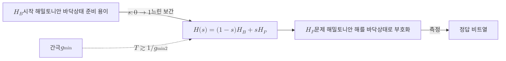

# Adiabatic Quantum Computation

> 양자 단열 정리에 기대어, 풀기 쉬운 시작 해밀토니안의 바닥상태를 정답이 담긴 문제 해밀토니안의 바닥상태까지 천천히 변형시켜 추종함으로써 계산을 수행하는 모형이다.

## 핵심
단열 양자 계산은 게이트의 합성으로 상태를 변환하는 회로 모형과 달리, 계의 [[Hamiltonian]]을 시간에 따라 연속적으로 바꾸어 계산을 진행한다. 출발점은 바닥상태를 쉽게 준비할 수 있는 시작 해밀토니안 $H_B$이고, 도착점은 해를 자신의 바닥상태로 부호화한 문제 해밀토니안 $H_P$이다. 보간 변수 $s = t/T$를 $0$에서 $1$까지 움직이며 두 항을 다음처럼 선형으로 섞는 경로가 가장 흔히 쓰인다.

$$ H(s) = (1-s)\, H_B + s\, H_P, \qquad s = \frac{t}{T},\ \ s \in [0, 1] $$

계의 상태는 [[Schrödinger Equation]]을 따라 발전한다.

$$ i\hbar\, \frac{d}{dt}\lvert \psi(t) \rangle = H(t)\,\lvert \psi(t) \rangle $$

핵심 도구는 양자 단열 정리다. 계가 처음에 순간 바닥상태에 놓여 있고 해밀토니안이 충분히 느리게 변하면, 계는 그 변형 내내 순간 바닥상태에 머문다. 따라서 $t = 0$에서 $H_B$의 바닥상태로 출발하면, $t = T$에서 $H_P$의 바닥상태에 도달하고, 이를 측정해 정답을 읽는다.

"충분히 느리게"가 무엇인지는 순간 고유에너지의 간극이 결정한다. 바닥상태와 첫 번째 들뜬상태 사이의 에너지 간극을 $g(s) = E_1(s) - E_0(s)$라 할 때, 발전이 정확하려면 전체 시간 $T$가 최소 간극 $g_{\min} = \min_{s} g(s)$의 역제곱에 비례하도록 커야 한다.

$$ T \gtrsim \frac{\max_{s} \lvert \langle E_1(s) \rvert \partial_s H(s) \lvert E_0(s) \rangle \rvert}{g_{\min}^{2}} $$

그래서 단열 알고리즘의 효율은 경로를 따라가는 동안 간극이 얼마나 좁아지는가에 달려 있다. 간극이 시스템 크기에 대해 다항으로만 줄어들면 다항 시간 알고리즘이 되지만, 지수적으로 닫히면 그만큼 느려진다.

## 구조

## 왜 중요한가
단열 양자 계산이 중요한 첫째 이유는 보편성이다. 게이트 기반 [[Quantum Circuit|회로 모형]]과 단열 모형은 서로를 다항 자원만으로 흉내 낼 수 있어 계산 능력이 동등하다. 즉 회로로 풀 수 있는 문제는 단열로도 풀 수 있고 그 반대도 성립한다. 따라서 단열은 보편 양자 계산의 또 다른 정식 모형이며, 같은 복잡도 이론의 한 면을 다른 언어로 보여 준다.

둘째 이유는 문제 표현의 자연스러움이다. 많은 최적화 문제는 비용 함수를 그대로 해밀토니안의 에너지로 옮길 수 있어, 정답이 가장 낮은 에너지 상태로 자연스럽게 부호화된다. 이 점은 조합 최적화와 이징 모형 형태의 문제에 단열 접근이 잘 맞는 이유다.

셋째 이유는 잡음에 대한 태도다. 계산 도중 계가 바닥상태라는 에너지적으로 가장 안정한 곳에 머물기 때문에, 작은 열적 요동이나 결맞음 손실에 대해 일정한 견고함을 기대할 수 있다. 이 직관은 실용 하드웨어로 내려오면서 단열 정리의 엄밀한 조건을 완화한 발견적 방법인 [[Quantum Annealing|양자 어닐링]]으로 이어진다. 단열 양자 계산이 정리에 근거한 이상적 모형이라면, 양자 어닐링은 유한 온도와 유한 시간에서 그 아이디어를 구현하려는 공학적 사촌에 해당한다.

## 연결
- [[Hamiltonian]] 시작 해밀토니안과 문제 해밀토니안의 보간으로 계산을 정의하는 토대
- [[Schrödinger Equation]] 단열 발전 동안 상태의 시간 변화를 지배하는 운동 방정식
- [[Quantum Annealing]] 단열 정리의 엄밀 조건을 완화해 유한 온도에서 구현한 발견적 사촌 모형
- [[Quantum Circuit]] 단열 모형과 다항 등가인 게이트 기반 보편 계산 모형
- [[Quantum Superposition]] 보간 도중 순간 바닥상태가 여러 기저의 중첩으로 표현되는 자원
