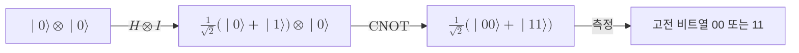

# Quantum Circuit

> 큐비트 레지스터에 유니터리 게이트를 순서대로 합성한 뒤 측정으로 마무리하는, 양자 계산의 표준 계산 모형이다.

## 핵심
양자 회로는 양자 알고리즘을 적어 내려가는 공통 언어다. 계산은 세 단계로 나뉜다. 먼저 $n$개의 [[Qubit]]을 보통 $\lvert 0 \rangle^{\otimes n}$ 같은 알려진 초기 상태로 준비한다. 이어서 게이트들을 정해진 순서로 적용해 상태를 변환한다. 마지막에 [[Quantum Measurement]]을 수행해 고전 비트열을 읽어 낸다.

가운데 변환 단계가 회로의 본체다. 닫힌계의 시간 발전이 [[Unitary Evolution|유니터리 변환]]이므로, 측정 직전까지의 회로 전체는 하나의 큰 유니터리 연산 $U$로 압축된다. 회로가 게이트 $U_1, U_2, \dots, U_L$을 이 순서로 적용한다면 전체 작용은 합성으로 표현된다.

$$ U = U_L \, U_{L-1} \cdots U_2 \, U_1 $$

행렬 곱이 오른쪽부터 작용하므로 그림에서 왼쪽에 놓인 게이트가 식의 오른쪽에 온다는 점에 유의한다. 초기 상태 $\lvert \psi_0 \rangle$이 변환을 거쳐 최종 상태 $\lvert \psi_{\text{out}} \rangle = U \lvert \psi_0 \rangle$이 되고, 여기에 측정을 적용한다.

게이트는 작용하는 큐비트 수로 나뉜다. 단일 큐비트 게이트는 $2 \times 2$ 유니터리 행렬로, [[Hadamard Gate|아다마르 게이트]]나 [[Pauli Matrices|파울리 게이트]]가 대표적이다. 둘 이상의 큐비트에 작용하는 게이트는 얽힘을 만들 수 있는데, [[CNOT Gate]]가 그 핵심이며 두 큐비트 사이의 상관을 빚어낸다. 한 큐비트에 게이트를 걸 때 나머지 큐비트에는 항등 연산 $I$가 동시에 작용하므로, 회로의 한 층(layer)은 게이트들의 [[Tensor Product|텐서곱]]으로 기술된다. 예를 들어 첫 큐비트에만 $H$를 거는 2큐비트 층은 $H \otimes I$로 적는다.

중요한 사실은 손에 꼽을 만큼 적은 종류의 게이트만 있어도 임의의 유니터리를 원하는 정밀도로 근사할 수 있다는 점이다. 이런 게이트 모음을 [[Universal Gate Set|보편 게이트 집합]]이라 부르며, 덕분에 무한히 많은 가능한 변환을 유한한 부품으로 조립할 수 있다.

## 구조
다음은 두 큐비트에 아다마르 게이트와 CNOT을 차례로 적용해 벨 상태를 만든 뒤 측정하는 회로의 데이터 흐름이다.

회로의 두 축은 공간과 시간이다. 큐비트 하나하나가 가로선(wire)으로 공간 축을 이루고, 게이트가 놓이는 위치가 시간 축을 이룬다. 같은 시점에서 서로 다른 큐비트에 걸리는 게이트들은 동시에 작용하므로 한 층으로 묶이고, 회로의 깊이(depth)는 이런 층의 수로 측정한다. 깊이는 연산이 끝나기까지의 시간 비용을, 게이트 수와 폭은 자원 비용을 나타내므로, 알고리즘 효율을 논할 때의 기본 척도가 된다.

## 왜 중요한가
양자 회로 모형이 중요한 까닭은 양자 계산을 정의하고 비교하고 구현하는 공통 기준점이기 때문이다.

첫째, 이론적으로 양자 회로는 양자 튜링 기계와 동등한 계산 능력을 가진다고 알려져 있어, 양자 계산의 표준 정의 역할을 한다. [[Shor's Algorithm|쇼어 알고리즘]]이나 [[Grover's Algorithm|그로버 알고리즘]] 같은 대표 알고리즘은 모두 회로로 명세되며, 게이트 수와 깊이가 곧 알고리즘의 복잡도 지표가 된다.

둘째, 실제 하드웨어와 직접 대응한다. [[Superconducting Qubit|초전도 큐비트]]나 [[Trapped-Ion Qubit|이온 트랩]] 같은 물리 플랫폼은 자기가 정밀하게 제어할 수 있는 게이트 집합을 제공하고, 추상 회로는 이 네이티브 게이트로 변환되어(트랜스파일) 장치 위에서 실행된다.

셋째, 잡음이 있는 현실에서는 측정 직전까지를 하나의 깨끗한 유니터리로 본 가정이 무너진다. 그래서 [[Quantum Error Correction|양자 오류정정]]은 논리 게이트를 결함 허용 가능한 형태의 회로로 다시 짜는 문제로 환원되고, 회로 모형은 그 위에서 결함 허용 계산을 설계하는 토대가 된다.

## 연결
- [[Qubit]] 회로가 다루는 정보의 기본 단위이자 회로의 가로선
- [[Unitary Evolution]] 측정 전 회로 전체가 따르는 유니터리 변환의 근거
- [[Universal Gate Set]] 유한한 게이트로 임의 회로를 조립할 수 있게 하는 보편성
- [[Quantum Measurement]] 회로의 마지막 단계로 양자 상태를 고전 결과로 바꾸는 과정
- [[Hadamard Gate]] 회로에서 중첩을 만드는 대표적 단일 큐비트 게이트
- [[CNOT Gate]] 큐비트 사이 얽힘을 생성하는 핵심 다중 큐비트 게이트
- [[Tensor Product]] 한 층의 게이트들을 결합해 전체 작용으로 만드는 연산
- [[Quantum Error Correction]] 잡음 환경에서 회로를 결함 허용 형태로 재구성하는 문제
