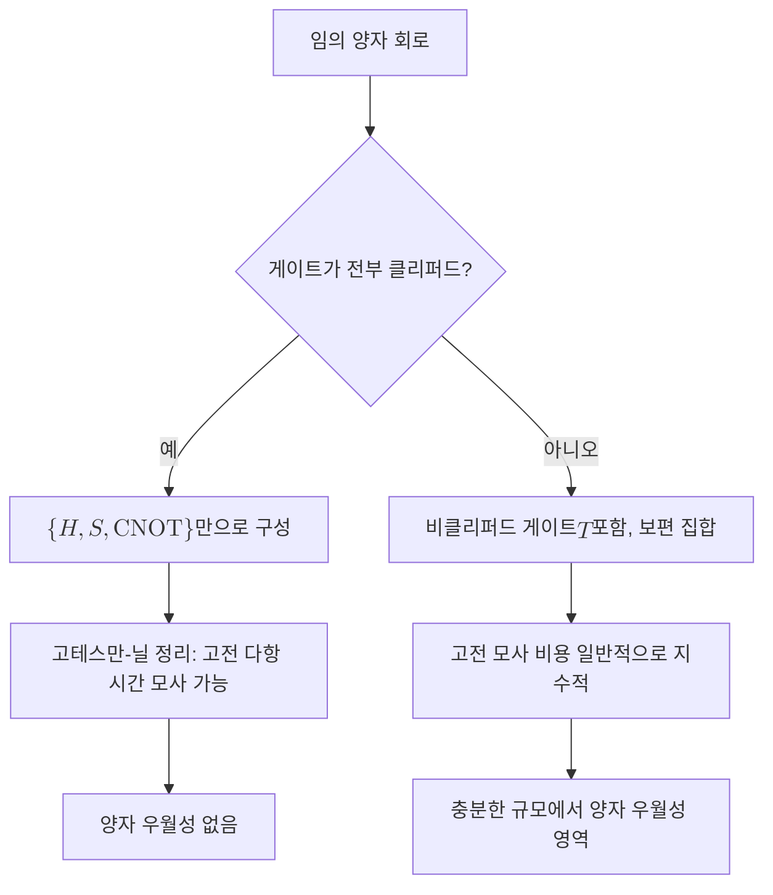

# Quantum Supremacy

> 고전 컴퓨터로는 실질적으로 끝낼 수 없는 특정 계산을 양자 장치가 실제로 수행해 보임으로써, 양자 계산 모형이 고전 모형을 능가하는 영역이 존재함을 입증하는 이정표다.

## 핵심
양자 우월성은 "양자컴퓨터가 더 유용하다"가 아니라 "양자컴퓨터가 고전 컴퓨터로는 현실적인 시간 안에 흉내 낼 수 없는 계산을 한다"는 좁고 엄밀한 주장이다. 여기서 핵심은 유용성이 아니라 모사 불가능성이다. 과제가 실용적일 필요는 없고, 다만 고전 모사 비용이 양자 실행 비용을 압도적으로 초과하기만 하면 된다. 2012년 John Preskill이 이 개념을 명명했고, 함의의 비대칭성에 부담을 느낀 학계 일부는 더 중립적인 표현으로 양자 이점([[Quantum Advantage|양자 우위]])을 함께 쓴다.

이 개념의 의미는 그 반대편, 즉 "양자처럼 보이지만 사실은 고전으로 모사 가능한" 회로와 대비할 때 선명해진다. [[Gottesman-Knill Theorem|고테스만-닐 정리]]는 [[Clifford Group|클리퍼드 군]]에 속한 게이트만으로 구성된 회로, 즉 클리퍼드 회로가 아무리 많은 큐비트와 얽힘을 동원하더라도 고전 컴퓨터에서 다항 시간에 모사된다고 말한다. 클리퍼드 게이트는 다음과 같은 표준 생성자로 만들어진다.

$$ H,\quad S = \begin{pmatrix} 1 & 0 \\ 0 & i \end{pmatrix},\quad \mathrm{CNOT} $$

이 집합은 [[Pauli Matrices|파울리 연산자]]를 파울리 연산자로 보내는 변환만 일으키므로, 상태 전체를 추적하는 대신 안정자(stabilizer) 생성자만 갱신하면 충분하다. 그래서 얽힘이 풍부해도 고전 모사가 깨지지 않는다. 양자 우월성이 성립하려면 클리퍼드 회로의 이 "고전 친화성"을 깨는 자원이 필요하고, 그 결정적 한 조각이 $T$ 게이트 같은 비클리퍼드 게이트다.

$$ T = \begin{pmatrix} 1 & 0 \\ 0 & e^{i\pi/4} \end{pmatrix} $$

클리퍼드 게이트 집합에 $T$ 한 종류를 더하면 임의의 유니터리를 원하는 정밀도로 근사하는 보편 게이트 집합이 되고, 바로 이 보편성의 문턱을 넘는 순간부터 회로의 고전 모사가 일반적으로 지수적으로 어려워진다. 양자 우월성은 이 문턱 너머에서 고전 모사 비용이 폭발하는 영역을 실제 하드웨어로 도달했다는 실험적 선언인 셈이다.

대표 시연인 무작위 회로 표본추출(random circuit sampling)에서는 $n$큐비트에 깊이 $d$의 무작위 회로를 걸어 출력 비트열의 분포 $p(x) = \lvert \langle x \vert \psi \rangle \rvert^{2}$에서 표본을 뽑는다. 이 분포를 고전적으로 충실히 모사하려면 일반적으로 $2^{n}$ 규모의 진폭을 다뤄야 하므로, 큐비트 수가 늘면 고전 비용이 기하급수로 커진다. 2019년 Google의 53큐비트 Sycamore 실험은 이 과제 하나를 약 200초에 처리하면서, 당시 최강 고전 슈퍼컴퓨터로는 비현실적인 시간이 걸린다고 주장해 최초의 양자 우월성 시연으로 보고되었다.

## 구조

## 왜 중요한가
양자 우월성은 양자컴퓨터가 단지 빠른 고전 기계가 아니라 계산 능력의 질이 다른 장치라는 가설에 처음으로 실험적 무게를 실었다. 처치-튜링 확장 명제는 "물리적으로 실현 가능한 모든 계산 장치는 확률적 튜링 기계로 다항 시간 안에 모사된다"고 주장하는데, 양자 우월성의 시연은 이 명제가 자연 앞에서 깨질 수 있음을 가리키는 강한 정황이다. 이정표로서의 가치는 실용성이 아니라 바로 이 원리적 분리에 있다.

동시에 이 개념은 무엇이 양자성을 "진짜" 자원으로 만드는가를 정밀하게 묻게 한다. 얽힘이 많다고 양자 우월성이 보장되지 않는다는 사실을 [[Gottesman-Knill Theorem|고테스만-닐 정리]]가 분명히 못 박기 때문이다. 우월성의 원천은 단순한 얽힘이 아니라, 클리퍼드 너머의 비클리퍼드 자원과 그것이 만드는 모사 불가능한 간섭 구조에 있다. 이 구분은 [[Magic State|마법 상태]]나 비클리퍼드 자원의 정량화 같은 후속 주제로 직접 이어진다.

마지막으로 양자 우월성은 그 자체로 끝이 아니라 출발점이다. 무작위 회로 표본추출은 유용한 답을 내놓지 않는 인위적 과제이므로, 다음 목표는 고전 모사 불가능성과 실질적 유용성을 동시에 갖춘 [[Quantum Advantage|양자 이점]]의 실현이다. [[Shor's Algorithm|쇼어 알고리즘]]이나 양자 화학 시뮬레이션처럼 실용 문제에서 분리를 보이려면, 우월성 시연에 쓰인 잡음 많은 장치를 넘어 [[Quantum Error Correction|오류정정]]으로 보호된 논리 큐비트가 필요하다. 그런 의미에서 우월성 실험은 결함 허용 양자컴퓨팅으로 가는 길 위의 첫 측량점이다.

## 연결
- [[Quantum Circuit]] 양자 우월성을 정의하고 측정하는 무대인 계산 모형으로, 게이트 구성에 따라 모사 가능성이 갈림
- [[Clifford Group]] 이 군만으로 짠 회로는 고전 모사가 쉬워, 우월성이 깨지는 경계를 정하는 기준 집합
- [[Gottesman-Knill Theorem]] 클리퍼드 회로의 고전 모사 가능성을 증명해 "얽힘이 많아도 우월하지 않을 수 있음"을 못 박는 대비 정리
- [[Pauli Matrices]] 클리퍼드 변환이 보존하는 연산자 집합으로, 안정자 형식주의의 토대를 이루어 고테스만-닐 모사의 효율 근거가 됨
- [[Shor's Algorithm]] 인위적 과제가 아닌 실용 문제에서 고전과의 분리를 노리는 사례로, 우월성을 양자 이점으로 끌어올리는 목표 지점
- [[Grover's Algorithm]] 제곱근 가속에 그쳐 단독으로는 강한 우월성 주장을 받치기 어려운 비교 사례
- [[Quantum Error Correction]] 잡음 장치의 우월성 시연을 실용적 양자 이점으로 발전시키기 위해 요구되는 후속 보호 계층
