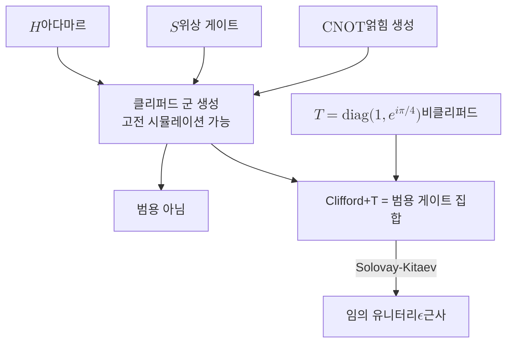

# Universal Gate Set

> 유한한 개수의 게이트만으로 임의의 유니터리 연산을 원하는 정밀도까지 근사할 수 있는 게이트 집합을 말한다.

## 핵심
양자 회로는 큐비트에 작용하는 유니터리 연산자의 합성으로 표현된다. 그러나 $n$큐비트 유니터리 군 $U(2^n)$은 연속군이라 원소가 비가산 무한 개다. 물리 장치가 구현할 수 있는 게이트는 유한 종류뿐이므로, 모든 양자 알고리즘을 한정된 부품으로 조립하려면 다음 질문에 답해야 한다. 어떤 유한 집합 $\mathcal{G}$를 고르면, 그 원소들의 유한 곱으로 임의의 타겟 유니터리 $U$를 임의의 정밀도로 근사할 수 있는가. 이런 성질을 만족하는 $\mathcal{G}$를 범용 게이트 집합이라 부른다.

근사의 기준은 연산자 노름으로 정의한다. 목표 정밀도 $\epsilon$이 주어졌을 때, 집합 $\mathcal{G}$의 원소들로 만든 회로 $V$가 임의의 $U$에 대해

$$ \lVert U - V \rVert < \epsilon $$

를 만족시킬 수 있으면 $\mathcal{G}$는 범용이다. 여기서 $\lVert \cdot \rVert$은 연산자 노름이며, 두 유니터리의 차이가 모든 입력 상태에 대해 만들어내는 출력 오차의 상한을 통제한다. 정확히 같게 만드는 것이 아니라 임의로 가깝게 만든다는 점이 핵심이다.

범용성은 두 층위로 나뉜다. 첫째는 연속 변수를 자유롭게 쓸 수 있는 경우다. 임의 단일 큐비트 회전 두 개에 [[CNOT Gate]] 하나를 더하면 임의의 다중 큐비트 유니터리를 정확히 분해할 수 있다. 단일 큐비트 게이트가 얽힘을 만들지 못하므로 2큐비트 게이트인 CNOT이 얽힘 생성을 담당하고, 단일 큐비트 회전이 임의 방향의 상태 조작을 담당한다. 둘째는 게이트 집합 자체가 유한해야 하는 경우다. 회전각을 연속으로 조절하는 장치는 보정 오차에 취약하고 [[Quantum Error Correction|오류정정]]과도 잘 맞지 않으므로, 실제로는 이산적인 유한 집합으로 임의 회전을 근사하길 원한다.

가장 널리 쓰이는 유한 범용 집합은 Clifford+T다. [[Hadamard Gate]]와 위상 게이트 $S$, CNOT은 [[Clifford Group|클리퍼드 군]]을 생성한다. 그러나 클리퍼드 군만으로는 범용이 되지 못한다. Gottesman-Knill 정리에 따르면 클리퍼드 회로는 고전 컴퓨터로 효율적으로 시뮬레이션되므로, 그 자체로는 양자적 이득을 주지 못한다. 클리퍼드 군 바깥의 게이트를 단 하나 추가하면 비로소 범용이 되는데, 그 표준 선택이 $T$ 게이트다.

$$ T = \begin{pmatrix} 1 & 0 \\ 0 & e^{i\pi/4} \end{pmatrix} $$

$T$는 $\pi/4$의 위상을 주는 비클리퍼드 게이트이고, $T^2 = S$가 성립한다. 따라서 $\{H, T, \text{CNOT}\}$만으로 임의의 유니터리를 근사할 수 있다. 결함허용 구조에서 클리퍼드 게이트는 횡단적으로 값싸게 구현되지만 $T$ 게이트는 그렇지 못해서, $T$를 안전하게 공급하기 위해 [[Magic State]]를 증류하는 별도 과정이 필요하다. 이 때문에 결함허용 비용 분석에서는 회로의 $T$ 개수, 즉 T-count가 핵심 지표가 된다.

이산 집합이 정확한 값이 아니라 근사만 줄 수 있는데도 효율적인 이유는 Solovay-Kitaev 정리가 보장한다. 임의 단일 큐비트 유니터리를 정밀도 $\epsilon$으로 근사하는 데 필요한 게이트 수가

$$ O\!\left( \log^{c}\frac{1}{\epsilon} \right) $$

로 정밀도의 역수에 대해 다항로그 규모에 그친다는 결과다. 표준 Solovay-Kitaev 알고리즘은 $c = \log 5 / \log(3/2) \approx 3.97$을 주며, 이후 개선으로 지수는 $c \approx 1.44$ 부근까지 낮아질 수 있다. 어느 경우든 $1/\epsilon$의 다항식이 아니라 다항로그에 머무는 것이 핵심이다. 즉 정밀도를 한 자릿수 높이는 데 회로 길이는 거의 선형 미만으로만 늘어나므로, 유한한 부품으로 임의 정밀도의 양자 계산을 현실적인 비용에 실현할 수 있다.

## 구조

## 왜 중요한가
범용 게이트 집합은 하드웨어와 알고리즘 사이를 잇는 추상화의 핵심이다. 알고리즘 설계자는 임의의 유니터리를 자유롭게 가정하고 회로를 그릴 수 있고, 하드웨어 개발자는 그 모든 회로를 단 몇 종의 물리 게이트로 환원해 구현할 수 있다. 두 진영이 같은 [[Quantum Circuit|양자 회로]] 모형 위에서 분업할 수 있는 근거가 바로 범용성이다.

또한 범용성의 경계는 어떤 게이트가 진짜 양자적 능력을 주는지를 드러낸다. 클리퍼드 군이 고전적으로 시뮬레이션된다는 사실과 $T$ 게이트 하나가 범용성을 완성한다는 사실을 나란히 놓으면, 양자 이득의 자원이 비클리퍼드 연산에 응축되어 있음을 알 수 있다. 이 관점은 결함허용 비용을 T-count로 측정하고 [[Magic State|마법 상태]] 증류를 최적화하려는 현대 양자 컴파일의 출발점이다.

## 연결
- [[Quantum Circuit]] 범용 게이트 집합이 표현 대상으로 삼는 계산 모형이며, 모든 회로를 유한 부품으로 환원하는 무대
- [[Clifford Group]] 그 자체로는 범용이 아니지만 Clifford+T의 클리퍼드 절반을 이루는 핵심 부분군
- [[CNOT Gate]] 단일 큐비트 게이트가 만들지 못하는 얽힘을 공급해 다중 큐비트 범용성을 떠받치는 2큐비트 게이트
- [[Hadamard Gate]] 클리퍼드 생성원의 하나이자 중첩을 만드는 표준 단일 큐비트 게이트
- [[Magic State]] 결함허용 구조에서 비클리퍼드 $T$ 게이트를 공급해 범용성을 완성하는 자원 상태
