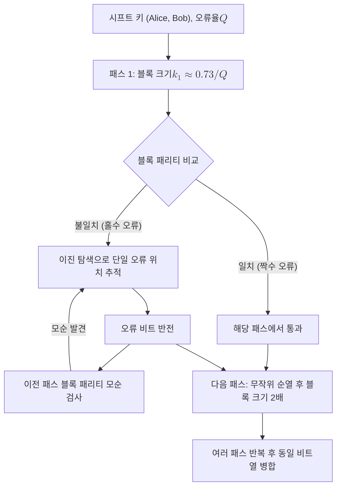

# Cascade Protocol

> Cascade는 블록 단위 패리티 비교와 이진 탐색으로 시프트 키의 불일치 비트를 찾아 정정하고, 여러 패스에 걸쳐 블록 경계를 뒤섞으며 반복하는 대화형 정보 조정 기법이다.

## 핵심
Cascade는 [[Information Reconciliation|정보 조정]] 단계에서 가장 널리 쓰이는 대화형 오류 정정 알고리즘이다. 입력은 Alice와 Bob이 [[Basis Sifting|기저 시프팅]] 이후 보유한 두 개의 시프트 키이며, 이 두 비트열은 오류율 $Q$만큼 어긋나 있다. 여기서 $Q$가 곧 [[Quantum Bit Error Rate (QBER)|QBER]]이다. Cascade의 목표는 인증된 공개 채널로 패리티만 주고받아 어긋난 위치를 찾아 정정하고, 두 사람의 키를 동일하게 병합하는 것이다.

알고리즘은 여러 패스로 구성된다. 한 패스 안에서 두 사람은 키를 같은 크기의 블록으로 나누고, 각 블록의 패리티를 공개해 비교한다. 패리티가 일치하면 그 블록에는 짝수 개(0개 포함)의 오류가 있다고 보고 넘어간다. 패리티가 어긋나면 그 블록에 홀수 개의 오류가 있으므로, 블록을 절반으로 나누어 각 절반의 패리티를 다시 비교하는 이진 탐색을 적용한다. 이 과정을 반복하면 단일 오류 비트 하나를 정확히 찾아 뒤집을 수 있다.

핵심 착상은 패스마다 블록 분할 방식을 무작위 순열로 바꾸는 데 있다. 첫 패스에서 패리티가 짝수로 맞아 넘어간 블록에는 오류가 짝수 개 숨어 있을 수 있다. 다음 패스에서 비트 위치를 뒤섞어 블록을 다시 나누면, 같은 위치 쌍이 서로 다른 블록으로 흩어져 그중 일부가 홀수 패리티 블록으로 드러난다. 이렇게 새로 드러난 오류를 정정하면, 그 비트가 이전 패스에서 속했던 짝수 패리티 블록의 패리티가 이제 홀수로 뒤집힌다. 이미 알고 있는 이전 패스의 블록 패리티와 모순이 생기므로, 그 블록에 또 다른 오류가 있음을 추적해 연쇄적으로 정정할 수 있다. 한 오류의 정정이 이전 패스들로 거슬러 올라가며 추가 오류 정정을 촉발하는 이 연쇄 효과가 이름의 유래다.

블록 크기는 입력 오류율에 맞춘다. 첫 패스의 블록 크기 $k_1$은 보통 $Q$에 반비례하게 잡아 블록당 기대 오류가 1을 넘지 않도록 하며, 다음 패스에서는 크기를 두 배로 키운다. 통상 4개 안팎의 패스를 돌린다.

## 흐름

## 왜 중요한가
Cascade가 중요한 이유는 두 가지다. 첫째, 동일 키를 보장하는 정보 조정의 실질적 표준 구현이기 때문이다. 정보 조정이 실패하면 Alice와 Bob의 키가 미세하게 어긋난 채 남고, 동일 키를 전제로 해시를 적용하는 [[Privacy Amplification|비밀성 증폭]]이 무너진다. Cascade는 구현이 단순하면서도 매우 낮은 잔류 오류율을 달성해 이 관문을 안정적으로 통과시킨다.

둘째, 누설 효율이 좋다. 정보 조정의 본질적 비용은 공개 채널로 흘러나가는 패리티 정보량이며, 이 누설은 인증되어 변조는 막히지만 Eve에게 그대로 노출된다. 길이 $n$, 오류율 $Q$에서 누설의 이상적 한계는 Shannon 한계인 $n\,h(Q)$ 비트이고, 여기서 $h(\cdot)$는 이진 엔트로피

$$ h(Q) = -Q\log_2 Q - (1-Q)\log_2(1-Q) $$

이다. 실제 누설량은 조정 효율 계수 $f \ge 1$로

$$ \mathrm{leak}_{\mathrm{EC}} = f \cdot n\, h(Q) $$

로 쓴다. 잘 조정된 Cascade는 실용 영역에서 $f \approx 1.05$에서 $1.2$ 수준을 달성해 한계에 근접한다. 누설이 작을수록 비밀성 증폭에서 깎아내는 비트가 줄어 최종 비밀 키가 길어지므로, Cascade의 효율은 곧 QKD 시스템의 키율로 이어진다.

다만 Cascade는 대화형이라 패스마다 여러 차례 왕복 통신이 필요하다. 이 왕복 지연이 고속 시스템의 병목이 될 수 있어, 신드롬을 한 번에 보내는 일방향 방식인 [[LDPC Codes|LDPC]] 기반 정보 조정이 대안으로 쓰인다. 그럼에도 Cascade는 단순성과 높은 효율 덕분에 기준 비교 대상이자 기본 선택지로 남아 있다.

## 연결
- [[Information Reconciliation]] Cascade가 구현하는 상위 키 증류 단계, 이 노트는 그 대표 기법을 상술
- [[Quantum Bit Error Rate (QBER)]] Cascade의 첫 패스 블록 크기 $k_1$을 결정하는 입력 오류율 $Q$
- [[Privacy Amplification]] Cascade의 공개 누설량 $\mathrm{leak}_{\mathrm{EC}}$를 차감해 비밀 키를 정제하는 다음 단계
- [[LDPC Codes]] 왕복을 줄이는 일방향 정보 조정 대안, Cascade와 효율 및 지연을 비교하는 경쟁 기법
- [[Basis Sifting]] Cascade의 입력인 시프트 키를 만들어 내는 직전 단계
