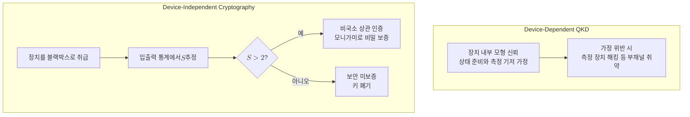

# Device-Independent Cryptography

> 측정 장치의 내부 구조를 신뢰하지 않고, 오직 관측된 입출력 통계의 벨 부등식 위반만으로 안전성을 보증하는 암호 패러다임이다.

## 핵심
장치 독립 암호의 출발점은 장치를 블랙박스로 취급하는 데 있다. 정당한 두 주체 Alice와 Bob은 각자 손에 든 장치에 측정 설정을 입력하고 결과를 출력으로 받지만, 그 장치가 실제로 어떤 양자계를 어떤 방식으로 측정하는지는 알 필요가 없다. 장치가 신뢰할 수 없는 공급자에게서 왔거나 도청자 Eve가 미리 만들어 건넨 것이어도 무방하다. 보안의 근거는 장치 내부에 대한 어떤 가정도 아니라, 입력과 출력 사이에서 통계적으로 드러나는 상관의 비국소성 하나에만 놓인다.

이 비국소성은 [[Bell Inequality (CHSH)|CHSH 부등식]]의 위반으로 정량화된다. Alice의 측정 설정을 $A, A'$, Bob의 설정을 $B, B'$라 하고 각 결과를 $\pm 1$로 두면, 두 사람은 입출력 표본에서 다음 조합량을 추정한다.

$$ S = E(A,B) - E(A,B') + E(A',B) + E(A',B') $$

국소 숨은변수 이론, 곧 결과가 미리 정해진 고전적 합의로 설명되는 모든 모형은 $\lvert S \rvert \le 2$를 넘지 못한다. 반면 [[Bell States|최대 얽힘 상태]]를 적절한 방향으로 측정하면 $S$는 Tsirelson 한계 $2\sqrt{2}$에 도달한다. 핵심 통찰은 관측된 $S$가 고전 한계 $2$를 넘었다는 사실 자체가 장치 내부를 보지 않고도 진짜 양자 상관이 존재했음을 증명한다는 데 있다.

### 모니가미가 비밀을 만든다
관측된 비국소 상관이 곧바로 비밀이 되는 까닭은 얽힘의 일부일처성(monogamy of entanglement)에 있다. 두 계가 거의 최대로 얽혀 있으면 어느 한 계도 제3의 계와 동시에 강하게 얽힐 수 없다. 따라서 Alice와 Bob이 추정한 $S$가 양자 한계 $2\sqrt{2}$에 가까울수록 Eve가 그들의 상관에 대해 가질 수 있는 정보는 원리적으로 제한된다. 이 관계를 정량화하면 Eve의 추측 확률 또는 그가 보유한 정보량이 벨 위반의 정도에 따라 위로 한계지어지고, 그 위에서 비밀 키 생성률 같은 안전성 지표를 끌어낼 수 있다. 즉 비밀의 양이 장치 사양이 아니라 측정된 $S$ 값의 함수로 결정된다.

### 봉인해야 할 전제
장치를 불신한다고 해서 모든 가정을 버릴 수 있는 것은 아니다. 장치 독립 보안에는 여전히 최소한의 전제가 필요하다. 첫째, 각 측정 회차에서 설정을 고르는 입력은 장치와 무관하게 자유롭고 무작위여야 한다. 입력이 장치 내부와 상관되면 고전 장치도 위반을 흉내낼 수 있기 때문이다. 둘째, Alice와 Bob의 장치는 측정 동안 서로에게 신호를 보낼 수 없도록 격리되어야 한다. 셋째, 측정 결과가 실험실 밖으로 새지 않도록 물리적으로 봉인되어야 한다. 이 전제들은 장치의 구현 방식이 아니라 입출력 인터페이스와 격리에 대한 조건이므로, 내부 사양을 신뢰하는 표준 양자 키 분배와는 가정의 성격이 다르다.

## 신뢰 모형 비교

## 왜 중요한가
장치 독립 암호는 보안 가정을 장치 사양에서 떼어내 검증 가능한 물리 사실로 옮긴다. 표준 양자 키 분배가 정보이론적으로 안전하다고 증명되어도, 실제 구현에서는 검출기의 비선형 응답이나 광원의 부채널 같은 틈으로 보안이 무너질 수 있다. 측정 장치 해킹 공격은 바로 이 신뢰 가정을 노린다. 장치 독립 접근은 이런 구현 의존 취약점을 원리적으로 차단한다. 장치가 무엇을 하든 관측된 $S$가 고전 한계를 넘기만 하면 안전성이 따라오기 때문이다.

이 발상의 뿌리는 [[E91 Protocol|E91]]이 보안을 도청 모형이 아니라 벨 위반에 연결한 데 있고, 장치 독립 암호는 그 연결을 끝까지 밀어붙여 장치 자체에 대한 신뢰마저 제거한 것이다. 같은 원리는 키 분배를 넘어 무작위성 증폭과 인증된 난수 생성으로도 확장된다. 다만 대가가 크다. 충분히 높은 $S$를 닫힌 허점 없이 관측하려면 검출 효율이 매우 높아야 하고, [[Bell Inequality (CHSH)|loophole-free 벨 실험]] 수준의 까다로운 조건을 통신 거리에서 만족시켜야 하므로 실용화는 여전히 도전적이다. 그럼에도 신뢰 최소화라는 방향에서 양자암호의 가장 강한 안전성 모형을 제시한다는 점에서 이론적 기준점이 된다.

## 연결
- [[E91 Protocol]] 보안을 벨 위반에 묶은 얽힘 기반 키 분배로, 장치 독립 암호로 발전하는 직접적 원형
- [[Bell Inequality (CHSH)]] 장치 내부를 불신해도 비국소 상관을 인증하는 핵심 지표 $S$를 제공하는 부등식
- [[Quantum Entanglement]] 일부일처성으로 제3자 정보를 제한해 비밀의 물리적 근거가 되는 자원
- [[Bell States]] $S$를 Tsirelson 한계까지 끌어올려 인증 가능한 위반을 만드는 최대 얽힘 상태
- [[Quantum Measurement]] 설정 선택과 결과 통계가 입출력 인터페이스를 이루어 보안 판별의 입력이 되는 공준
