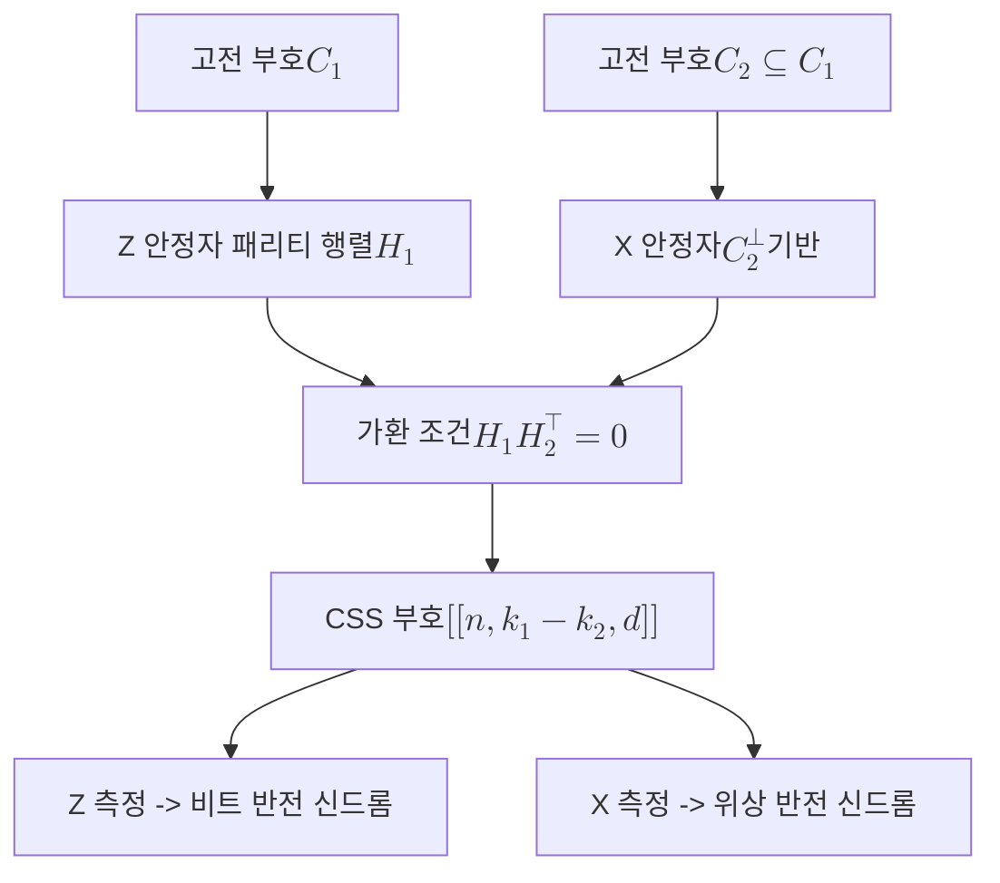

# CSS Code

> 두 개의 고전 선형 부호를 짜맞춰 X 오류와 Z 오류를 서로 독립적으로 정정하는 안정자 부호의 부류다.

## 핵심

CSS 부호는 [[Stabilizer Code|안정자 부호]]의 특수한 하위 부류로, 안정자 생성원을 X 연산자로만 이루어진 묶음과 Z 연산자로만 이루어진 묶음으로 완전히 분리할 수 있다는 점이 핵심이다. 일반 안정자 부호의 생성원은 X와 Z가 뒤섞인 파울리 연산자일 수 있지만, CSS 부호에서는 어떤 생성원도 X와 Z를 동시에 포함하지 않는다. 이 분리 덕분에 비트 반전 오류와 위상 반전 오류를 각각 독립된 신드롬으로 검출하고 정정할 수 있다.

구성은 고전 선형 부호 두 개에서 출발한다. 길이 $n$의 고전 부호 $C_1$과 $C_2$가 포함 관계 $C_2 \subseteq C_1$을 만족한다고 하자. 각 부호의 패리티 검사 행렬을 $H_1$과 $H_2$라 하면, X 안정자는 $C_2$의 쌍대 부호 $C_2^{\perp}$의 패리티 구조에서, Z 안정자는 $C_1$의 패리티 행렬 $H_1$에서 얻는다. 이렇게 만든 부호는 $[[n, k_1 - k_2, d]]$ 양자 부호가 되며, 여기서 $k_1$과 $k_2$는 각 고전 부호의 차원이고 논리 큐비트 수는 $k = k_1 - k_2$다.

두 안정자 묶음이 서로 가환이어야 한다는 [[Stabilizer Code|안정자]] 부호의 요건은, 고전 부호의 언어로는 포함 조건 $C_2^{\perp} \subseteq C_1$ 또는 동등하게 $C_1^{\perp} \subseteq C_2$로 번역된다. X형 생성원과 Z형 생성원이 겹치는 자리의 개수가 항상 짝수가 되도록 이 조건이 보장하기 때문이다. 두 파울리 연산자의 가환성은 겹치는 자리에서 X와 Z가 함께 등장하는 횟수의 홀짝으로 결정되므로, 다음이 성립한다.

$$ X(a)\, Z(b) = (-1)^{\,a \cdot b}\, Z(b)\, X(a) $$

여기서 $a, b \in \mathbb{F}_2^{\,n}$는 각 연산자의 지지 벡터이고 $a \cdot b$는 $\mathbb{F}_2$ 위의 내적이다. X 안정자의 모든 지지 벡터와 Z 안정자의 모든 지지 벡터가 직교하면, 즉 $H_1 H_2^{\top} = 0$이면 두 묶음이 가환이 되어 유효한 부호공간이 정의된다.

부호공간은 X 안정자 묶음의 공통 $+1$ 고유공간과 Z 안정자 묶음의 공통 $+1$ 고유공간의 교집합이다. 논리 상태는 $C_1$의 잉여류(coset)에 대응하는 중첩으로 표현되며, 베이시스 상태는 다음처럼 적는다.

$$ \lvert \overline{x} \rangle \;=\; \frac{1}{\sqrt{\lvert C_2 \rvert}} \sum_{c \in C_2} \lvert x + c \rangle, \qquad x \in C_1 / C_2 $$

오류 정정 과정에서 X 신드롬은 Z 안정자를 측정해 얻고 비트 반전 오류의 위치를 가리키며, Z 신드롬은 X 안정자를 측정해 얻고 위상 반전 오류의 위치를 가리킨다. 두 신드롬이 서로 간섭하지 않으므로 복호는 본질적으로 두 개의 독립된 고전 복호 문제로 분해된다.

## 구조

## 왜 중요한가

CSS 부호의 가치는 양자 오류정정의 가장 어려운 부분을 잘 정립된 고전 부호 이론으로 환원한다는 데 있다. 임의의 안정자 부호를 설계하려면 X와 Z가 얽힌 가환 조건을 직접 풀어야 하지만, CSS 구조에서는 좋은 고전 선형 부호 한 쌍을 고르는 문제로 바뀐다. 수십 년간 축적된 고전 부호의 거리 보장과 복호 알고리즘을 거의 그대로 가져다 쓸 수 있다는 뜻이다.

X 오류와 Z 오류가 분리된다는 성질은 내결함 양자계산의 토대가 된다. 횡단(transversal) 게이트 구현이 단순해지고, 신드롬 추출 회로의 구조가 규칙적이며, 복호기를 비트 반전과 위상 반전 두 채널로 나눠 병렬화할 수 있다. 이 부류의 가장 작은 대표 사례가 [[Steane Code|스테인 부호]]로, 고전 $[7,4,3]$ 해밍 부호 하나로 $C_1$과 $C_2$를 모두 만들어 $[[7,1,3]]$ 양자 부호를 얻는다.

현대 양자 오류정정의 주력인 [[Surface Code|표면 부호]] 역시 CSS 부호의 한 사례다. 표면 부호의 플라켓 안정자와 버텍스 안정자가 각각 Z형과 X형으로 깔끔하게 나뉘는 것은 CSS 구조를 격자 위에 기하학적으로 구현한 결과다. 나아가 [[Quantum LDPC Codes|양자 LDPC 부호]]의 상당수도 두 고전 LDPC 부호를 CSS 방식으로 결합해 만든다. CSS 부호는 [[Quantum Error Correction|양자 오류정정]] 전반에서 이론적 단순성과 실용적 구현 가능성을 동시에 제공하는 설계 원리다.

## 연결

- [[Stabilizer Code]] CSS 부호가 속하는 상위 부류이자 X와 Z 분리라는 특수 조건을 부과하기 전의 일반 틀
- [[Surface Code]] 격자 기하 위에 CSS 구조를 구현한 대표적 위상 부호
- [[Quantum Error Correction]] CSS 부호가 기여하는 상위 분야로 고전 부호 이론과의 다리 역할
- [[Pauli Group]] X 안정자와 Z 안정자가 거주하는 연산자 군이며 가환성 판정의 기반
- [[Steane Code]] 해밍 부호 하나로 만든 가장 작은 CSS 부호 사례
- [[Quantum LDPC Codes]] 두 고전 LDPC 부호를 CSS 방식으로 병합해 얻는 확장 부호군
