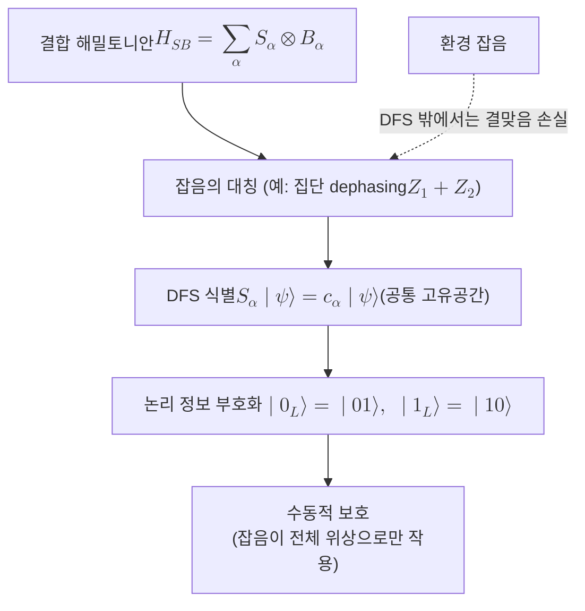

# Decoherence-Free Subspace

> 환경과의 결합이 지닌 대칭 때문에 잡음이 항등 연산처럼만 작용하는 부분공간으로, 그 안에 부호화된 양자 정보는 능동적 정정 없이도 결어긋남에서 수동적으로 보호된다.

## 핵심
[[Quantum Decoherence|결어긋남]]은 계가 환경과 [[Quantum Entanglement|얽히면서]] 결맞음이 환경으로 빠져나가는 과정이다. 결어긋남 없는 부분공간(DFS)의 발상은 잡음 자체를 줄이는 대신, 잡음이 계의 상태를 구별하지 못하는 영역을 찾아 그 안에만 정보를 담는 것이다. 잡음이 어떤 상태들에 대해 똑같은 위상을 곱하거나 아무 일도 하지 않는다면, 그 상태들 사이의 상대 위상은 손상되지 않고 보존된다.

이 그림은 계와 환경의 결합 해밀토니안이 가진 대칭에서 나온다. 상호작용 해밀토니안을 계 연산자 $S_\alpha$와 환경 연산자 $B_\alpha$의 곱으로 전개하면

$$ H_{SB} = \sum_\alpha S_\alpha \otimes B_\alpha $$

로 쓸 수 있다. 부분공간 $\mathcal{H}_{\text{DFS}}$가 모든 계 연산자 $S_\alpha$의 공통 고유공간이고, 그 부분공간 안의 모든 상태가 같은 고윳값 $c_\alpha$를 공유한다면

$$ S_\alpha \lvert \psi \rangle = c_\alpha \lvert \psi \rangle \qquad \forall\, \lvert \psi \rangle \in \mathcal{H}_{\text{DFS}} $$

잡음은 이 부분공간 위에서 상태에 의존하지 않는 전체 위상이나 환경 쪽 작용으로만 나타난다. 결과적으로 부분공간 안의 두 상태가 받는 영향이 동일해 상대 위상이 보존되고, 부호화된 정보는 결어긋남을 겪지 않는다.

대표적인 예가 집단 결어긋남(collective dephasing)이다. 두 큐비트가 동일한 환경 위상 잡음을 함께 받는다면 잡음은 총 위상 연산자 $Z_1 + Z_2$를 통해 작용한다. 이때 단일 들뜸 영역의 두 상태

$$ \lvert 0_L \rangle = \lvert 01 \rangle, \qquad \lvert 1_L \rangle = \lvert 10 \rangle $$

는 $Z_1 + Z_2$의 고윳값이 모두 $0$으로 같아, 집단 위상 잡음 아래에서 동일하게 변환된다. 따라서 이 두 상태가 펼치는 2차원 부분공간은 집단 dephasing에 대한 DFS가 되고, 한 개의 논리 큐비트를 결어긋남 없이 실어 나른다. 더 일반적으로 잡음이 모든 큐비트를 똑같이 건드리는 치환 대칭을 가질 때, 잡음 작용에 불변인 부분공간은 결어긋남 없는 무잡음 부분계(noiseless subsystem)로 확장된다.

## 흐름

## 능동적 정정과의 차이
DFS는 잡음을 진단하고 되돌리는 [[Quantum Error Correction|양자 오류정정]]과 목적은 같지만 방식이 정반대다. 양자 오류정정은 신드롬을 측정해 오류를 검출하고 복원 연산을 적용하는 능동적 기법이라, 측정과 게이트라는 추가 자원을 쉼 없이 소모한다. 반면 DFS는 잡음의 대칭에 맞게 부호화 기저를 한 번 고르기만 하면 그 뒤로는 어떤 측정도 정정도 필요 없는 수동적 보호다. 오버헤드가 거의 없는 대신 보호는 잡음이 가진 대칭이 정확히 성립하는 동안에만 유효하다는 한계가 있다.

이 둘은 배타적이지 않고 계층적으로 병합된다. 먼저 DFS로 가장 지배적인 상관 잡음을 수동적으로 흡수해 유효 오류율을 낮추고, 그 위에 양자 오류정정을 얹어 대칭이 깨지는 잔여 오류를 능동적으로 정정하는 식이다. 실제로 무잡음 부분계는 [[Stabilizer Code|안정자 부호]]의 한 특수한 경우로 통합해 기술할 수 있어, DFS는 능동적 부호화의 토대 위에서 자연스럽게 결합된다.

## 왜 중요한가
결어긋남 없는 부분공간은 양자 정보를 지키는 데에 잡음의 구조 자체를 자원으로 쓸 수 있음을 보여준다. 현실의 잡음은 완전히 무작위가 아니라 종종 공간적으로 상관되어 있다. 가까이 놓인 큐비트들이 같은 떠도는 장이나 같은 제어선의 흔들림을 공유해 거의 동일한 잡음을 함께 받는 경우가 흔하다. 바로 이 상관성이 DFS가 작동할 대칭을 제공하므로, 잡음이 상관될수록 오히려 보호가 쉬워지는 역설적 이점이 생긴다.

실용적으로 DFS는 결함허용으로 가는 자원 부담을 줄이는 첫 방어선이 된다. 능동적 [[Quantum Error Correction|양자 오류정정]]은 하나의 [[Logical Qubit|논리 큐비트]]에 수백에서 수천 개의 물리 큐비트를 요구할 만큼 비싸므로, 그 앞단에서 지배적 상관 잡음을 공짜에 가깝게 걷어내는 수동적 보호는 전체 자원 예산을 크게 절약한다. 이온 덫이나 핵스핀 앙상블처럼 집단 잡음이 두드러지는 플랫폼에서는 DFS 부호화가 결맞음 수명을 실험적으로 여러 배 늘리는 것이 확인되었다. 잡음을 줄이는 하드웨어 개선, 잡음을 평균해 없애는 [[Dynamical Decoupling|동역학적 디커플링]], 잡음을 정정하는 양자 오류정정과 함께, DFS는 잡음의 대칭을 이용해 잡음을 피하는 또 하나의 독립된 축을 이룬다.

## 연결
- [[Quantum Decoherence]] DFS가 회피하려는 결맞음 손실 과정 자체이며, 그 결합 대칭을 분석해 보호 부분공간을 찾아내는 출발점
- [[Quantum Error Correction]] 신드롬으로 오류를 능동적으로 정정하는 기법으로, DFS의 수동적 보호와 계층적으로 병합되어 잔여 오류를 처리
- [[Density Matrix]] 잡음이 부분공간 안에서 비대각 항을 보존하는지로 보호 여부를 판정하는 정량적 무대
- [[Quantum Entanglement]] 집단 잡음에 불변인 논리 상태가 흔히 얽힌 부호화로 구성되는 까닭이 되는 토대
- [[Stabilizer Code]] 무잡음 부분계가 그 특수 경우로 통합되어, DFS의 수동적 보호를 능동적 부호화와 한 언어로 묶는 형식론
- [[Logical Qubit]] DFS가 수동적으로 보호하는 정보 단위이자 능동적 부호화가 비싼 자원으로 떠받치는 대상
- [[Surface Code]] 능동적 부호화의 대표 사례로, DFS가 줄여 준 유효 오류율 위에 얹혀 결함허용을 완성하는 상위 방어층
- [[Dynamical Decoupling]] 펄스열로 잡음을 시간 평균해 상쇄하는 또 다른 수동에 가까운 잡음 억제 기법(작성 예정)
