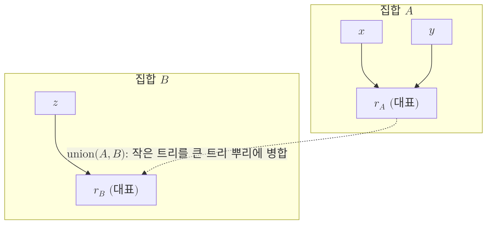

# Disjoint-Set Union

> 원소들을 겹치지 않는 여러 집합으로 나눠 관리하면서, 두 집합을 합치는 연산과 어떤 원소가 속한 집합을 묻는 연산을 거의 상수 시간에 처리하는 자료구조.

## 핵심

서로소 집합 자료구조는 전체 원소 집합을 서로 교집합이 없는 여러 덩어리로 분할해 두고, 그 분할 상태를 효율적으로 갱신하고 조회하는 도구다. 제공하는 연산은 본질적으로 두 가지다. find 연산은 주어진 원소가 현재 어느 집합에 속하는지를 그 집합의 대표(representative)로 답하고, union 연산은 두 원소가 속한 집합을 하나로 [[Union-Find Decoder|병합]]한다. 두 원소가 같은 집합에 있는지는 각각의 find 결과가 같은 대표를 가리키는지로 판정한다.

구현은 각 집합을 트리로 표현한다. 모든 원소는 부모 포인터 하나를 가지며, 트리의 뿌리가 곧 그 집합의 대표다. find는 부모를 따라 뿌리까지 거슬러 올라가고, union은 한 트리의 뿌리를 다른 트리의 뿌리에 매달아 두 트리를 하나로 잇는다. 이 단순한 형태만으로는 트리가 길게 늘어져 find가 느려질 수 있어, 두 가지 최적화를 함께 쓴다.

첫째는 랭크 기준 병합(union by rank) 또는 크기 기준 병합(union by size)이다. 두 트리를 합칠 때 더 낮은(또는 작은) 트리를 더 높은(또는 큰) 트리 아래에 매달아 전체 높이가 불필요하게 자라지 않게 한다. 둘째는 경로 압축(path compression)이다. find가 뿌리까지 올라가는 길에 들른 모든 노드의 부모를 뿌리로 직접 다시 연결해, 다음 번 조회를 짧게 만든다. 두 기법을 동시에 적용하면 $m$번의 연산을 $n$개의 원소에 수행할 때 분할 상환 총비용이 다음과 같이 거의 선형으로 묶인다.

$$
T(m, n) = O\!\left(m\,\alpha(n)\right)
$$

여기서 $\alpha(n)$은 아커만 함수의 역함수로, 극도로 느리게 증가해 현실에서 만나는 모든 $n$에 대해 $\alpha(n) \le 4$ 수준이다. 따라서 한 연산의 분할 상환 비용은 사실상 상수로 취급할 수 있고, 이 거의 상수 시간 보장이 자료구조의 핵심 성질이다.

## 구조

## 왜 중요한가

서로소 집합 자료구조는 그 자체로는 양자 개념이 아니라 일반 알고리즘의 부품이지만, 양자 오류정정 복호의 처리량을 떠받치는 결정적 토대로서 이 vault에 자리한다. [[Union-Find Decoder|유니온-파인드 복호기]]는 점화된 결함을 씨앗으로 군집을 키우다가 두 군집의 경계가 만나는 순간 둘을 병합하고, 어떤 정점이 어느 군집에 속하는지를 끊임없이 조회한다. 군집의 병합은 union 연산에, 군집 소속 판정은 find 연산에 그대로 대응하므로, 복호기의 전체 시간 복잡도는 이 자료구조의 연산 비용이 좌우한다.

거의 상수 시간 보장 덕분에 복호기는 결함과 정점의 개수 $n$에 대해 $O(n\,\alpha(n))$, 즉 거의 선형 시간에 동작할 수 있다. 이는 정확하지만 비용이 다항식 차수로 늘어나는 [[Minimum-Weight Perfect Matching|최소 무게 완전 매칭]]과 대비되는 속도 우위의 근원이다. 또한 부모 포인터 배열과 랭크 배열이라는 단순한 메모리 구조만으로 구현되어, FPGA나 ASIC 같은 전용 하드웨어로 옮겨 실시간 복호의 역추적 병목을 줄이기에도 유리하다. 결국 추상적인 집합 분할 자료구조의 효율이 표면 부호를 실제 장치에서 굴리는 복호 계층의 실현 가능성과 직결된다.

## 연결

- [[Union-Find Decoder]] 군집 성장과 병합, 소속 판정을 이 자료구조의 union과 find로 구동하는 직접적 응용처
- [[Decoder]] 신드롬을 회복 연산으로 옮기는 일반 복호 문제, 이 자료구조는 그 한 구현의 핵심 부품
- [[Minimum-Weight Perfect Matching]] 더 정확하지만 느린 대안 복호기, 거의 상수 시간 보장이 만드는 속도 차이를 가늠하는 비교 기준
- [[Surface Code]] 유니온-파인드 복호가 적용되는 위상 부호이자 거의 선형 복호가 요구되는 무대
