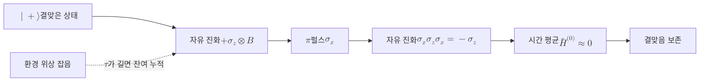

# Dynamical Decoupling

> 큐비트에 정교하게 설계한 제어 펄스열을 주기적으로 가해 환경과의 결합을 시간 평균으로 상쇄함으로써 결맞음을 능동적으로 보호하는 개방계 제어 기법이다.

## 핵심
[[Quantum Decoherence|결맞음 손실]]은 큐비트가 환경과 결합해 위상 정보가 환경으로 새어 나가면서 일어난다. 동역학적 디커플링(DD)의 발상은 잡음의 원천을 없애는 대신, 큐비트를 빠르게 뒤집어 잡음이 한쪽으로 누적되기 전에 부호를 반대로 만드는 것이다. 한 주기 동안 잡음이 더한 위상과 뒤집힌 구간에서 잡음이 더한 위상이 서로 상쇄되어, 시간 평균된 유효 결합이 0에 가까워진다. 스핀 에코(Hahn echo)가 이 아이디어의 가장 단순한 형태다.

수학적으로는 큐비트와 환경의 결합 해밀토니안을 다음처럼 둔다.

$$ H = H_B + \sigma_z \otimes B $$

여기서 $H_B$는 환경 자체의 동역학이고 $\sigma_z \otimes B$는 위상 잡음을 일으키는 결합이다. 큐비트에 시각 $\tau$마다 $\pi$ 펄스를 가하면 큐비트 연산자가 [[Pauli Matrices|파울리 연산]]을 통해 부호를 바꾼다.

$$ \sigma_x\, \sigma_z\, \sigma_x = -\sigma_z $$

따라서 두 번째 자유 진화 구간에서 결합은 $-\sigma_z \otimes B$로 작용하고, 첫 구간과 합치면 일차항이 소거된다. 가장 기본적인 시퀀스가 단일 축 펄스를 일정 간격으로 가하는 Carr-Purcell 형태이고, 펄스 축을 초기 상태와 정렬되도록 위상을 어긋나게 두어 펄스 자체의 불완전성에 강건하게 만든 것이 CPMG 시퀀스다. 펄스의 방향을 직교 두 축(X와 Y)으로 번갈아 적용해 임의 방향의 결합까지 평균하면서 펄스 오차를 함께 소거하는 것이 XY 계열 시퀀스다.

DD가 작동하는 이유는 평균 해밀토니안 이론으로 정리된다. 펄스 간격 $\tau$가 환경 잡음의 상관 시간보다 충분히 짧으면, 시간순 펄스열이 만드는 토글링 프레임에서 유효 해밀토니안의 저차항이 사라진다.

$$ \bar{H}^{(0)} = \frac{1}{T}\int_0^T \tilde{H}(t)\, dt \approx 0 $$

남는 것은 $\tau$의 높은 차수에 비례하는 작은 잔여 항뿐이므로, 펄스를 촘촘하게 가할수록 보호가 좋아진다. 다만 펄스 자체의 오차와 하드웨어의 최소 펄스 간격이 한계를 정한다.

## 흐름

## 왜 중요한가
동역학적 디커플링은 추가 큐비트나 신드롬 측정 없이 한 개의 물리 큐비트만으로도 적용할 수 있는 가장 저렴한 결맞음 보호 수단이다. [[Quantum Error Correction|양자 오류정정]]이 하나의 [[Logical Qubit|논리 큐비트]]를 만들기 위해 수많은 보조 큐비트와 끊임없는 측정을 요구하는 것과 달리, DD는 제어 펄스만 일정에 맞게 끼워 넣으면 되어 결함허용으로 가기 전의 첫 방어선 역할을 한다. 실험에서 DD는 초전도 큐비트와 핵스핀의 결맞음 시간 $T_2$를 여러 배에서 수십 배까지 늘려 왔다.

수동적 보호인 [[Decoherence-Free Subspace|결어긋남 없는 부분공간]](DFS)과는 상보적이다. DFS는 잡음이 가진 대칭에 맞게 부호화 기저를 고정해 잡음이 정보를 건드리지 못하는 영역에 정보를 숨기는 정적인 방식이고, DD는 시간 영역에서 펄스를 가해 잡음의 효과를 능동적으로 평균해 없애는 동적인 방식이다. 둘은 배타적이지 않아, DFS로 상관 잡음을 흡수하고 그 위에 DD로 남은 위상 잡음을 평균하며 다시 그 위에 양자 오류정정을 얹는 계층적 결합이 가능하다. 잡음을 줄이는 하드웨어 개선, 잡음을 피하는 DFS, 잡음을 정정하는 양자 오류정정과 더불어, DD는 잡음을 시간 평균으로 상쇄하는 또 하나의 독립된 축을 이룬다.

## 연결
- [[Decoherence-Free Subspace]] 잡음의 대칭을 이용한 수동적 보호로, 시간 영역에서 잡음을 평균하는 DD와 상보적이며 계층적으로 병합 가능
- [[Quantum Decoherence]] DD가 펄스열로 시간 평균해 상쇄하려는 결맞음 손실 과정 자체
- [[Pauli Matrices]] $\pi$ 펄스가 큐비트 연산자의 부호를 뒤집어 결합을 상쇄하는 메커니즘의 기반 연산
- [[Quantum Error Correction]] 신드롬으로 잔여 오류를 능동적으로 정정하는 상위 방어층으로, DD가 낮춘 유효 잡음 위에 결합
- [[Logical Qubit]] 양자 오류정정이 비싼 자원으로 떠받치는 정보 단위이자, DD가 그 앞단에서 물리 큐비트 수준에서 보호하는 대상
