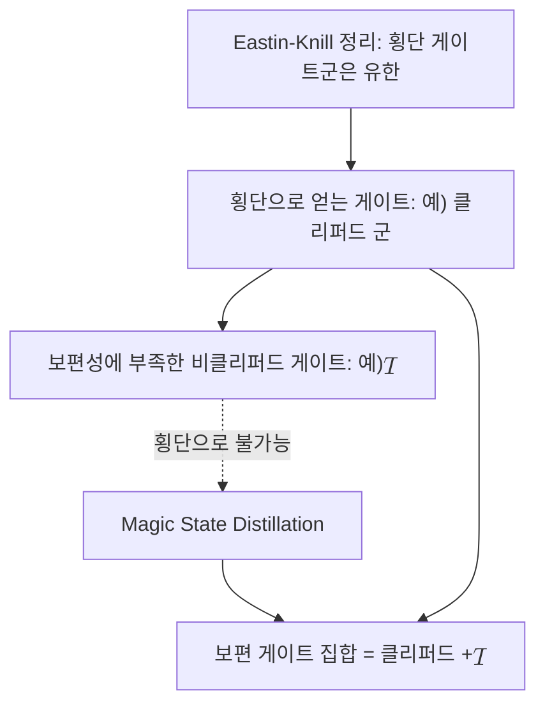

# Eastin-Knill Theorem

> 비자명한 거리를 가진 어떤 양자 오류정정 부호도 보편적인 횡단 게이트 집합을 가질 수 없다는 불가 정리다.

## 핵심
[[Transversal Gate|횡단 게이트]]는 논리 블록의 각 물리 큐비트에 개별 게이트를 가하는 방식이라 한 블록 안에서 오류가 번지지 않는다. 이 결함 내성 덕분에 횡단 구현은 매우 매력적이지만, 이스틴과 닐은 횡단성과 계산 능력을 동시에 극대화할 수 없음을 증명했다. 정확히 말하면, 적어도 하나의 오류를 검출할 수 있는 부호(부호 거리 $d \ge 2$)에 대해 횡단으로 구현 가능한 논리 게이트들의 집합은 항상 유한군을 이루며, 따라서 [[Universal Gate Set|보편 게이트 집합]]이 요구하는 연속적인 게이트 다양체를 결코 채울 수 없다.

증명의 직관은 다음과 같다. 횡단 게이트는 물리 큐비트별 텐서곱 형태 $U = U_1 \otimes U_2 \otimes \cdots \otimes U_n$로 작용한다. 만약 이런 게이트들이 연속군을 이룬다면 항등원 근방에서 연속적으로 변하는 논리 연산을 만들 수 있는데, 이는 임의로 작은 횡단 연산을 뜻한다. 그런데 한 큐비트에만 작용하는 작은 횡단 연산은 부호의 관점에서 단일 큐비트 오류와 구별되지 않는다. 결함 내성을 갖추려면 부호는 그런 단일 큐비트 변화를 오류로 교정해 버려야 하고, 그 결과 그 연산은 논리 공간에서 항등 작용으로 환원된다. 연속적으로 비자명한 횡단 논리 게이트가 존재할 수 없으므로, 횡단 게이트군은 이산적이고 유한할 수밖에 없다.

대표적인 사례가 [[Stabilizer Code|안정자 부호]]에서 횡단으로 얻어지는 [[Clifford Group|클리퍼드 군]]이다. 클리퍼드 군 자체는 유한군이며, 보편 계산에 도달하려면 그 바깥의 게이트가 하나 더 필요하다. 흔히 $T$ 게이트가 그 역할을 맡는다.

$$ T = \begin{pmatrix} 1 & 0 \\ 0 & e^{i\pi/4} \end{pmatrix} $$

이 $T$ 게이트는 대다수 부호에서 횡단으로 구현되지 않으며, 이것이 정리가 가리키는 빈틈이다.

## 구조

## 왜 중요한가
이 정리는 결함 내성 양자계산의 설계 전략 전체를 규정하는 출발점이다. 횡단 게이트만으로는 보편성에 결코 도달할 수 없다는 사실이 못 박히면서, 부족한 비클리퍼드 게이트를 다른 자원으로 우회해 공급해야 한다는 요구가 생긴다. 그 표준 해법이 바로 [[Magic State Distillation|마법 상태 증류]]다. 잡음 섞인 [[Magic State|마법 상태]]를 다수 모아 더 순수한 한 부를 정제하고, 이를 게이트 텔레포테이션 회로에 주입해 횡단 클리퍼드 연산만으로 $T$ 게이트에 해당하는 논리 연산을 실현한다.

다시 말해 이스틴-닐 정리는 보편 결함 내성 계산의 비용 구조를 결정한다. 결함 내성을 지키는 한 보편성은 공짜로 오지 않고, 마법 상태를 만들고 증류하는 막대한 자원 오버헤드를 치러야 한다. 오늘날 [[Surface Code|표면 부호]] 기반 아키텍처에서 마법 상태 공장이 큐비트 예산의 큰 비중을 차지하는 근본 이유가 여기에 있다. 정리는 또한 부호 설계의 방향도 자극한다. 더 풍부한 횡단 게이트 집합을 가진 부호나 부호 전환, 격자 수술 같은 대안적 보편화 기법을 찾는 연구가 모두 이 불가 정리의 제약을 우회하려는 시도다.

## 연결
- [[Transversal Gate]] 이 정리가 제약하는 대상으로, 횡단 게이트군이 유한군에 갇힌다는 결론을 준다
- [[Universal Gate Set]] 횡단만으로는 결코 완성할 수 없는 목표로, 정리가 가리키는 빈틈의 정체
- [[Magic State Distillation]] 정리가 막은 비클리퍼드 게이트를 우회 공급하는 표준 해법
- [[Magic State]] 증류와 게이트 텔레포테이션에 주입되는 비클리퍼드 자원 상태
- [[Clifford Group]] 안정자 부호에서 횡단으로 얻는 대표적 유한군으로, 보편성에 한 게이트가 부족하다
- [[Fault-Tolerant Quantum Computation]] 이 정리가 비용 구조를 규정하는 상위 맥락
