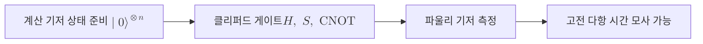

# Gottesman-Knill Theorem

> 클리퍼드 게이트와 계산 기저 준비, 파울리 측정만으로 구성된 양자 회로는 고전 컴퓨터로 다항 시간에 효율적으로 모사할 수 있다는 정리다.

## 핵심
이 정리의 출발점은 회로가 만들어 내는 상태가 아니라 그 상태를 고정하는 연산자에 주목하는 발상이다. [[Stabilizer Code|안정자 형식론]]에서 $n$ 큐비트 상태 $\lvert \psi \rangle$는 자신을 고윳값 $+1$로 고정하는 [[Pauli Group|파울리 군]]의 가환 부분군, 즉 안정자군 $S = \langle g_1, \dots, g_n \rangle$로 완전히 기술된다. 상태 벡터는 $2^n$개의 진폭을 가지지만, 안정자 생성원은 단 $n$개뿐이고 각각은 $2n+1$비트로 적을 수 있다. 따라서 안정자로 표현 가능한 상태는 지수적 정보 대신 다항 크기 정보로 저장된다.

핵심은 [[Clifford Group|클리퍼드 게이트]]가 이 다항 표현을 보존한다는 점이다. 클리퍼드 군은 정의상 파울리 군을 켤레변환으로 자기 자신에 보내므로, 클리퍼드 연산 $U$를 가하면 각 생성원이 $g_i$에서 $U g_i U^\dagger$라는 또 다른 파울리 연산자로 바뀐다. 상태 벡터의 모든 진폭을 갱신하는 대신, $n$개의 생성원만 갱신하면 된다. 이것이 [[Heisenberg Picture|하이젠베르크 묘사]]의 사고방식이다. 상태를 시간에 따라 진화시키는 대신 연산자를 진화시켜 같은 물리를 기술한다.

$$
\lvert \psi \rangle \xrightarrow{\;U\;} U \lvert \psi \rangle,
\qquad
g_i \,\lvert \psi \rangle = \lvert \psi \rangle
\;\Longrightarrow\;
(U g_i U^\dagger)\, U \lvert \psi \rangle = U \lvert \psi \rangle
$$

생성원의 갱신은 각 파울리 연산자가 다른 파울리 연산자들에 어떻게 매핑되는지 추적하는 일이라, 적절한 표(이진 심플렉틱 표현)에서 $O(n^2)$ 비용의 행렬 갱신으로 처리된다. 측정 역시 효율적이다. 파울리 측정의 결과가 결정적인지 무작위인지, 무작위라면 두 결과가 각각 확률 $\tfrac{1}{2}$인지를 안정자군과의 가환 관계만으로 판정하고, 측정 후 안정자를 갱신할 수 있다. Aaronson과 Gottesman은 이 갱신을 더 정교하게 다듬어 회로 모사를 $O(n^2)$ 메모리와 측정당 다항 시간으로 수행하는 구체적 알고리즘(CHP)을 제시했다.

정리의 적용 범위는 다음 세 요소로 닫힌 회로다.

이 닫힌 집합을 단 하나의 게이트라도 벗어나면 보장이 깨진다. 대표적 탈출구가 $T$ 게이트 $\mathrm{diag}(1, e^{i\pi/4})$다. $T$는 클리퍼드 군의 원소가 아니어서 파울리 연산자를 파울리 연산자로 보내지 않고, 안정자 표현을 무너뜨린다. 따라서 클리퍼드 게이트에 $T$ 하나만 추가해도 게이트 집합은 보편 양자 계산이 가능해지고, 동시에 효율적 고전 모사 가능성을 잃는다. 실제 회로에서 $T$의 효과는 보통 [[Magic State|마법 상태]] $\lvert T \rangle = \tfrac{1}{\sqrt{2}}(\lvert 0 \rangle + e^{i\pi/4}\lvert 1 \rangle)$를 자원으로 주입해 구현한다.

## 왜 중요한가
이 정리는 얽힘 자체가 양자 우월성의 원천이라는 흔한 오해를 정면으로 반박한다. 벨 상태나 GHZ 상태처럼 강하게 얽힌 다체 상태도 클리퍼드 회로로 만들어지면 고전적으로 효율 모사된다. 즉 얽힘이 많다는 사실만으로 고전 컴퓨터를 능가하지는 못한다. 양자가 고전을 앞서려면 안정자 형식론 바깥의 자원, 곧 비클리퍼드 연산이 필요하다. [[Magic State|마법 상태]]가 정량화하는 이 자원을 흔히 마법(magic) 또는 비안정자성(non-stabilizerness)이라 부른다. [[Quantum Supremacy|양자 우월성]] 논의에서 이 정리는 "어디부터 고전이 따라올 수 없는가"의 경계선을 그어 준다.

[[Quantum Error Correction|양자 오류정정]] 관점에서도 이 정리는 실용적 의미가 크다. 대부분의 안정자 부호는 인코딩, 신드롬 측정, 논리 파울리 보정이 모두 클리퍼드 연산으로 이뤄지므로, 부호의 동작과 오류 전파를 클래식 컴퓨터로 빠르게 시뮬레이션해 검증할 수 있다. 오류 모델을 파울리 채널로 근사하면 대규모 부호의 임계값 추정도 가능해진다. 동시에 정리는 결함허용 양자컴퓨터 설계의 난점을 드러낸다. 값싸게 결함허용으로 구현되는 클리퍼드 게이트만으로는 보편 계산이 안 되고, 비싼 비클리퍼드 자원인 마법 상태를 별도로 증류해 공급해야 한다. 이 구조가 결함허용 아키텍처에서 자원 비용의 핵심 병목이 된다.

## 연결
- [[Clifford Group]] 정리가 효율 모사를 보장하는 게이트 집합이자 파울리 군을 켤레변환으로 보존하는 연산
- [[Stabilizer Code]] 상태를 안정자군으로 다항 크기 표현하는 형식론, 이 정리의 표현 기반
- [[Pauli Group]] 안정자와 측정, 켤레변환 추적의 기본 대상이 되는 연산자 군
- [[Heisenberg Picture]] 상태 대신 연산자를 진화시키는 묘사, 정리의 계산 절차가 따르는 관점
- [[Magic State]] 클리퍼드를 넘어 보편 계산과 양자 우월성을 가능케 하는 비클리퍼드 자원
- [[Quantum Supremacy]] 고전 모사가 불가능해지는 경계를 정리가 규정하는 맥락
