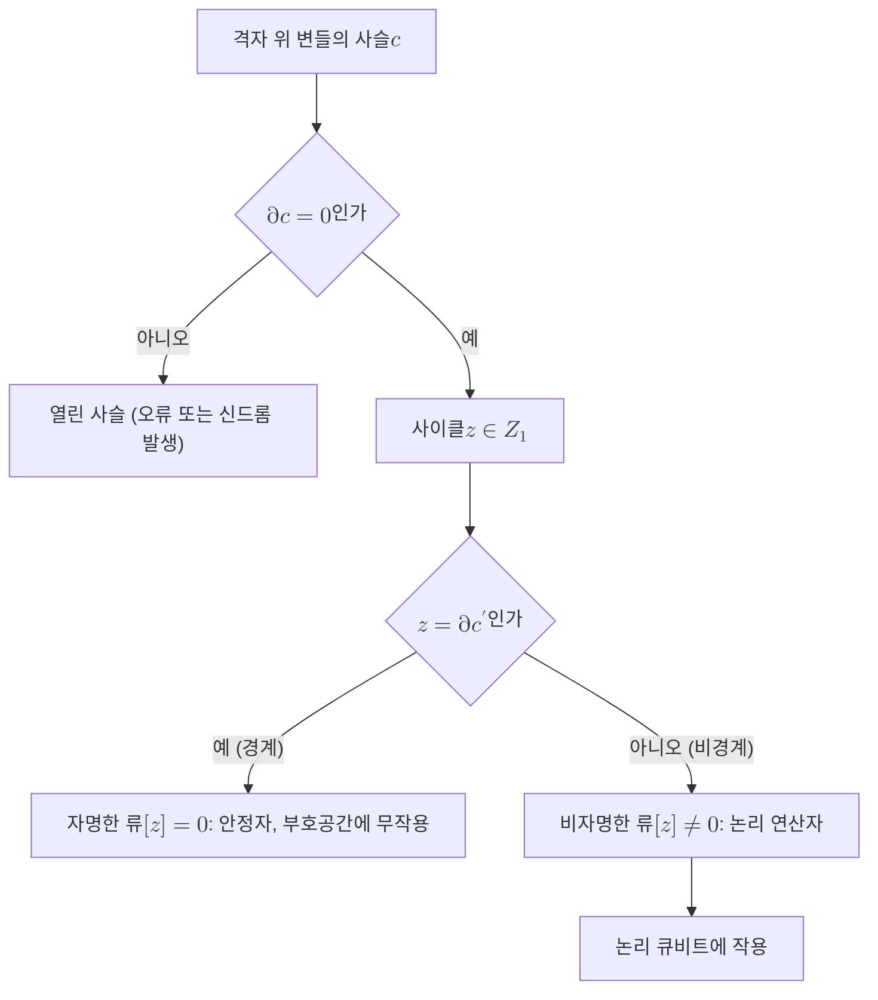

# Homology Class

> 격자 위의 닫힌 사이클을 경계 여부로 묶은 동치류로, 표면부호의 논리 연산자가 어떤 류에 속하느냐로 그 작용이 결정되는 위상적 라벨이다.

## 핵심
호몰로지는 공간의 구멍을 대수적으로 세는 도구다. [[Surface Code|표면부호]]의 큐비트는 2차원 격자(셀 복합체)의 변에 놓이고, 오류와 연산자는 이 격자 위의 변 집합, 즉 사슬(chain)로 표현된다. 핵심은 두 가지 연산자다. 경계 연산자 $\partial$는 변들의 사슬을 그 끝점인 정점들의 집합으로 보내고, 그 위에 또 한 번 더 쌓은 구조에서 닫힌 사슬과 경계 사슬을 비교한다.

경계가 없는 사슬, 즉 $\partial z = 0$을 만족하는 $z$를 사이클(cycle)이라 한다. 어떤 영역의 테두리로 만들어진 사슬, 즉 $b = \partial c$ 꼴인 $b$를 경계(boundary)라 한다. 모든 경계는 자동으로 사이클이지만($\partial \partial = 0$) 그 역은 성립하지 않는다. 바로 이 차이를 모은 몫공간이 호몰로지 군이다.

$$
H_1 = \frac{\ker \partial_1}{\operatorname{im} \partial_2} = \frac{Z_1}{B_1}
$$

여기서 $Z_1$은 사이클 전체, $B_1$은 경계 전체다. 한 사이클 $z$가 결정하는 원소 $[z] \in H_1$이 호몰로지 류다. 두 사이클이 같은 류에 속한다는 것은 둘의 차이가 어떤 영역의 경계라는 뜻, 다시 말해 한쪽을 격자 위에서 연속적으로 변형해 다른 쪽으로 옮길 수 있다는 뜻이다.

표면부호에서 이 구조가 부호의 모든 부분을 정확히 나눈다. 경계인 사이클은 [[Stabilizer Code|안정자]] 연산자에 대응하므로 부호공간에 자명하게 작용한다. 반면 닫혀 있지만 경계가 아닌 비자명한 사이클은 [[Logical Qubit|논리 큐비트]]에 실제로 작용하는 논리 연산자가 된다. 즉 논리 연산자의 정체는 그것이 그리는 경로가 아니라 그 경로가 속한 호몰로지 류로 결정된다.

토러스 위에 정의된 [[Toric Code|토릭 부호]]가 가장 깨끗한 예다. 토러스는 서로 독립인 두 개의 비수축 고리(가로 방향과 세로 방향)를 가지므로 $H_1$의 차원이 2다. 따라서 비자명한 논리 연산자의 류도 그만큼 생기고, 이것이 토릭 부호가 두 개의 논리 큐비트를 담는 위상적 근거가 된다. 일반적으로 부호가 담는 논리 큐비트 수는 바탕 곡면의 종수에 묶여 있으며, 닫힌 곡면에서는 $k = 2g$로 주어진다.

## 구조
사슬에서 호몰로지 류, 다시 논리 연산자로 이어지는 분류를 다이어그램으로 정리하면 다음과 같다.

격자의 변에 사는 사이클이 $Z$형 논리 연산자라면, 같은 격자의 쌍대 격자(dual lattice) 위에서 정의되는 사이클은 $X$형 논리 연산자가 된다. 두 류가 서로 다른 격자에 살면서 홀수 번 교차할 때, 대응하는 논리 연산자 $\bar{X}$와 $\bar{Z}$는 반교환하며 하나의 논리 큐비트를 구성한다.

## 왜 중요한가
호몰로지 류는 표면부호의 보호 능력이 왜 국소적 잡음에 강한지를 설명한다. 어떤 류에 속하는지는 사이클을 조금 늘이거나 구부리거나 안정자를 곱해도 바뀌지 않는 위상적 불변량이다. 따라서 논리 정보는 국소적인 연산으로는 결코 건드릴 수 없고, 오직 격자를 가로지르는 비자명한 사이클 전체를 한꺼번에 뒤집는 큰 오류만이 논리 오류를 일으킨다.

이 관점은 [[Code Distance|부호 거리]]에도 직접적인 의미를 준다. 논리 오류를 내려면 가장 짧은 비자명 사이클만큼의 변을 오류가 덮어야 하므로, 부호 거리는 곧 비자명한 호몰로지 류 안에서 가장 가벼운 대표원의 무게와 같다. 격자를 키우면 비자명 사이클이 길어지고 거리가 커지므로, 위상적 보호가 부호 크기에 따라 강해지는 이유가 명료해진다.

더 넓게는 호몰로지 류가 오류정정을 기하학과 위상수학의 언어로 다시 쓰게 해 준다. 신드롬은 사슬의 경계로, 디코딩은 같은 류 안에서 가장 그럴듯한 대표원을 고르는 문제로 환원된다. 이 추상화 덕분에 평면 표면부호, 토릭 부호, 더 높은 종수의 곡면 부호, 고차원 위상 부호가 하나의 틀 안에서 통일적으로 다뤄진다.

## 연결
- [[Surface Code]] 표면부호의 논리 연산자가 격자 위 비자명 사이클로 정의되며, 그 동치 관계를 주는 것이 호몰로지 류다
- [[Logical Qubit]] 비자명한 호몰로지 류 하나하나가 부호공간 안의 논리 큐비트 자유도에 대응한다
- [[Toric Code]] 토러스의 두 비수축 고리가 $H_1$의 차원 2를 주어 두 개의 논리 큐비트를 담는 위상적 근거가 된다
- [[Stabilizer Code]] 경계가 되는 자명한 류는 안정자 연산자에 대응하여 부호공간에 작용하지 않는다
- [[Code Distance]] 부호 거리는 가장 짧은 비자명 사이클의 무게와 같아 위상적 보호와 직결된다
