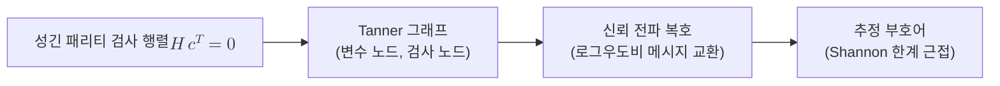

# LDPC Codes

> LDPC 부호는 0이 대부분이고 1이 드문 성긴(저밀도) 패리티 검사 행렬로 정의되는 선형 블록 부호로, 메시지 전달 복호로 Shannon 한계에 근접하는 성능을 내며 QKD 정보 조정과 양자 LDPC 부호의 토대가 된다.

## 핵심
LDPC(Low-Density Parity-Check) 부호는 패리티 검사 행렬 $H$의 원소 대부분이 $0$이고 $1$의 개수가 극히 적은, 즉 성긴 구조를 갖는 선형 부호다. 길이 $n$인 부호어 $\mathbf{c}$는 다음 조건을 만족할 때 유효하다.

$$ H \mathbf{c}^{\mathsf{T}} = \mathbf{0} \pmod 2 $$

여기서 $H$는 $m \times n$ 이진 행렬이고, 각 행은 하나의 패리티 검사 방정식을, 각 열은 하나의 부호 비트를 나타낸다. 부호율은 $R = k/n$이며 $k = n - \mathrm{rank}(H)$이다. 행렬이 성기다는 말은 각 검사에 참여하는 비트 수와 각 비트가 걸리는 검사 수가 $n$이 커져도 일정한 작은 상수로 묶여 있다는 뜻이다. 이 희소성이 LDPC 부호의 모든 장점을 떠받친다.

부호는 [[Tanner 그래프]]라는 이분 그래프로 시각화한다. 한쪽에는 부호 비트에 대응하는 변수 노드가, 다른 쪽에는 패리티 검사에 대응하는 검사 노드가 놓이고, $H$의 $1$ 위치마다 두 노드를 잇는 간선이 생긴다. 행렬이 성기므로 그래프도 성기고, 복호는 이 그래프 위에서 노드끼리 신뢰도를 주고받는 국소 메시지 전달로 수행된다.

복호의 핵심은 신뢰 전파(belief propagation) 또는 합곱(sum-product) 알고리즘이다. 각 변수 노드는 자신이 $0$ 또는 $1$일 확률에 대한 신뢰도를 검사 노드로 보내고, 각 검사 노드는 인접 비트들의 패리티 제약을 적용해 갱신된 신뢰도를 되돌려준다. 보통 로그우도비 $L_i = \log \frac{\Pr(c_i = 0)}{\Pr(c_i = 1)}$ 형태로 메시지를 주고받으며, 이 반복을 여러 차례 거쳐 추정 부호어로 수렴한다. 검사 노드 갱신은 다음과 같은 형태를 띤다.

$$ \tanh\!\left(\frac{L_{j \to i}}{2}\right) = \prod_{i' \in N(j) \setminus i} \tanh\!\left(\frac{L_{i' \to j}}{2}\right) $$

여기서 $N(j)$는 검사 노드 $j$에 인접한 변수 노드 집합이다. 그래프가 성기므로 각 갱신 비용이 작고, 전체 복호 복잡도가 부호 길이에 거의 선형으로 유지된다. 그 덕분에 매우 긴 부호를 실용적인 시간에 복호하면서 Shannon 채널 용량에 극도로 근접하는 성능을 얻는다.

## 구조

## 왜 중요한가
LDPC 부호는 두 갈래로 양자정보과학에 깊이 들어와 있다. 첫째는 [[Quantum Key Distribution|QKD]]의 [[Information Reconciliation|정보 조정]]이다. 시프트 키에 남은 Alice와 Bob의 불일치 비트를 정정할 때, LDPC는 한쪽이 신드롬 $\mathbf{s} = H\mathbf{x}^{\mathsf{T}}$만 인증된 공개 채널로 보내면 상대가 자신의 비트열을 신드롬에 맞춰 복호하는 일방향 방식을 가능하게 한다. [[Cascade Protocol|Cascade]]가 여러 차례 왕복하며 패리티를 비교하는 대화형인 데 반해, LDPC는 왕복을 한 번으로 줄여 고속 QKD 시스템의 처리량을 크게 끌어올린다. 다만 공개되는 신드롬 길이가 곧 누설량이고, 이는 이후 [[Privacy Amplification|비밀성 증폭]]에서 차감되므로 부호율과 효율 계수 $f$를 신중히 설계해야 한다.

둘째는 양자 오류정정으로의 일반화다. 고전 LDPC의 성긴 패리티 검사라는 발상은 안정자가 모두 적은 수의 큐비트에만 작용하는 [[Quantum LDPC Code|양자 LDPC 부호]]로 이어진다. [[Surface Code|표면 부호]]도 격자 위 국소 안정자라는 점에서 양자 LDPC 부호의 한 사례이며, 최근에는 일정한 부호율을 유지하면서 거리도 함께 키우는 좋은 양자 LDPC 부호가 발견되어, [[Surface Code|표면 부호]]보다 큐비트 오버헤드가 작은 내결함성 경로로 주목받는다. 성긴 검사 구조가 측정 회로의 국소성과 낮은 가중치를 보장한다는 점이 고전과 양자 양쪽에서 동일하게 핵심 가치다.

## 연결
- [[Quantum Error Correction]] 성긴 패리티 검사라는 LDPC의 핵심 발상을 양자 안정자 부호로 일반화하는 상위 틀
- [[Information Reconciliation]] LDPC 신드롬을 일방향으로 보내 시프트 키 불일치를 정정하는 QKD 키 증류 단계
- [[Surface Code]] 격자 위 국소 안정자로 정의되어 양자 LDPC 부호의 대표 사례에 해당하는 부호
- [[Stabilizer Code]] 양자 LDPC 부호가 속하는 상위 부호 계열로, LDPC의 양자판이 안정자 형식론 위에서 정의됨
- [[Decoder]] 신드롬에서 오류를 추정하는 양자 복호기 일반론, LDPC의 신뢰 전파 복호와 같은 계보에 놓이는 절차
- [[Quantum LDPC Code]] 안정자 가중치를 작게 묶은 LDPC의 양자 일반화(작성 예정)
- [[Tanner 그래프]] 성긴 패리티 검사 행렬을 이분 그래프로 표현해 신뢰 전파 복호를 정의하는 구조(작성 예정)
- [[Cascade Protocol]] LDPC와 대비되는 대화형 정보 조정 기법
