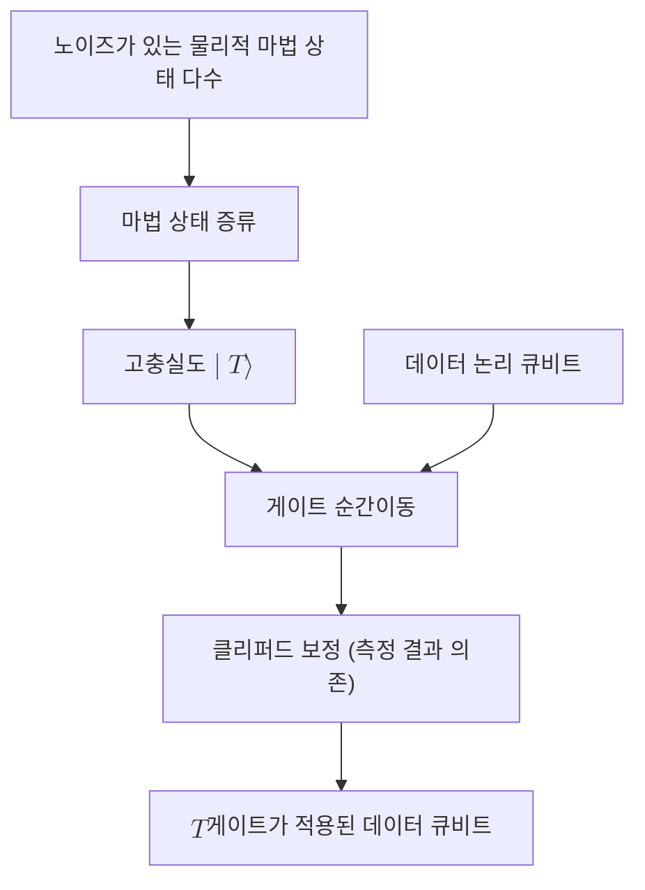

# Magic State

> 마법 상태는 클리퍼드 연산만으로는 만들 수 없는 비안정자 자원 상태로, 결함 허용 양자컴퓨터에서 비클리퍼드 게이트를 게이트 순간이동으로 주입하기 위해 소비된다.

## 핵심

마법 상태가 필요한 이유는 결함 허용 양자컴퓨팅의 구조적 한계에서 나온다. [[Surface Code|표면 부호]] 같은 안정자 부호 위에서는 [[Clifford Group|클리퍼드 게이트]]를 [[Transversal Gate|횡단 게이트]]로 비교적 싸게 구현할 수 있다. 그러나 [[Eastin-Knill Theorem|이스틴-닐 정리]]에 따라 어떤 부호도 보편 게이트 집합 전체를 횡단으로 구현할 수는 없다. 하필 그 부족분이 [[Universal Gate Set|보편 게이트 집합]]을 완성하는 데 꼭 필요한 비클리퍼드 게이트, 대표적으로 $T = \mathrm{diag}(1, e^{i\pi/4})$ 게이트다. 마법 상태는 이 비클리퍼드 게이트를 부호 안에서 직접 구현하지 않고 우회 주입하기 위한 자원이다.

대표적인 두 종류는 위상형과 디스틸레이션의 출발점인 다음 상태들이다. $T$ 게이트 주입에 쓰이는 상태는

$$ \lvert T \rangle = \lvert A_{\pi/4} \rangle = \frac{1}{\sqrt{2}}\left( \lvert 0 \rangle + e^{i\pi/4}\lvert 1 \rangle \right) $$

이고, 보통 $\lvert H \rangle$로 표기하는 상태는 블로흐 구의 한 마법 방향을 가리킨다. 핵심 성질은 이 상태들이 안정자 형식론으로 효율적으로 기술되지 않는다는 점이다. [[Gottesman-Knill Theorem|고테스만-닐 정리]]는 안정자 상태와 클리퍼드 연산, 계산 기저 측정만으로 이루어진 회로가 고전 컴퓨터로 효율적으로 모사된다고 말한다. 따라서 마법 상태처럼 안정자 다면체 바깥에 있는 비안정자 자원을 외부에서 공급해야만 회로가 고전 모사의 경계를 넘어 진정한 양자 우위로 들어선다. 마법 상태는 클리퍼드 회로에 주입되는 그 비안정자 연료에 해당한다.

주입 메커니즘은 게이트 순간이동이다. 미리 준비한 $\lvert T \rangle$ 한 개를 데이터 큐비트와 함께 클리퍼드 연산과 측정으로 상호작용시키면, 측정 결과에 따라 결정되는 클리퍼드 보정을 거쳐 데이터 큐비트에 $T$ 게이트가 적용된 효과가 남는다. 회로 안에서 실제로 실행되는 연산은 전부 부호가 보호하는 클리퍼드 연산과 측정뿐이고, 어렵고 비횡단적인 부분은 오프라인에서 준비한 마법 상태로 외부화된다. 즉 어려움이 게이트 실행 시점에서 상태 준비 시점으로 옮겨진다.

문제는 물리적으로 준비한 마법 상태가 노이즈로 오염되어 있다는 것이다. 이것을 정제하는 절차가 [[Magic State Distillation|마법 상태 증류]]다. 충실도가 낮은 여러 개의 마법 상태를 입력으로 받아 클리퍼드 연산과 측정만으로 더 적은 수의 고충실도 마법 상태를 합성한다. 따라서 마법 상태는 자원이고, 증류는 그 자원을 정련하는 공정이며, 게이트 순간이동은 정련된 자원을 소비해 게이트로 바꾸는 소비 단계다.

## 구조

## 왜 중요한가

마법 상태는 결함 허용 양자컴퓨팅에서 보편성을 확보하는 사실상 표준 경로다. [[Eastin-Knill Theorem|이스틴-닐 정리]]가 횡단 보편성을 원천 봉쇄하기 때문에, 비클리퍼드 게이트를 안전하게 얻으려면 이 자원 기반 우회로가 필요하다. 그 결과 마법 상태 준비와 증류는 표면 부호 기반 머신에서 시공간 자원의 압도적인 비중을 차지하는 비용 병목이 된다. 큰 양자 알고리즘의 자원 추정이 흔히 필요한 $T$ 게이트 수, 곧 $T$-카운트로 환산되는 이유도 여기에 있다. 하드웨어가 소비하는 마법 상태의 수와 증류 공장의 면적이 곧 알고리즘 실행 비용을 결정하기 때문이다. 마법 상태를 이해하는 것은 결함 허용 양자컴퓨터의 비용 구조와 한계를 이해하는 것과 같다.

## 연결

- [[Magic State Distillation]] 노이즈가 있는 마법 상태를 정제해 고충실도 자원을 합성하는 공정. 이 노트가 정의한 자원의 정련 단계
- [[Transversal Gate]] 클리퍼드 게이트를 싸게 구현하는 방법이자, 비클리퍼드 게이트에서는 막혀 마법 상태가 필요해지는 맞은편 경계
- [[Eastin-Knill Theorem]] 어떤 부호도 보편 게이트를 횡단으로 구현할 수 없다는 정리로, 마법 상태가 존재해야 하는 근본 이유
- [[Gottesman-Knill Theorem]] 안정자 회로의 고전 모사 가능성을 말하며, 마법 상태가 그 모사 경계를 넘는 비안정자 연료임을 설명
- [[Universal Gate Set]] 마법 상태가 주입하는 비클리퍼드 게이트가 완성하는 타겟. 보편성의 마지막 조각
- [[Clifford Group]] 마법 상태 주입과 증류가 전적으로 의존하는 보호된 연산 집합
