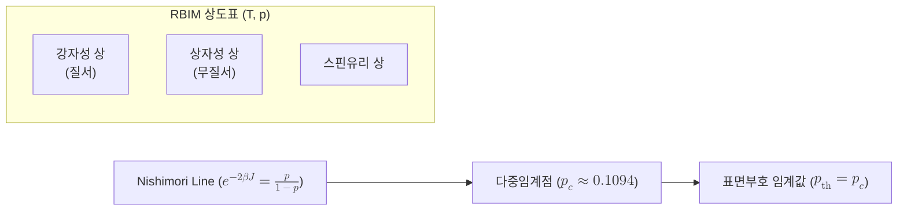

# Nishimori Line

> 무작위 결합 이징 모형에서 온도와 무질서 세기가 특정 관계로 묶이는 통계역학적 선이며, 이 선상의 다중임계점이 표면부호의 오류정정 임계값과 정확히 대응한다.

## 핵심
Nishimori Line은 [[Random-Bond Ising Model|무작위 결합 이징 모형]](RBIM)의 매개변수 공간에 그어지는 특수한 곡선이다. RBIM에서는 각 결합 $J_{ij}$가 확률 $1-p$로 강자성($+J$), 확률 $p$로 반강자성($-J$)을 띠도록 무작위로 뒤섞인다. 여기서 두 가지 독립 매개변수가 등장하는데, 하나는 온도 $T$가 정하는 열적 요동의 세기이고, 다른 하나는 결합 부호를 뒤집는 확률 $p$가 정하는 무질서의 세기이다.

니시모리는 이 두 매개변수가 다음 관계로 묶이는 특별한 선을 발견했다. 역온도 $\beta = 1/(k_B T)$를 쓰면

$$ e^{-2\beta J} = \frac{p}{1-p} $$

가 성립하는 점들의 모임이 Nishimori Line이다. 동등하게 결합 세기를 무질서 확률에 맞추어 $\beta J = \tfrac{1}{2}\ln\!\frac{1-p}{p}$로 두는 조건이다. 이 선은 임의로 고른 직선이 아니라 모형 자체가 가진 게이지 대칭에서 자연스럽게 솟아나는 선이다. 결합 부호의 무작위성과 스핀 정렬을 흩뜨리는 열적 요동이 정확히 같은 확률분포를 따르도록 균형을 맞춘 지점이라고 이해할 수 있다.

이 균형 덕분에 선상에서는 보통의 무질서계에서 다루기 까다로운 양들이 단순해진다. 예컨대 내부 에너지가 닫힌 형태로 주어지고, 특정 상관함수에 엄밀한 부등식과 항등식이 성립한다. 통계역학에서 Nishimori Line이 오래 연구된 이유가 바로 이 해석 가능성에 있다.

## 구조
온도와 무질서를 두 축으로 놓으면 상도표 위에서 Nishimori Line이 강자성 영역의 경계를 가로지른다. 이 선이 상경계와 만나는 자리가 다중임계점(Nishimori point)이며, 그 좌표 $p_c$가 표면부호 임계값에 대응한다.

## 왜 중요한가
이 선이 양자 오류정정에서 결정적인 이유는 [[Surface Code|표면부호]]의 오류정정 문제가 RBIM의 통계역학으로 정확히 번역되기 때문이다. Dennis, Kitaev, Landahl, Preskill의 위상적 양자 메모리 분석에서, 물리 큐비트에 독립적으로 일어나는 비트반전 오류율 $p$를 RBIM의 결합 뒤집힘 확률 $p$와 동일시하고, 오류 사슬을 짝짓는 복호 절차를 이징 스핀의 분배함수로 사상한다. 이 사상에서 복호가 성공할 조건은 정확히 RBIM이 강자성 질서 상에 머무르는 조건과 같다.

복호기가 신드롬만 보고 가장 그럴듯한 오류를 추정할 때, 그 추정이 통계적으로 정당해지는 지점이 바로 Nishimori Line 위의 다중임계점이다. 즉 오류율 $p$가 다중임계점의 좌표 $p_c$보다 작으면 RBIM은 질서 상에 있고 표면부호는 거리를 키워 논리 오류율을 지수적으로 억누를 수 있다. $p_c$를 넘으면 무질서 상으로 무너지며 정정이 불가능해진다. 이 임계 좌표가 곧 표면부호의 [[Quantum Threshold Theorem|오류 임계값]]이고, 완전 복호기를 가정한 이상적 임계값은 다중임계점 좌표인 약 $p_{\mathrm{th}} \approx 10.9\%$로 알려져 있다.

$$ p_{\mathrm{th}} = p_c \approx 0.1094 $$

요컨대 Nishimori Line은 추상적인 통계역학 개념이 아니라, 표면부호가 견딜 수 있는 최대 오류율을 수치로 못 박는 다리 역할을 한다. 실제 하드웨어에서 흔히 인용되는 약 $1\%$의 임계값은 측정 오류와 비완전 복호기를 포함한 현실적 추정이며, $10.9\%$는 그 이상적 상한에 해당한다. 두 값의 간극이 복호기와 측정을 개선해 좁힐 수 있는 여지를 보여 준다.

## 연결
- [[Random-Bond Ising Model]] Nishimori Line이 그어지는 무대인 통계역학 모형으로, 결합 무질서와 온도가 이 선에서 균형을 이룬다
- [[Surface Code]] 오류정정 문제가 RBIM으로 사상되어 다중임계점이 표면부호의 임계값으로 나타나는 응용 대상
- [[Quantum Threshold Theorem]] 임계값 아래에서 논리 오류율을 억누를 수 있다는 일반 명제이며, Nishimori 다중임계점은 표면부호에서 그 임계값을 구체적으로 정한다
- [[Minimum-Weight Perfect Matching]] 다중임계점 좌표로 정해지는 이상적 임계값에 다가가려 실제 복호기가 근사하는 표준 매칭 알고리즘
