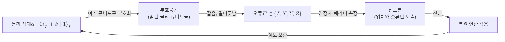

# Quantum Error Correction

> 여러 개의 물리 큐비트를 얽어 하나의 논리 큐비트를 부호화하고, 상태 자체를 측정하지 않은 채 오류만 진단하는 신드롬으로 잡음을 검출하고 되돌려 결맞음을 보호하는 기법이다.

## 핵심
[[Quantum Decoherence|결어긋남]]과 불완전한 게이트는 양자 상태에 끊임없이 오류를 새긴다. 고전 오류정정은 비트를 그대로 복제해 다수결로 고치지만, 양자 세계에서는 같은 전략이 두 겹의 장벽에 막힌다. 첫째로 [[No-Cloning Theorem|복제 불가 정리]] 때문에 미지의 상태 $\lvert \psi \rangle$를 그대로 베낄 수 없고, 둘째로 진폭을 직접 측정하면 [[Quantum Measurement|상태가 붕괴]]해 보호하려던 양자 정보가 파괴된다. 양자 오류정정은 이 두 제약을 우회하는 방식으로 설계된다.

핵심 발상은 정보를 단일 물리 큐비트가 아니라 여러 큐비트에 걸친 [[Quantum Entanglement|얽힘]] 패턴 속에 분산해 숨기는 것이다. 논리 상태는 큰 힐베르트 공간 안의 부호공간(code space)이라는 부분공간으로 부호화된다. 가장 단순한 예가 세 큐비트 비트반전 부호로, 한 큐비트의 정보를 다음처럼 펼친다.

$$ \lvert 0 \rangle_L = \lvert 000 \rangle, \qquad \lvert 1 \rangle_L = \lvert 111 \rangle $$

$$ \alpha \lvert 0 \rangle + \beta \lvert 1 \rangle \;\longmapsto\; \alpha \lvert 000 \rangle + \beta \lvert 111 \rangle $$

### 신드롬 측정: 상태를 보지 않고 오류만 본다
이 부호의 묘미는 정정 과정이 진폭 $\alpha, \beta$를 전혀 들여다보지 않는다는 데 있다. 대신 이웃한 큐비트들의 패리티만 측정한다. 가령 첫째와 둘째 큐비트의 패리티 $Z_1 Z_2$와 둘째와 셋째 큐비트의 패리티 $Z_2 Z_3$를 측정하면, 그 결과는 어느 큐비트에 비트반전이 일어났는지를 알려줄 뿐 어떤 진폭이 실렸는지는 누설하지 않는다. 이렇게 오류의 위치만 진단하는 측정값의 묶음을 신드롬(syndrome)이라 부른다.

신드롬 측정이 가능한 이유는 패리티 연산자가 부호공간 전체를 같은 고윳값으로 안정시키기 때문이다. 정정용 측정 연산자들은 서로 교환하며 부호공간을 고윳값 $+1$로 고정하는 [[Pauli Matrices|파울리 연산자]]들의 곱으로 만들어지는데, 이 연산자 집합을 안정자(stabilizer)라 하고 그 형식체계가 [[Stabilizer Formalism|안정자 형식체계]]다. 오류가 없으면 모든 신드롬이 $+1$이고, 오류 $E$가 생기면 $E$와 반교환하는 안정자에서만 $-1$이 나와 오류의 종류와 위치를 가리킨다.

### 오류의 이산화
양자 잡음은 연속적인 작은 회전까지 포함해 무한히 많아 보이지만, 양자 오류정정은 모든 단일 큐비트 오류를 [[Pauli Matrices|파울리 연산자]] $\{I, X, Y, Z\}$의 네 가지로 환원한다. 임의의 단일 큐비트 잡음 연산은 이 기저로 전개되고, 신드롬 측정이라는 사영이 그 중첩을 한 파울리 오류로 붕괴시키기 때문이다. 비트반전 $X$, 위상반전 $Z$, 그리고 둘이 함께 일어나는 $Y = iXZ$만 정정하면 연속 잡음 전체가 디지털 오류처럼 정정된다. 이 이산화가 양자 오류정정을 실행 가능하게 만드는 결정적 단순화다.

비트반전과 위상반전을 동시에 막으려면 두 부호를 결합한다. Shor의 아홉 큐비트 부호는 비트반전 부호와 위상반전 부호를 겹쳐 쌓아 임의의 단일 큐비트 오류를 모두 정정하는 최초의 완전한 양자 부호였다. 부호가 정정할 수 있는 오류의 한계는 부호 거리 $d$로 정해지며, $d$ 이하의 무게를 갖는 모든 오류를 구별할 때 $t = \lfloor (d-1)/2 \rfloor$개까지의 오류를 정정한다. 부호의 핵심 지표는 다음 삼중항으로 요약된다.

$$ [[n, k, d]] $$

여기서 $n$은 물리 큐비트 수, $k$는 부호화된 논리 큐비트 수, $d$는 거리다. 정정 가능 조건은 Knill과 Laflamme의 부호화 조건으로 정식화되어, 오류 집합 $\{E_a\}$에 대해 $\langle i_L \vert E_a^\dagger E_b \vert j_L \rangle = C_{ab}\, \delta_{ij}$가 성립하면 그 부호로 해당 오류들을 정정할 수 있음을 보장한다.

## 흐름

## 결함허용과 임계값
물리적 오류정정만으로는 충분하지 않다. 신드롬을 재는 게이트와 측정 자체도 오류를 일으키므로, 정정 과정이 오류를 줄이기는커녕 늘릴 위험이 있다. 이를 막는 설계 원칙이 결함허용(fault tolerance)이며, 한 부품의 오류가 한 부호 블록 안에서 여러 오류로 번지지 않도록 회로를 구성한다. 여기서 임계값 정리(threshold theorem)가 결정적이다. 물리적 오류율이 어떤 임계값 $p_{\text{th}}$ 아래로 내려가면, 부호를 겹겹이 연접하거나 거리 $d$를 키울수록 논리 오류율을 임의로 낮출 수 있다.

$$ p_L \sim \left( \frac{p}{p_{\text{th}}} \right)^{\lfloor (d+1)/2 \rfloor} $$

즉 물리 오류율 $p$가 임계값보다 작기만 하면 거리를 키울 때 논리 오류율 $p_L$이 지수적으로 작아진다. 실용 부호로 가장 널리 연구되는 것이 격자 위 안정자 부호인 [[Surface Code|표면 부호]]로, 비교적 높은 임계값과 국소적 측정만으로 구현 가능한 구조 덕분에 [[양자 하드웨어 로드맵 추적|하드웨어 로드맵]]에서 사실상 표준 후보로 다뤄진다.

## 왜 중요한가
양자 오류정정은 대규모 양자컴퓨터를 현실로 만드는 관문이다. [[Quantum Decoherence|결어긋남]]은 결맞음 시간 $T_2$라는 물리적 상한을 부과하므로, 부호화 없이는 깊은 회로가 끝나기 전에 정보가 잡음에 묻힌다. 부호 거리를 키워 논리 오류율을 임계값 아래로 누르는 일이 곧 잡음의 물리적 한계를 정보 차원에서 돌파하는 길이다. 이 전환이 [[양자 하드웨어 로드맵 추적|하드웨어 로드맵]]에서 단순한 물리 큐비트 수의 증가가 아니라, 오류정정으로 보호된 고품질 논리 큐비트로 넘어가는 진전을 가장 중요한 신호로 삼는 이유다.

응용 측면에서도 양자 오류정정은 결정적이다. RSA나 ECC를 깨는 [[Shor's Algorithm|Shor 알고리즘]]은 수천 개 규모의 논리 큐비트와 깊은 회로를 요구하는데, 이는 물리 큐비트 수백만 개를 오류정정으로 묶어야 도달하는 영역이다. 따라서 CRQC, 즉 암호학적으로 유의미한 양자컴퓨터의 등장 시점은 사실상 결함허용 양자 오류정정의 성숙도에 달려 있다. 양자정보를 보호하는 모든 능동적 기법의 중심에 양자 오류정정이 자리한다.

## 연결
- [[Quantum Decoherence]] 양자 오류정정이 맞서는 잡음의 근원이며, 결맞음 시간의 물리적 한계를 정보 차원에서 돌파하는 대상
- [[Pauli Matrices]] 오류를 $\{I, X, Y, Z\}$로 이산화하고 안정자 연산자를 구성하는 대수적 기본 블록
- [[Quantum Entanglement]] 논리 정보를 여러 물리 큐비트의 얽힘 패턴에 분산해 숨기는 부호화의 토대
- [[No-Cloning Theorem]] 단순 복제 다수결을 불가능하게 만들어 신드롬 기반 정정이라는 우회 설계를 강제하는 제약
- [[양자 하드웨어 로드맵 추적]] 물리 큐비트에서 보호된 논리 큐비트로 넘어가는 진전을 추적하며 양자 오류정정 성숙도를 핵심 지표로 삼는 영역
- [[Stabilizer Formalism]] 안정자 연산자로 부호공간과 신드롬을 기술하는 형식체계(작성 예정)
- [[Surface Code]] 격자 위 안정자 부호로 결함허용 구현의 표준 후보(작성 예정)
