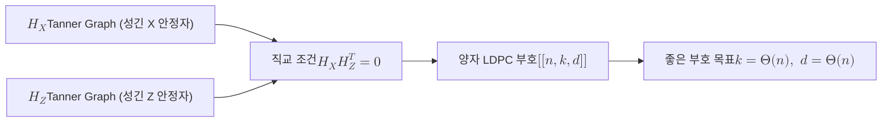

# Quantum LDPC Code

> 양자 LDPC 부호는 모든 안정자 생성원이 소수의 큐비트에만 작용하는 성긴 안정자 부호로, 일정 부호율과 함께 커지는 거리를 노려 표면 부호의 큐비트 오버헤드를 근본적으로 줄이려는 양자 오류정정의 방향이다.

## 핵심
양자 LDPC(Low-Density Parity-Check) 부호는 [[LDPC Codes|고전 LDPC 부호]]의 성긴 패리티 검사라는 발상을 [[Stabilizer Code|안정자 부호]]로 옮긴 것이다. 고전에서 희소성이 패리티 검사 행렬 $H$의 $1$이 드물다는 조건이었다면, 양자에서는 안정자 생성원이 작은 가중치를 갖는다는 조건으로 번역된다. 즉 각 생성원이 작용하는 큐비트 수와 각 큐비트가 걸리는 생성원 수가 모두 부호 크기 $n$이 커져도 일정한 상수로 묶인다.

가장 다루기 쉬운 형태는 [[CSS Code|CSS 부호]] 구조의 양자 LDPC다. 이때 안정자는 X형과 Z형으로 분리되고 각각 이진 패리티 검사 행렬 $H_X$와 $H_Z$로 기술된다. 두 생성원 묶음이 가환이어야 한다는 안정자 요건은 다음 직교 조건으로 표현된다.

$$ H_X H_Z^{\mathsf{T}} = \mathbf{0} \pmod 2 $$

여기에 희소성 조건이 더해진다. $H_X$와 $H_Z$의 각 행과 각 열에 들어 있는 $1$의 개수가 모두 어떤 상수 $w$ 이하로 제한될 때, 그 부호를 양자 LDPC 부호라 부른다. 이 행 가중치 제한이 곧 측정해야 할 안정자의 가중치 제한이며, 신드롬 추출 회로의 국소성과 깊이를 작게 유지하는 실용적 근거가 된다.

부호의 성능은 세 수 $[[n, k, d]]$로 요약한다. $n$은 물리 큐비트 수, $k$는 보호되는 논리 큐비트 수, $d$는 [[Code Distance|부호 거리]]다. 양자 LDPC 연구의 궁극 목표는 이른바 좋은(good) 부호다.

$$ k = \Theta(n), \qquad d = \Theta(n) $$

즉 큐비트를 늘려도 부호율 $k/n$이 $0$으로 꺼지지 않고 거리가 큐비트 수에 선형으로 함께 자라는 부호를 가리킨다. [[Surface Code|표면 부호]]는 $k$가 상수에 머물고 $d \sim \sqrt{n}$에 그쳐 이 기준을 만족하지 못하지만, 격자 위 국소 안정자라는 점에서 양자 LDPC 부호의 한 사례이기는 하다. 2022년 무렵 좋은 양자 LDPC 부호의 명시적 구성이 잇따라 발견되면서 이 방향은 이론적 가능성을 넘어 실현 경로로 올라섰다.

## 구조
양자 LDPC 부호는 두 개의 [[Tanner 그래프|Tanner Graph]]를 짜맞춘 형태로 이해할 수 있다. 하나는 $H_X$가, 다른 하나는 $H_Z$가 정의하는 이분 그래프이며, 두 그래프가 직교 조건으로 묶여 하나의 양자 부호를 이룬다. 복호는 신드롬에서 오류를 추정하는 [[Decoder|복호기]]가 이 그래프 위에서 신뢰 전파 계열 알고리즘을 돌려 수행하되, 양자 특유의 축퇴(degeneracy) 때문에 고전 신뢰 전파를 그대로 쓰면 막히므로 BP-OSD 같은 후처리를 덧붙인다.

## 왜 중요한가
양자 LDPC 부호가 중요한 이유는 내결함성의 비용 구조를 바꾸기 때문이다. [[Surface Code|표면 부호]]는 임계값이 높고 구현이 평면적이라는 큰 장점이 있지만, 논리 큐비트 하나를 충분히 낮은 오류율로 지키려면 물리 큐비트가 수백에서 수천 개씩 필요한 무거운 오버헤드를 동반한다. 부호율이 사실상 $0$으로 수렴하기 때문이다. 좋은 양자 LDPC 부호는 부호율을 상수로 유지하므로, 같은 수의 물리 큐비트로 훨씬 많은 논리 큐비트를 보호할 잠재력을 갖는다. 이는 대규모 [[Fault-Tolerant Quantum Computation|내결함성 양자컴퓨팅]]에 드는 물리 자원을 한 자릿수 이상 줄일 수 있는 거의 유일한 알려진 경로다.

대가도 분명하다. 좋은 양자 LDPC 부호의 안정자는 일반적으로 격자 위 가까운 이웃으로 배치되지 않아 장거리 연결을 요구하고, 측정 회로 설계와 복호가 표면 부호보다 까다롭다. 따라서 현재 연구는 단순히 좋은 부호를 찾는 단계를 지나, 실제 하드웨어의 연결 제약 아래에서 신드롬 추출과 복호를 효율적으로 수행하는 방법, 그리고 부호 위에서 논리 게이트를 내결함적으로 구현하는 방법으로 무게중심이 옮겨 가고 있다. 성긴 검사 구조가 측정의 국소성과 낮은 가중치를 보장한다는 점은 [[LDPC Codes|고전 LDPC]]와 양자가 공유하는 핵심 가치이며, 양자에서는 여기에 부호율 보존이라는 결정적 이점이 더해진다.

## 연결
- [[LDPC Codes]] 성긴 패리티 검사라는 발상의 고전 원형, 양자 LDPC가 이를 안정자 형식론으로 일반화함
- [[Stabilizer Code]] 양자 LDPC가 속하는 상위 부호 계열, 희소성은 안정자 가중치 제한으로 정의됨
- [[Surface Code]] 격자 위 국소 안정자로 정의되는 양자 LDPC의 대표 사례이자 오버헤드 비교 기준
- [[CSS Code]] 양자 LDPC를 가장 다루기 쉽게 만드는 구조로, $H_X$와 $H_Z$ 직교 조건의 무대
- [[Quantum Error Correction]] 양자 LDPC가 자원 오버헤드를 줄이려는 목표를 두는 상위 틀
- [[Tanner 그래프|Tanner Graph]] $H_X$와 $H_Z$를 각각 이분 그래프로 표현해 신뢰 전파 복호를 정의하는 구조(작성 예정)
- [[Code Distance]] 좋은 부호 기준 $d = \Theta(n)$을 판정하는 거리 척도(작성 예정)
- [[Fault-Tolerant Quantum Computation]] 양자 LDPC의 오버헤드 절감이 향하는 최종 목표(작성 예정)
- [[Decoder]] 양자 LDPC 신드롬을 처리하는 BP-OSD 계열 복호 절차의 일반론(작성 예정)
