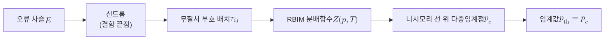

# Random-Bond Ising Model

> 결합 상수의 부호가 무작위로 뒤섞인 이징 모형으로, 표면 부호의 복호 가능 여부를 무질서계의 강자성 상전이 문제로 사상해 오류정정 임계값을 통계역학으로 계산하게 해 주는 모형이다.

## 핵심
보통의 이징 모형은 격자 위 스핀 $s_i \in \{+1, -1\}$들이 일정한 결합 상수 $J$로 묶여 있어, 에너지가 낮아지려면 이웃 스핀들이 같은 방향으로 정렬한다. Random-Bond Ising Model(RBIM)은 여기서 각 결합 $J_{ij}$의 부호를 격자마다 무작위로 고정한 무질서계다. 어떤 변은 강자성($J_{ij} > 0$, 같은 방향 선호)이고 어떤 변은 반강자성($J_{ij} < 0$, 반대 방향 선호)이라, 한 플라켓을 돌았을 때 반강자성 결합이 홀수 개면 모든 결합을 동시에 만족시킬 수 없는 좌절(frustration)이 생긴다. 해밀토니안은 다음과 같다.

$$ H(\{s\}) = -\sum_{\langle i,j \rangle} J_{ij}\, s_i s_j, \qquad J_{ij} = \tau_{ij}\,J $$

여기서 $\tau_{ij} \in \{+1, -1\}$는 무작위 부호이며, 어떤 변이 반강자성이 될지는 확률 $p$로 정해진다. 즉 $\tau_{ij} = -1$일 확률이 $p$이고 $\tau_{ij} = +1$일 확률이 $1-p$이다.

이 모형이 양자 오류정정과 만나는 지점은 표면 부호의 복호 문제다. [[Surface Code]]에서 비트반전 오류 사슬은 격자 위 결함 끝점 쌍으로 신드롬을 남기고, 복호기는 이 끝점들을 잇는 가장 그럴듯한 오류 사슬을 찾는다. 같은 신드롬을 내는 모든 오류 사슬은 서로 닫힌 고리만큼 차이가 나는데, 이 고리가 부호공간을 감싸는 비자명한 위상이면 논리 오류가 된다. Dennis, Kitaev, Landahl, Preskill은 이 복호 성공 확률을 정확히 RBIM의 분배함수로 옮겨 적었다. 물리 오류율 $p$가 RBIM의 무질서 확률 $p$ 그대로 대응하고, 통계역학의 온도는 [[Nishimori Line|니시모리 조건]]을 통해 같은 $p$에 묶인다. 이 대응의 결과로 다음 등식이 성립한다.

$$ p_{\mathrm{th}} = p_c $$

왼쪽은 표면 부호의 오류정정 임계값이고 오른쪽은 RBIM이 강자성 질서를 잃는 상전이점이다. 즉 임계값 계산이라는 양자 문제가 무질서 자기계의 상전이점을 찾는 고전 통계역학 문제로 바뀐다.

## 구조
복호 성공 영역을 정하는 두 변수가 무질서 확률 $p$와 온도 $T$이며, 의미 있는 물리는 [[Nishimori Line|니시모리 선]] 위에서 일어난다. 표면 부호 임계값은 이 선과 강자성에서 상자성으로의 경계가 만나는 다중임계점에 대응한다.

강자성 상($p < p_c$)에서는 무작위 부호에도 불구하고 스핀이 전체적으로 정렬을 유지하며, 이는 표면 부호에서 오류가 충분히 드물어 올바른 복호가 압도적으로 우세한 영역에 해당한다. 상자성 상($p > p_c$)에서는 좌절이 질서를 무너뜨려 어느 정렬도 우세하지 못하고, 이는 복호가 논리 오류와 정답을 구별하지 못하는 영역이다. 정사각 격자 비트반전 채널에서 이 다중임계점은 수치적으로 $p_c \approx 0.1094$로 알려져 있어, 표면 부호의 약 $11\%$라는 이상적 임계값의 근거가 된다.

## 왜 중요한가
임계값은 내결함성 양자컴퓨터가 작동하느냐를 가르는 가장 중요한 수치다. [[Quantum Threshold Theorem|문턱값 정리]]는 물리 오류율이 임계값 아래이기만 하면 부호 거리를 키워 논리 오류율을 임의로 낮출 수 있다고 보장하므로, 그 임계값이 정확히 얼마인지가 하드웨어가 도달해야 할 목표선을 정한다. RBIM 사상은 이 목표선을 추측이 아니라 통계역학의 상전이 계산으로 못 박아 준다. 임계값을 묻는 일이 무질서 자기계의 $p_c$를 묻는 일이 되면서, 수십 년간 축적된 무질서계 몬테카를로 기법과 임계지수 이론을 그대로 끌어다 쓸 수 있게 된다.

이 사상은 또한 복호기의 한계를 또렷이 드러낸다. RBIM이 주는 $p_c$는 모든 오류 사슬의 확률을 합산하는 이상적 최대가능도 복호의 임계값이므로, 현실의 빠른 복호기가 낼 수 있는 임계값의 상한이 된다. [[Minimum-Weight Perfect Matching|최소 가중치 완전 매칭]]처럼 단일 최단 사슬만 고르는 복호기는 이보다 다소 낮은 임계값을 갖는데, 이는 매칭이 통계 무게의 합이 아니라 영온도 극한의 단일 바닥상태만 보는 근사이기 때문이다. 같은 틀에서 측정 오류까지 포함하면 3차원 무작위 플라켓 게이지 모형으로 확장되어 시공간 복호의 임계값도 같은 방식으로 다룰 수 있다. 한편 무작위 결합이 만드는 좌절과 거친 에너지 지형이라는 RBIM의 본질은 스핀 글라스 최적화 문제로도 나타나며, 이런 바닥상태 탐색은 [[Quantum Annealing|양자 어닐링]]이 겨냥하는 전형적 대상이기도 하다.

## 연결
- [[Surface Code]] 복호 성공 확률을 RBIM 분배함수로 사상해 임계값 $p_{\mathrm{th}}$를 강자성 상전이점 $p_c$로 환원하는 핵심 적용 대상
- [[Nishimori Line]] 물리 오류율과 통계역학 온도를 한데 묶어 의미 있는 임계 거동이 나타나는 RBIM의 특수 조건선
- [[Quantum Threshold Theorem]] RBIM이 산출한 임계값을 가정으로 받아 임계값 아래 임의 길이 계산을 보장하는 정리
- [[Code Distance]] 격자 크기를 키울수록 임계값 아래에서 논리 오류율이 지수적으로 억제되는 정도를 정하는 부호 매개변수
- [[Minimum-Weight Perfect Matching]] RBIM이 주는 이상적 임계값을 상한으로 두고 그보다 낮은 임계값을 내는 영온도 근사 복호기
- [[Quantum Annealing]] RBIM의 좌절과 스핀 글라스 바닥상태 탐색이라는 최적화 문제 측면을 공유하는 양자 계산 방식
