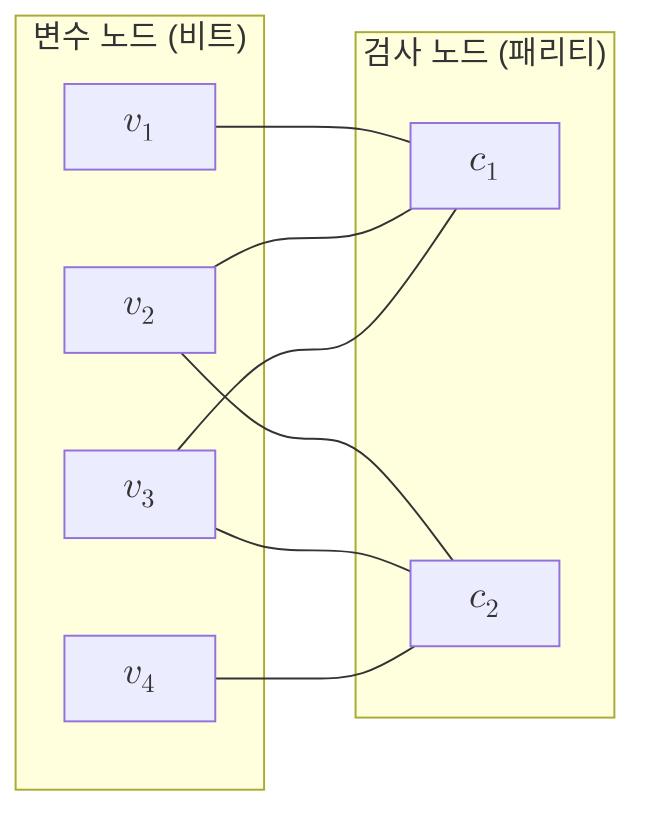

# Tanner Graph

> Tanner 그래프는 부호의 패리티 검사 행렬을 변수 노드와 검사 노드의 이분 그래프로 나타낸 표현으로, 신뢰 전파 복호가 메시지를 주고받는 무대가 된다.

## 핵심
Tanner 그래프는 [[LDPC Codes|LDPC 부호]]의 패리티 검사 행렬 $H$를 그래프 구조로 옮긴 것이다. 행렬은 어느 비트가 어느 검사에 묶이는지를 숫자로 담고 있는데, 같은 정보를 노드와 간선의 관계로 다시 그리면 복호 알고리즘이 그 위에서 자연스럽게 정의된다.

구성 방식은 단순하다. $m \times n$ 이진 행렬 $H$가 주어졌을 때, 한쪽에는 각 부호 비트에 대응하는 변수 노드 $v_1, \dots, v_n$을 두고, 다른 쪽에는 각 패리티 검사 방정식에 대응하는 검사 노드 $c_1, \dots, c_m$을 둔다. 그리고 $H$의 원소 $H_{ji} = 1$일 때마다 검사 노드 $c_j$와 변수 노드 $v_i$를 잇는 간선을 하나 그린다.

$$ H_{ji} = 1 \iff (c_j, v_i) \in E $$

같은 부류의 노드끼리는 절대 이어지지 않으므로 이 그래프는 이분 그래프다. 변수 노드 $v_i$의 차수는 행렬 $i$열의 $1$의 개수, 즉 그 비트가 참여하는 검사의 수와 같고, 검사 노드 $c_j$의 차수는 $j$행의 $1$의 개수, 즉 그 검사가 묶는 비트의 수와 같다. 부호어가 유효하다는 조건은 모든 검사 노드에서 인접한 변수 비트들의 합이 짝수라는 국소 제약으로 번역된다.

$$ \forall j \in \{1, \dots, m\} : \bigoplus_{i \in N(c_j)} x_i = 0 \pmod 2 $$

여기서 $N(c_j)$는 검사 노드 $c_j$에 인접한 변수 노드 집합이고 $x_i$는 변수 노드 $v_i$에 대응하는 부호 비트값이다. 행렬이 성기면 그래프도 성기고, 각 노드의 차수가 부호 길이 $n$과 무관하게 작은 상수로 묶인다. 이 희소성 덕분에 그래프 위 국소 계산만으로 복호가 가능해진다.

신뢰 전파 복호는 이 그래프의 간선을 따라 신뢰도를 흘려보내는 과정이다. 변수 노드는 자신이 $0$ 또는 $1$일 확률에 대한 로그우도비를 인접한 검사 노드로 보내고, 검사 노드는 자신에게 묶인 비트들의 패리티 제약을 적용해 갱신된 메시지를 되돌려준다. 그래프에 짧은 순환(특히 길이 $4$인 순환)이 적을수록 메시지가 같은 정보를 반복 강화하는 일이 줄어 복호 성능이 좋아진다. 그래서 가장 짧은 순환의 길이인 둘레(girth)가 부호 설계의 중요한 지표가 된다.

## 구조

## 왜 중요한가
Tanner 그래프는 추상적인 행렬 연산을 국소적이고 병렬적인 메시지 교환으로 바꾸어 놓는다. 이 관점 덕분에 [[LDPC Codes|LDPC 부호]]가 매우 긴 길이에서도 부호 길이에 거의 선형인 복잡도로 복호되며 Shannon 한계에 근접한다. [[Decoder|복호기]]의 동작을 행렬식이 아니라 그래프 위 알고리즘으로 이해하면, 신뢰 전파, 최소합, 사후 순서화 같은 변형들이 모두 같은 무대 위의 메시지 규칙 차이로 정리된다.

양자 쪽에서도 같은 발상이 그대로 옮겨진다. [[Quantum LDPC Code|양자 LDPC 부호]]에서는 변수 노드가 큐비트에, 검사 노드가 안정자 측정에 대응하며, 측정으로 얻은 신드롬을 그래프 위에서 복호해 오류 위치를 추정한다. 안정자가 적은 수의 큐비트에만 작용한다는 성긴 검사 조건이 곧 Tanner 그래프의 희소성이고, 이것이 측정 회로의 국소성과 낮은 가중치를 보장한다. 즉 고전 부호의 복호 무대였던 구조가 양자 내결함성 설계의 언어로 그대로 재사용된다.

## 연결
- [[LDPC Codes]] 성긴 패리티 검사 행렬을 정의하는 부호로, Tanner 그래프는 그 행렬을 이분 그래프로 옮긴 표현
- [[Decoder]] 신드롬에서 오류를 추정하는 복호기 일반론으로, Tanner 그래프 위 신뢰 전파가 그 대표 절차
- [[Quantum LDPC Code]] 변수 노드를 큐비트로, 검사 노드를 안정자로 두는 양자 일반화(작성 예정)
- [[Surface Code]] 격자 위 국소 안정자가 성긴 Tanner 그래프를 이루는 양자 LDPC 부호의 한 사례
