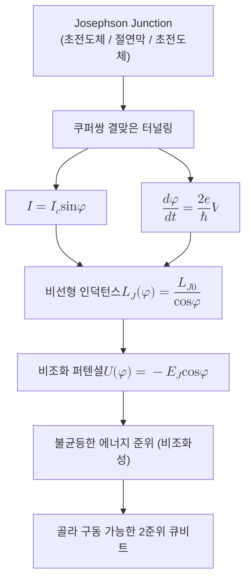

# Josephson Junction

> 두 초전도체를 얇은 절연막으로 갈라 놓은 소자로, 절연막을 통한 쿠퍼쌍의 결맞은 터널링으로 손실 없는 비선형 인덕턴스를 제공해 [[Superconducting Qubit|초전도 큐비트]]의 비조화 에너지 준위를 만들어 내는 핵심 부품이다.

## 핵심
조지프슨 접합의 구조는 단순하다. 두 초전도체 사이에 두께가 약 $1\ \mathrm{nm}$ 안팎인 절연막을 끼운 샌드위치다. 알루미늄과 산화알루미늄을 이용한 Al/AlOx/Al 접합이 대표적이다. 고전 회로의 직관으로는 절연막이 전류를 막아야 하지만, 양자역학에서는 쿠퍼쌍이 절연막을 결맞은 상태로 터널링한다. 여기서 중요한 점은 이 터널링이 단순한 입자 누설이 아니라, 양쪽 초전도체의 거시 파동함수가 위상으로 연결되는 현상이라는 것이다.

각 초전도체는 하나의 거시 양자 상태로 기술되며 고유한 위상을 갖는다. 접합 양단의 위상차를 $\varphi$라 하면, 접합을 흐르는 초전류와 양단 전압은 두 개의 조지프슨 관계식으로 정리된다.

$$ I = I_c \sin \varphi $$

$$ \frac{d\varphi}{dt} = \frac{2e}{\hbar} V $$

첫 번째 식은 직류 조지프슨 효과로, 전압이 걸리지 않아도 위상차만으로 임계전류 $I_c$ 이하의 초전류가 흐름을 뜻한다. 두 번째 식은 교류 조지프슨 효과로, 일정한 전압 $V$를 걸면 위상이 진동수 $\omega = 2eV / \hbar$로 감기며 교류가 발생함을 뜻한다. 계수 $2e$는 전하 운반자가 전자 하나가 아니라 전자 두 개로 이루어진 쿠퍼쌍이라는 사실에서 나온다.

이 비선형성이 양자정보에서 갖는 의미는 인덕턴스를 보면 분명해진다. 두 관계식을 결합하면 접합이 마치 인덕터처럼 행동하되, 그 값이 위상에 의존하는 비선형 인덕턴스임을 알 수 있다.

$$ L_J(\varphi) = \frac{\hbar}{2e I_c \cos \varphi} = \frac{L_{J0}}{\cos \varphi} $$

선형 인덕터의 인덕턴스는 상수이지만, 조지프슨 인덕턴스는 $\cos \varphi$에 반비례해 위상에 따라 달라진다. 바로 이 위상 의존성이 회로의 퍼텐셜 에너지를 조화 진동자에서 벗어나게 만든다. 접합의 퍼텐셜 에너지는 다음과 같다.

$$ U(\varphi) = -E_J \cos \varphi, \qquad E_J = \frac{\hbar I_c}{2e} $$

여기서 $E_J$는 조지프슨 에너지다. $-E_J \cos \varphi$를 $\varphi = 0$ 근처에서 전개하면 $\tfrac{1}{2} E_J \varphi^2$이라는 조화 항에 더해 $-\tfrac{1}{24} E_J \varphi^4$ 같은 고차 항이 따라 나온다. 이 4차 이상의 비조화 항이 에너지 준위 간격을 불균등하게 벌려 놓는다. 순수한 LC 진동자라면 모든 준위 간격이 같아 두 준위만 골라 다룰 수 없지만, 접합이 만든 비조화성 덕분에 최저 두 준위 $\lvert 0 \rangle$과 $\lvert 1 \rangle$의 전이 진동수가 그 위 전이와 어긋난다. 그래서 특정 진동수의 마이크로파만으로 두 준위 사이를 골라 구동할 수 있고, 비로소 잘 정의된 [[Qubit|큐비트]]가 성립한다.

## 구조
접합 한 개에서 출발해 초전도 큐비트의 비조화 준위가 만들어지기까지의 인과를 정리하면 다음과 같다.

여러 접합을 병렬로 묶어 외부 자속으로 유효 $E_J$를 조절하는 SQUID 구조를 쓰면, 큐비트의 전이 진동수를 자속으로 튜닝할 수 있다. 이는 [[Tunable Coupler|튜너블 커플러]]와 주파수 가변 큐비트 설계의 토대가 된다.

## 왜 중요한가
조지프슨 접합이 특별한 이유는 손실이 없으면서 비선형인 인덕턴스를 제공하는 사실상 유일한 초전도 소자라는 데 있다. 저항은 비선형성을 줄 수 있지만 에너지를 흩어 버려 양자 결맞음을 파괴하고, 보통의 인덕터와 커패시터는 선형이라 조화 진동자만 만든다. 양자 결맞음을 지키면서 동시에 깨끗한 2준위계를 떼어내려면 비선형성과 무손실이 함께 필요한데, 이 두 조건을 한꺼번에 만족하는 부품이 조지프슨 접합이다. 이 때문에 트랜스몬을 비롯한 거의 모든 [[Superconducting Qubit|초전도 큐비트]]가 조지프슨 접합을 기본 비선형 요소로 삼는다.

대비되는 방식인 [[Trapped-Ion Qubit|트랩 이온 큐비트]]는 자연이 빚은 동일한 원자의 이산 에너지 준위를 그대로 빌려 쓰기 때문에 비조화성을 인공으로 만들 필요가 없다. 반대로 초전도 회로는 인공 원자를 처음부터 설계해야 하며, 그 인공 원자에 비조화성을 불어넣는 일을 조지프슨 접합이 전담한다. 같은 큐비트라는 목표를 자연계 원자 대신 설계된 고체 회로로 달성하려는 접근에서, 이 접합은 없어서는 안 될 출발점이다.

나아가 조지프슨 접합은 큐비트에 그치지 않는다. 양자 한계에 가까운 증폭을 수행하는 [[Josephson Parametric Amplifier|조지프슨 파라메트릭 증폭기]], 전압 표준, 초전도 단일 자속 양자 논리 등 초전도 양자기술 전반의 공통 기반 소자로 쓰인다.

## 연결
- [[Superconducting Qubit]] 이 접합의 비선형 인덕턴스가 비조화 준위를 만들어 큐비트를 성립시키는 직접적 응용처
- [[Trapped-Ion Qubit]] 자연 원자의 준위를 이용해 비조화성을 인공으로 만들 필요가 없는 대조적 큐비트 방식
- [[Qubit]] 이 접합이 물리적으로 실현하려는 추상적 정보 단위
- [[Tunable Coupler]] 접합을 병렬로 묶은 SQUID로 결합 세기와 진동수를 자속으로 조절하는 확장 구조
- [[Josephson Parametric Amplifier]] 동일 접합의 비선형성을 측정 신호 증폭에 활용하는 또 다른 응용
