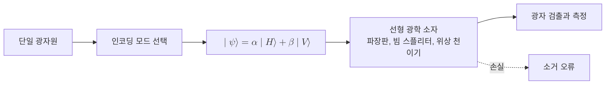

# Photonic Qubit

> 단일 광자의 편광, 경로, 시간 빈 같은 이산 자유도를 두 직교 상태로 삼아 정보를 싣는 빛 기반 2준위 양자계로 구현한 [[Qubit]]다.

## 핵심
광자 큐비트는 빛의 양자인 단일 광자가 가진 이산 자유도 가운데 두 직교 모드를 골라 계산 기저로 삼은 [[Qubit]]의 물리적 실현이다. 광자는 전하가 없어 환경과 약하게 상호작용하므로 결맞음이 잘 유지되고, 광속으로 전파하므로 전송 매체로서 강점을 가진다. 어떤 자유도를 인코딩으로 쓰느냐에 따라 여러 방식이 있다.

가장 직관적인 것은 편광 인코딩이다. 수평 편광과 수직 편광을 두 기저로 잡으면 일반 상태는 다음과 같이 쓰인다.

$$ \lvert \psi \rangle = \alpha \lvert H \rangle + \beta \lvert V \rangle, \qquad \lvert \alpha \rvert^2 + \lvert \beta \rvert^2 = 1 $$

여기서 $\lvert H \rangle$과 $\lvert V \rangle$는 각각 수평과 수직 편광 상태이며, 대각 편광이나 원형 편광은 이 두 기저의 [[Quantum Superposition|중첩]]에 해당한다. 편광 외에도 광자가 어느 광로를 지나는지로 정의하는 경로 인코딩(dual-rail), 광자가 어느 시간 구간에 도착하는지로 정의하는 시간 빈 인코딩이 널리 쓰인다. 경로 인코딩에서는 두 광로의 점유 상태 $\lvert 10 \rangle$과 $\lvert 01 \rangle$을 계산 기저로 삼는다.

단일 큐비트 게이트는 비교적 단순하다. 편광 인코딩에서 파장판(wave plate)은 편광 상태를 회전시켜 임의의 단일 큐비트 유니터리를 구현하고, 빔 스플리터와 위상 천이기는 경로 인코딩에서 같은 역할을 한다. 진짜 어려움은 2큐비트 게이트에 있다. 광자끼리는 서로 거의 상호작용하지 않으므로 비선형 결정을 이용한 결정론적 게이트가 매우 약하다. 이 한계를 우회한 것이 KLM(Knill, Laflamme, Milburn) 방식으로, 선형 광학 소자와 단일 광자원, 광자 수 분해 검출기에 측정 기반 후선택을 결합하면 확률적이지만 원리상 보편 양자계산이 가능함을 보였다. 오늘날 광자 플랫폼은 이 측정 기반 사고를 발전시킨 [[Measurement-Based Quantum Computing|측정 기반 양자계산]]과 클러스터 상태 접근을 주로 채택한다.

광자 큐비트의 측정은 광자 검출기로 어느 모드에 광자가 도착했는지를 읽는 방식이다. 측정 한 번이 큐비트의 풍부한 연속 진폭을 0 또는 1이라는 1비트로 환원하는 [[Quantum Measurement|붕괴]] 구조는 다른 플랫폼과 동일하다. 광자 플랫폼의 고질적 난점은 손실이다. 광섬유와 소자에서 광자가 흡수되거나 산란되면 그 큐비트는 사라진다. 이는 발생 위치가 검출되는 소거 오류(erasure error)로 나타나는데, 어디서 큐비트가 사라졌는지 알 수 있어 위치를 모르는 위상 오류보다 오류정정 임계값이 훨씬 높다. 그래서 광자 손실을 검출 가능한 소거 오류로 바꾸는 전략이 광자 진영의 핵심 이점으로 적극 연구된다.

## 흐름

## 왜 중요한가
광자 큐비트는 정지형 양자 정보를 다른 플랫폼이 떠안는 동안 정보를 멀리 나르는 비행 큐비트(flying qubit)로서 거의 독보적이다. 광자는 상온에서 동작하고 극저온 냉각이 필요 없으며 광섬유 통신 인프라와 직접 맞물리므로, [[Quantum Key Distribution|양자 키 분배]]와 [[Quantum Teleportation|양자 원격전송]] 같은 양자통신의 사실상 표준 매체다. 양자 인터넷과 양자 중계기 구상에서 노드 사이를 잇는 매개도 거의 항상 광자다.

계산 플랫폼으로서의 강점은 결맞음과 상온 동작, 그리고 빛 산업의 집적 광학(integrated photonics) 제조 기반을 활용한 확장 가능성이다. 동시에 결정론적 2큐비트 게이트의 부재와 광자 손실은 [[Superconducting Qubit|초전도 큐비트]]나 [[Trapped-Ion Qubit|가둔 이온 큐비트]]와 구별되는 고유한 난점이다. 이 때문에 광자 진영은 게이트 기반 회로보다 클러스터 상태와 측정 기반 계산, 그리고 손실을 소거 오류로 적극 활용하는 융합 기반 양자계산(fusion-based) 노선을 밀고 있다. 어느 물리계가 최종 우위를 점하든, 광자 큐비트는 분산된 양자 자원을 연결하는 통신 계층에서 핵심 역할을 유지할 것으로 보인다.

## 연결
- [[Qubit]] 광자 큐비트가 물리적으로 실현하는 추상적 2준위 정보 단위
- [[Superconducting Qubit]] 같은 큐비트 추상을 초전도 회로로 구현한 대표적 정지형 플랫폼
- [[Trapped-Ion Qubit]] 가둔 이온의 내부 준위로 큐비트를 구현하는 또 다른 대표 플랫폼
- [[Quantum Key Distribution]] 광자 큐비트를 매체로 삼는 대표적 양자통신 응용
- [[Measurement-Based Quantum Computing]] 결정론적 2큐비트 게이트 부재를 우회하는 광자 진영의 주요 계산 모델
