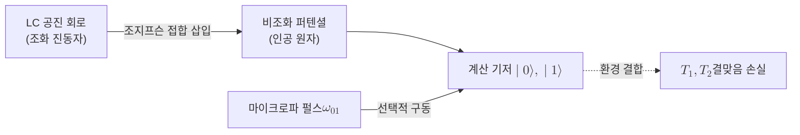

# Superconducting Qubit

> 조지프슨 접합의 비선형 인덕턴스로 만든 비조화 LC 진동자의 두 최저 에너지 준위를 계산 기저로 삼아, 마이크로파로 제어하는 초전도 회로 기반 [[Qubit|큐비트]]다.

## 핵심
초전도 큐비트는 [[Qubit|큐비트]]라는 추상적 정보 단위를 초전도 전기 회로라는 물리계로 실현한 것이다. 출발점은 인덕턴스 $L$과 커패시턴스 $C$가 만드는 고전적 LC 공진 회로다. 이 회로를 절대영도 근처(약 $10\ \mathrm{mK}$)로 냉각해 초전도 상태로 만들면, 회로 안의 전하와 자속이라는 거시 자유도가 양자화되어 마치 인공 원자처럼 이산적인 에너지 준위를 갖는다. 문제는 순수한 LC 회로가 조화 진동자라는 점이다. 조화 진동자는 준위 간격이 모두 균일하므로, 가장 낮은 두 준위 $\lvert 0 \rangle$과 $\lvert 1 \rangle$만 선택적으로 다루려 해도 같은 진동수가 그 위 준위까지 함께 들뜨게 만든다. 즉 깨끗한 2준위계를 분리할 수 없다.

이 한계를 푸는 핵심 소자가 [[Josephson Junction|조지프슨 접합]]이다. 조지프슨 접합은 손실 없이 비선형 인덕턴스를 제공하는 유일한 초전도 소자로, 이를 회로에 넣으면 퍼텐셜이 비조화(anharmonic)가 된다. 그 결과 에너지 준위 간격이 불균등해지고, 최저 두 준위의 전이 진동수 $\omega_{01}$이 그 위 전이 $\omega_{12}$와 충분히 어긋난다. 이 비조화성 $\alpha = \omega_{12} - \omega_{01}$ 덕분에 특정 진동수의 마이크로파 펄스로 $\lvert 0 \rangle$과 $\lvert 1 \rangle$ 사이만 골라 구동할 수 있고, 비로소 잘 정의된 큐비트가 된다.

오늘날 주류 설계는 트랜스몬(transmon)이다. 트랜스몬은 조지프슨 에너지 $E_J$와 충전 에너지 $E_C$의 비를 $E_J / E_C \gg 1$로 크게 잡아, 전하 잡음에 대한 민감도를 지수적으로 억제한 큐비트다. 비조화성을 어느 정도 희생하는 대신 결맞음 시간을 크게 늘린 절충이며, 이 설계가 초전도 방식이 규모 확장에서 앞서나가게 한 결정적 전환점이었다. 단일 큐비트 연산은 큐비트 전이 진동수에 맞춘 마이크로파 펄스로, 두 큐비트 얽힘 연산은 커플러나 공진기를 통한 결합으로 구현한다.

## 구조

## 왜 중요한가
초전도 큐비트는 현재 가장 널리 연구되고 산업화된 양자 하드웨어 방식 중 하나로, 칩 위에 리소그래피로 회로를 새기는 반도체 공정과 유사한 제작 방식을 쓴다는 점에서 규모 확장에 유리하다. 큐비트들을 평면 격자 위 최근접 이웃으로 배치하는 구조는, 안정자를 모두 국소 측정으로 구성하는 [[Surface Code|표면 부호]]의 요구와 자연스럽게 맞물린다. 이 때문에 초전도 방식은 내결함성 양자컴퓨터로 가는 가장 현실적인 경로 중 하나로 평가된다.

동시에 한계도 분명하다. 거시 회로는 환경과 강하게 결합하므로 [[Quantum Decoherence|결어긋남]]이 빠르게 일어나며, 에너지 이완 시간 $T_1$과 위상 결맞음 시간 $T_2$가 마이크로초에서 수백 마이크로초 수준에 머문다. 또한 정밀한 마이크로파 제어와 밀리켈빈급 희석 냉동기가 필요하다. 이런 잡음과 짧은 결맞음 때문에 초전도 큐비트는 단독으로 쓰이기보다 다수를 묶어 하나의 [[Logical Qubit|논리 큐비트]]로 보호하는 오류정정과 함께 논의된다. 가둔 이온을 쓰는 [[Trapped-Ion Qubit|이온 트랩]]이나 광자를 쓰는 [[Photonic Qubit|광자]] 방식과 비교하면, 초전도 방식은 게이트 속도와 집적도에서 앞서고 결맞음 시간과 큐비트 균일성에서 뒤지는 절충 관계를 갖는다.

## 연결
- [[Qubit]] 초전도 큐비트가 물리적으로 실현하는 추상적 정보 단위
- [[Surface Code]] 평면 격자 위 최근접 이웃 배치가 초전도 하드웨어와 맞물리는 대표적 오류정정 부호
- [[Quantum Decoherence]] 거시 초전도 회로의 환경 결합에서 비롯되는 결맞음 손실로, 결맞음 시간 $T_1, T_2$를 제한하는 근본 원인
- [[Josephson Junction]] 회로에 비선형 인덕턴스를 주어 비조화 2준위계를 만드는 핵심 초전도 소자
- [[Trapped-Ion Qubit]] 결맞음과 균일성에서 앞서지만 게이트 속도에서 뒤지는 대비되는 하드웨어 방식
- [[Photonic Qubit]] 광자의 편광이나 경로를 자유도로 쓰는 또 다른 큐비트 실현 방식
