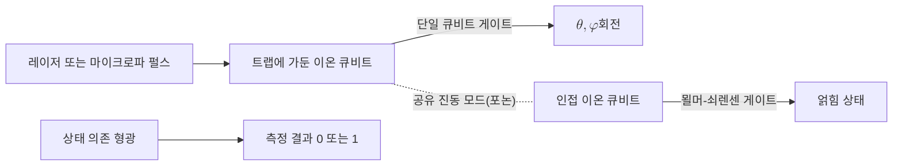

# Trapped-Ion Qubit

> 전자기 트랩에 가둔 단일 이온의 두 내부 전자 준위를 계산 기저로 삼아 [[Qubit|큐비트]]를 구현하는 물리적 실현 방식이다.

## 핵심
트랩 이온 큐비트는 진공 챔버 안에서 전자기장으로 공중에 띄워 가둔 이온 하나를 정보 단위로 쓴다. 보통 칼슘($^{40}\mathrm{Ca}^+$)이나 이터븀($^{171}\mathrm{Yb}^+$) 같은 알칼리 토금속 계열의 단일 이온화 원자를 사용한다. 이온은 전자 하나를 잃어 알짜 양전하를 띠므로, 시간에 따라 변하는 전기장으로 만든 퍼텐셜 우물에 안정적으로 붙들 수 있다. 이렇게 가두는 장치를 폴 트랩(Paul trap)이라 하며, 라디오 주파수 전압으로 회전하는 안장 모양 퍼텐셜을 만들어 이온을 중앙에 모은다.

큐비트의 두 기저 상태 $\lvert 0 \rangle$과 $\lvert 1 \rangle$은 이온의 두 내부 전자 준위로 인코딩한다. 초미세 분리(hyperfine) 구조의 바닥 상태 두 준위를 쓰는 초미세 큐비트와, 바닥 준위와 준안정 들뜬 준위를 쓰는 광학 큐비트로 나뉜다. 어느 쪽이든 본질적 자유도가 2준위 구조로 환원되므로 동일한 [[Qubit|큐비트]] 추상으로 다룬다. 상태는 다음처럼 적힌다.

$$ \lvert \psi \rangle = \alpha \lvert 0 \rangle + \beta \lvert 1 \rangle, \quad \lvert \alpha \rvert^2 + \lvert \beta \rvert^2 = 1 $$

단일 큐비트 게이트는 이온에 공명 레이저나 마이크로파를 쪼여 두 준위 사이의 회전을 일으키는 방식으로 구현한다. 펄스의 세기와 지속 시간이 [[Bloch Sphere|블로흐 구]] 위 회전 각도 $\theta$를 정하고, 펄스의 위상이 회전 축을 정한다.

여러 큐비트 사이의 얽힘 게이트는 트랩 이온 방식의 핵심 특징이다. 같은 트랩에 갇힌 이온들은 쿨롱 반발로 서로 밀어내며 일렬로 정렬하고, 공유하는 진동 운동 모드(포논)로 결합한다. 레이저로 한 이온의 내부 상태를 이 공유 진동 모드에 임시로 실어 다른 이온에 전달하는 방식으로 두 큐비트 게이트를 만든다. 가장 널리 쓰이는 묄머-쇠렌센(Mølmer-Sørensen) 게이트가 이 원리를 따른다. 공유 모드를 매개로 하므로 같은 트랩 안의 임의의 두 이온을 직접 얽을 수 있고, 이것이 전체 연결성(all-to-all connectivity)이라는 이점으로 이어진다.

상태 읽기는 형광 측정으로 한다. 특정 준위에만 공명하는 레이저를 쪼이면 그 준위에 있는 이온은 광자를 산란해 밝게 빛나고, 다른 준위에 있으면 어둡다. 광검출기로 밝음과 어두움을 구별해 계산 기저 측정 결과를 얻으며, 트랩 이온 측정은 충실도가 매우 높은 편이다.

성능을 좌우하는 양은 [[Quantum Decoherence|결맞음 시간]]과 게이트 충실도다. 트랩 이온은 잘 격리된 원자 내부 준위를 쓰기에 결맞음 시간이 길고, 같은 종의 이온은 모두 동일한 에너지 준위를 가지므로 제작 편차가 원리상 없다. 반면 게이트 속도가 [[Superconducting Qubit|초전도 큐비트]]보다 느리고, 이온 수가 늘면 공유 진동 모드가 복잡해져 한 트랩에 담을 수 있는 큐비트 수에 한계가 생긴다. 이를 넘기 위해 여러 트랩 구역 사이로 이온을 물리적으로 옮기는 QCCD 구조나, 광자를 매개로 떨어진 트랩을 잇는 광 연결 방식이 연구된다.

## 왜 중요한가
트랩 이온은 초전도 회로와 함께 게이트형 양자컴퓨터의 양대 선도 플랫폼이다. 동일한 이온이 본질적으로 동일하다는 점에서 오는 균일성, 긴 결맞음 시간, 높은 측정 충실도, 같은 트랩 안 임의 두 큐비트를 직접 얽는 전체 연결성은 알고리즘 컴파일과 [[Quantum Error Correction|양자 오류정정]] 부담을 줄여 준다. 전체 연결성은 큐비트가 격자 위 이웃하고만 직접 상호작용하는 초전도 방식과 대비되는 분명한 이점이다. 동시에 느린 게이트 속도와 단일 트랩 확장의 어려움이라는 약점이 있어, 어떤 물리적 실현이 대규모 결함 허용 양자컴퓨터로 가는 길을 먼저 열지를 가르는 비교의 한 축을 이룬다. 큐비트라는 추상이 실제 물리계로 어떻게 내려앉는지를 보여 주는 대표 사례이기도 하다.

## 연결
- [[Qubit]] 트랩 이온이 물리적으로 구현하는 추상적 정보 단위이며, 이 노트가 그 한 가지 실현이다
- [[Superconducting Qubit]] 같은 게이트형 양자컴퓨팅의 경쟁 플랫폼으로, 게이트 속도와 연결성에서 상반된 특성을 보인다
- [[Photonic Qubit]] 광자를 정보 단위로 쓰는 또 다른 큐비트 실현 방식이자, 트랩 사이를 잇는 광 연결의 매개이기도 하다
- [[Quantum Decoherence]] 트랩 이온의 긴 결맞음 시간이 성능 우위로 작동하는 배경 메커니즘
- [[Bloch Sphere]] 레이저 펄스로 일으키는 단일 큐비트 회전을 시각화하는 기하 표현
