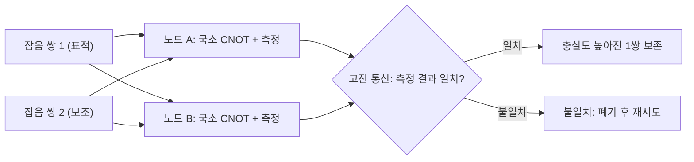

# Entanglement Distillation

> 잡음이 섞여 충실도가 낮은 다수의 얽힘쌍을 국소 연산과 고전 통신만으로 가공해 더 적은 수의 고충실도 얽힘쌍으로 끌어올리는 절차다.

## 핵심
멀리 떨어진 두 노드 사이에 얽힘을 분배하면, 채널 손실과 [[Quantum Memory|양자 메모리]] 결함 때문에 도착한 상태는 이상적인 [[Bell States|벨 상태]] $\lvert \Phi^+ \rangle$가 아니라 잡음이 섞인 혼합 상태가 된다. 이 상태의 품질은 표적 벨 상태와의 겹침으로 정의되는 충실도

$$ F = \langle \Phi^+ \rvert \rho \lvert \Phi^+ \rangle $$

로 측정한다. $F = 1$이면 완벽한 얽힘이고, $F = 1/2$ 부근으로 떨어지면 [[Bell Inequality (CHSH)|벨 부등식]]을 위반하지 못하는 사실상 쓸모없는 상관만 남는다. 얽힘 정제의 목표는 여러 개의 저충실도 쌍을 소비해 충실도가 더 높은 소수의 쌍을 추출하는 것이다.

핵심 제약은 두 노드가 물리적으로 떨어져 있다는 점이다. 따라서 정제는 [[LOCC|국소 연산과 고전 통신(LOCC)]]만으로 이루어져야 한다. 각 노드는 자기가 보유한 큐비트에만 국소 게이트와 측정을 적용하고, 그 측정 결과를 고전 채널로 주고받아 협력한다. 양자 채널을 다시 쓰지 않는다는 점이 중요한데, 정제가 가능해야 비로소 잡음 채널 위에서 고품질 얽힘을 합성할 수 있다.

가장 고전적인 방식은 베넷, 브라사르 등이 제안한 재귀적 양방향 정제(BBPSSW)다. 두 노드는 잡음 섞인 쌍을 두 개씩 짝지어, 한 쌍을 표적으로 두고 다른 쌍을 보조로 쓴다. 각 노드가 자기 큐비트 둘에 CNOT을 건 다음 보조 쌍을 계산 기저로 측정하고, 두 측정 결과를 고전 통신으로 비교한다.

두 결과가 일치하면 표적 쌍을 살리고, 일치하지 않으면 둘 다 버린다. 살아남은 쌍의 충실도가 $F$보다 커지는 구간이 존재하는데, 두 입력이 모두 $F > 1/2$일 때 출력 충실도 $F'$가 $F$를 넘기는 사상(map)이 성립한다. 이 절차를 살아남은 쌍들에 다시 적용하기를 반복하면 충실도가 1에 점근한다. 대가로 매 회마다 절반 이상의 쌍이 측정에 소비되거나 폐기되므로, 자원 비용은 충실도와 맞바꾸는 거래다.

또 다른 계열은 일방향 통신만 쓰는 해싱(hashing) 기반 정제다. 다수의 쌍을 한꺼번에 다루며 한쪽 방향 고전 통신으로 오류 신드롬을 추출하는 방식으로, 점근적으로 추출 가능한 최대 쌍 수의 비율은 증류 가능 얽힘(distillable entanglement) $E_D(\rho)$로 정의된다. 이 양은 입력 상태가 가진 얽힘 자원의 상한을 규정하며, 어떤 LOCC 절차로도 그 이상은 짜낼 수 없다.

## 왜 중요한가
얽힘 정제는 [[Quantum Repeater|양자 중계기]]를 실제로 동작하게 만드는 보정 단계다. 중계기는 긴 거리를 짧은 구간으로 나누고 [[Entanglement Swapping|얽힘 교환]]으로 구간 얽힘을 종단까지 확장하는데, 교환을 거듭할수록 각 구간의 결함이 누적되어 종단 충실도가 떨어진다. 정제를 중간중간 끼워 넣어 충실도를 다시 끌어올리지 않으면, 누적된 잡음 때문에 종단에 남는 상태가 쓸모없어진다. 즉 얽힘 생성, 정제, 교환이라는 세 연산이 맞물려야 비로소 임의 거리 양자 통신이 성립한다.

이론적으로도 정제는 얽힘을 정량화 가능한 자원으로 보는 관점의 출발점이다. 잡음 섞인 상태에서 순수 얽힘을 얼마나 추출할 수 있는가라는 질문은 증류 가능 얽힘과 얽힘 형성 비용(entanglement cost) 같은 척도로 이어지고, 이 둘 사이의 간극은 얽힘에 가역적으로 회수되지 않는 부분이 있음을 드러낸다. 바로 묶인 얽힘(bound entanglement) 같은 현상이다. 응용 측면에서도 정제는 [[Quantum Key Distribution|QKD]]의 키 증류, 분산 양자 컴퓨팅, 양자 인터넷에서 고충실도 자원을 공급하는 공통 기반이며, 정제의 처리율과 성공 확률이 실용 시스템의 성능 병목을 좌우한다.

## 연결
- [[Quantum Repeater]] 얽힘 교환으로 누적된 충실도 저하를 회복시켜 중계기를 실제로 동작하게 하는 보정 단계
- [[Quantum Entanglement]] 정제가 잡음 상태에서 추출하려는 자원의 본질이며 그 정량화 출발점
- [[Bell States]] 정제가 끌어올리려는 표적 상태이자 충실도를 재는 기준
- [[Entanglement Swapping]] 정제와 번갈아 적용되어 장거리 얽힘 분배를 함께 구성하는 짝 연산
- [[LOCC]] 떨어진 두 노드가 정제에 쓸 수 있는 유일한 연산 집합으로 정제의 가능성과 한계를 규정
- [[Quantum Key Distribution]] 정제와 같은 원리의 키 증류로 안전한 키율을 확보하는 응용
