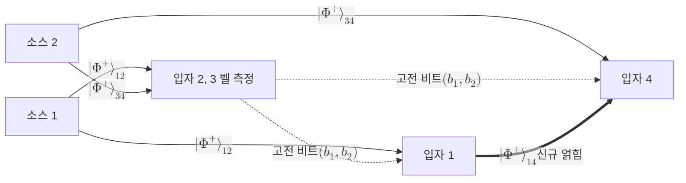

# Entanglement Swapping

> 서로 직접 상호작용한 적 없는 두 입자를, 각자 다른 입자와 맺고 있던 얽힘을 벨 측정으로 병합해 새로 얽히게 만드는 기법이다.

## 핵심
얽힘 교환은 한마디로 얽힘을 가진 입자가 아니라 얽힘 자체를 전송하는 [[Quantum Teleportation|양자 원격전송]]이다. 원격전송이 미지의 단일 큐비트 상태를 옮긴다면, 얽힘 교환은 옮길 상태가 마침 다른 입자와 얽혀 있는 절반인 경우에 해당한다. 그 절반을 텔레포트하면 얽힘의 한쪽 끝이 통째로 다른 위치로 이동하고, 결과적으로 한 번도 만난 적 없는 두 입자가 얽히게 된다.

출발점은 독립적으로 준비한 두 쌍의 [[Bell States|벨 상태]]다. 입자 1과 2가 한 쌍, 입자 3과 4가 다른 한 쌍이며, 둘 다 $\lvert \Phi^{+} \rangle$로 두자. 중요한 점은 쌍 사이에 아무 상관이 없다는 것이다. 입자 1과 4는 같은 출처에서 나오지도 않았고 서로를 본 적도 없다. 전체 초기 상태는 두 얽힘 쌍의 곱이다.

$$ \lvert \Phi^{+} \rangle_{12} \otimes \lvert \Phi^{+} \rangle_{34} = \frac{1}{2} \big( \lvert 00 \rangle_{12} + \lvert 11 \rangle_{12} \big) \otimes \big( \lvert 00 \rangle_{34} + \lvert 11 \rangle_{34} \big) $$

이제 가운데에 모인 입자 2와 3을 [[Bell States|벨 기저]]로 함께 측정한다. 측정 대상이 되는 두 입자에 대해 전체 상태를 벨 기저로 다시 묶어 적으면, 바깥쪽 입자 1과 4에 걸리는 상태가 측정 결과 네 가지와 일대일로 짝지어진다.

$$ \lvert \Phi^{+} \rangle_{12} \otimes \lvert \Phi^{+} \rangle_{34} = \frac{1}{2} \Big( \lvert \Phi^{+} \rangle_{23} \lvert \Phi^{+} \rangle_{14} + \lvert \Phi^{-} \rangle_{23} \lvert \Phi^{-} \rangle_{14} + \lvert \Psi^{+} \rangle_{23} \lvert \Psi^{+} \rangle_{14} + \lvert \Psi^{-} \rangle_{23} \lvert \Psi^{-} \rangle_{14} \Big) $$

이 항등식이 얽힘 교환의 전부다. 입자 2와 3에 대한 벨 측정이 어떤 결과를 내든, 남은 입자 1과 4는 그 결과에 대응하는 벨 상태로 붕괴한다. 측정 전에는 곱 상태여서 전혀 얽혀 있지 않던 1과 4가, 측정 후에는 최대 얽힘 상태가 된다. 측정 결과가 $\lvert \Phi^{+} \rangle_{23}$이면 1과 4는 곧바로 $\lvert \Phi^{+} \rangle_{14}$이고, 다른 결과가 나오면 고전 통신으로 그 두 비트를 전달받아 [[Pauli Matrices|파울리 보정]]을 가하면 원하는 표준 벨 상태로 맞출 수 있다.

여기서 짚을 점이 두 가지다. 첫째, 입자 1과 4는 측정 순간까지 빛조차 주고받은 적이 없으므로 얽힘은 직접 상호작용 없이 생겨난다. 둘째, 얽힘 교환은 무에서 얽힘을 만드는 것이 아니라 이미 가진 두 얽힘을 소비해 더 먼 한 쌍의 얽힘으로 재배치하는 자원 변환이다. 벨 측정은 이 변환을 일으키는 [[Joint Measurement|결합 측정]]이며, 측정 결과를 알려 주는 고전 채널이 함께 있어야 결정론적으로 동작한다.

## 흐름

원격전송과의 대응을 정리하면 이렇다. 원격전송에서 텔레포트되는 미지 상태의 자리에 다른 입자와 얽힌 절반을 넣으면 그대로 얽힘 교환이 된다. 따라서 얽힘 교환은 별개의 신비한 현상이 아니라 원격전송의 한 특수한 입력에 지나지 않는다. 이 관점은 두 프로토콜이 같은 벨 측정과 같은 고전 보정 구조를 공유하는 이유를 분명히 해 준다.

## 왜 중요한가
얽힘 교환의 결정적 쓸모는 [[Quantum Repeater|양자 중계기]]에 있다. 양자 채널의 손실은 거리에 지수적으로 커지므로 두 종단을 직접 잇는 얽힘 분배는 먼 거리에서 사실상 불가능해진다. 중계기는 전체 거리를 여러 짧은 기본 구간으로 쪼개 각 구간에 짧은 얽힘을 분배한 뒤, 중간 노드에서 얽힘 교환을 반복해 인접 구간의 얽힘을 차례로 이어 붙인다. 이 계층적 병합을 거쳐 한 번도 마주친 적 없는 양 끝 종단 사이에 얽힘이 남는다. 얽힘 교환이 없다면 중계기는 거리 확장 수단을 잃고, 장거리 양자 통신은 손실 천장에 갇힌다.

응용은 거리 확장에 그치지 않는다. 측정 장치 독립형 [[Quantum Key Distribution|QKD]]는 중앙의 신뢰할 수 없는 측정 노드가 벨 측정을 수행하게 하여 양 끝 사용자의 얽힘을 사후에 성립시키는데, 이 구조의 심장이 바로 얽힘 교환이다. 또한 떨어진 양자 프로세서를 잇는 분산 양자 컴퓨팅과 양자 인터넷의 노드 연결도 얽힘 교환으로 임의의 두 노드를 얽히게 만든다. 다만 실제 구현에서는 광자 손실과 불완전한 벨 측정 탓에 매 교환의 성공률이 1보다 작고 충실도도 떨어지므로, 누적된 잡음을 회복하는 [[Entanglement Distillation|얽힘 정제]]를 곁들여야 실용적인 종단 얽힘을 얻는다.

## 연결
- [[Quantum Repeater]] 짧은 구간 얽힘을 계층적으로 이어 붙여 거리를 확장하는 중계기의 핵심 연산
- [[Quantum Teleportation]] 옮길 상태가 다른 입자와 얽힌 절반인 경우의 원격전송으로, 얽힘 교환과 측정 및 보정 구조를 공유
- [[Bell States]] 입력 얽힘 자원이자 가운데 입자 쌍을 사영하는 벨 기저 측정의 측정 기저
- [[Quantum Entanglement]] 직접 상호작용 없이 두 입자 사이에 새로 만들어지는 비국소 상관 자원
- [[Entanglement Distillation]] 반복된 교환으로 떨어진 충실도를 회복해 고품질 종단 얽힘을 얻는 보정 단계
