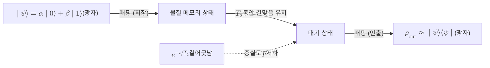

# Quantum Memory

> 날아온 광자나 다른 정보 운반자가 실은 양자 상태를 측정하지 않고 일정 시간 저장했다가 원래 상태 그대로 다시 인출하는 장치다.

## 핵심
양자 메모리의 본질은 정보를 옮겨 적는 일이다. 통신 채널을 통해 도착한 광자는 그 자리에 머무르지 않고 계속 진행하므로, 그 안에 담긴 양자 상태를 정지한 물질계(원자 앙상블, 단일 원자, 색중심 등)의 상태로 충실하게 옮겨 새긴 뒤, 필요할 때 다시 광자로 되돌려야 한다. 이때 상태를 측정해 읽으면 [[No-Cloning Theorem|복제 불가 정리]]와 측정 붕괴 때문에 임의의 미지 상태를 보존할 수 없으므로, 저장과 인출은 모두 결맞음을 유지하는 가역 사상이어야 한다.

저장 대상이 임의의 단일 큐비트라면 $\lvert \psi \rangle = \alpha \lvert 0 \rangle + \beta \lvert 1 \rangle$ 의 진폭 $\alpha, \beta$ 가 미지인 채로 보존되어야 한다. 이상적인 메모리는 입력 상태에 다음과 같은 항등 사상으로 작용한다.

$$ \mathcal{M}_{\text{retrieve}} \circ \mathcal{M}_{\text{store}}(\rho) = \rho $$

현실에서는 저장 채널이 완전한 항등 사상이 아니라 잡음이 섞인 양자 채널이며, 그 품질을 두 가지 수치로 가늠한다. 하나는 저장 후 인출된 상태가 원래 상태와 얼마나 일치하는지를 나타내는 충실도 $F = \langle \psi \rvert \rho_{\text{out}} \lvert \psi \rangle$ 이고, 다른 하나는 상태를 쓸 만하게 유지할 수 있는 시간인 저장 수명 또는 결맞음 시간 $T_2$ 다. 저장된 상태의 결맞음은 [[Quantum Decoherence|양자 결어긋남]]에 의해 시간에 따라 감쇠하며, 진폭 감쇠와 위상 잡음을 묶어 단순화하면 결맞음 항이 대략

$$ C(t) = C(0)\, e^{-t / T_2} $$

처럼 줄어든다. 따라서 좋은 양자 메모리는 높은 $F$ 와 긴 $T_2$, 그리고 광자를 받아들이는 효율(저장 효율)을 동시에 요구한다.

물리적 구현은 운반자와 저장 매질을 어떻게 결합하느냐로 갈린다. 원자 앙상블에 빛을 거시적 결맞음 들뜸으로 새기는 전자기 유도 투명(EIT) 기반 메모리, 비균질 확장된 흡수선을 이용해 흡수된 광자를 다시 방출시키는 원자 주파수 빗(AFC) 기반 메모리, 그리고 [[Trapped-Ion Qubit|갇힌 이온 큐비트]]나 다이아몬드 질소 공공 중심처럼 단일 물질 큐비트에 광자 상태를 사상하는 방식이 대표적이다. 어느 방식이든 저장 중에는 결맞음을 지키는 일이 관건이며, 이 때문에 잡음이 같은 위상으로 작용해 상쇄되는 부분공간에 정보를 숨기는 [[Decoherence-Free Subspace|결어긋남 없는 부분공간]] 같은 수동 보호 기법이 함께 쓰인다.

## 흐름
광자에 실린 양자 상태가 물질 메모리에 저장되었다가 다시 인출되는 과정을 단계로 나타내면 다음과 같다.

## 왜 중요한가
양자 메모리는 거리에 따라 지수적으로 늘어나는 채널 손실을 극복하려는 [[Quantum Repeater|양자 중계기]]의 심장부다. 중계기는 긴 구간을 짧은 구간으로 나눠 각 구간에 얽힘을 분배한 뒤 얽힘 교환으로 이어 붙이는데, 인접 구간들이 동시에 얽힘 분배에 성공하는 사건은 확률적이라 시점이 어긋난다. 먼저 성공한 구간의 얽힘을 메모리에 잠시 저장해 두고 다른 구간이 따라잡기를 기다려야 비로소 얽힘 교환을 동기화할 수 있다. 메모리가 없다면 모든 구간이 한순간에 성공해야 하므로 성공 확률이 거리에 따라 다시 지수적으로 무너진다.

이 동기화 역할은 단순한 임시 저장을 넘어선다. 양자 네트워크에서 여러 노드의 연산과 측정 타이밍을 맞추고, 얽힘 정제를 위해 여러 쌍을 모아 두며, 분산 양자 컴퓨팅에서 떨어진 프로세서 사이의 상태를 주고받는 버퍼로도 작동한다. 결국 메모리의 충실도와 수명이 양자 네트워크가 도달할 수 있는 거리와 처리량의 상한을 직접 결정하므로, 양자 인터넷을 향한 실용화의 병목이자 핵심 자원으로 다뤄진다.

## 연결
- [[Quantum Repeater]] 확률적으로 어긋나 도착하는 구간별 얽힘을 동기화하는 저장 자원으로, 메모리가 중계기의 동작을 가능하게 한다
- [[Quantum Decoherence]] 저장된 상태의 충실도와 수명 $T_2$ 를 제한하는 근본 원인으로, 메모리 설계가 맞서 싸우는 대상이다
- [[Trapped-Ion Qubit]] 단일 물질 큐비트로 광자 상태를 사상해 긴 결맞음 시간을 얻는 대표적 메모리 구현 플랫폼이다
- [[Decoherence-Free Subspace]] 결맞음 손실을 수동적으로 막아 저장 수명을 늘리는 부분공간 보호 기법으로, 메모리 품질을 끌어올린다
- [[No-Cloning Theorem]] 미지 상태를 측정하거나 복제할 수 없게 하므로, 저장과 인출이 측정 없는 가역 사상이어야 하는 이유를 제공한다
