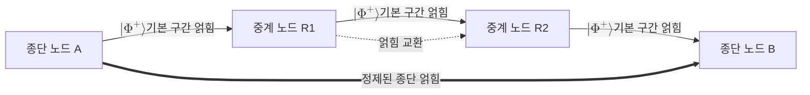

# Quantum Repeater

> 신호를 그대로 증폭할 수 없는 양자 채널에서 긴 구간을 여러 짧은 구간으로 나누고, 각 구간에 얽힘을 분배한 뒤 얽힘 교환과 정제로 이어 붙여 장거리 양자 통신을 가능하게 하는 중계 장치다.

## 핵심
양자 통신의 가장 큰 적은 채널 손실이다. 광섬유나 자유공간 채널의 투과율은 거리 $L$ 에 대해

$$ \eta(L) = 10^{-\alpha L / 10} $$

처럼 지수적으로 떨어진다. 고전 통신이라면 중간에 신호를 측정해 증폭하면 그만이지만, 양자 신호는 사정이 다르다. [[No-Cloning Theorem|복제 불가 정리]] 때문에 미지의 양자 상태를 복사해 증폭할 수 없고, 도중에 측정하면 상태가 교란되어 전송하려던 양자 정보가 파괴된다. 그래서 단일 광자 수준의 신호를 멀리 보낼수록 도달 확률이 급격히 작아진다. 직접 전송만으로는 비밀 키율이나 얽힘 분배율이 거리에 따라 지수적으로 붕괴한다.

양자 중계기는 이 문제를 분할 정복으로 푼다. 전체 거리 $L$ 을 $N$ 개의 짧은 기본 구간으로 나누면 각 구간의 길이는 $L/N$ 이 되고, 손실의 지수가 그만큼 작아진다. 각 기본 구간에서 먼저 인접한 두 노드 사이에 얽힌 쌍을 만들어 [[Quantum Memory|양자 메모리]]에 저장한다. 그다음 중간 노드에서 [[Entanglement Swapping|얽힘 교환]]을 수행해 직접 상호작용한 적 없는 양 끝 노드 사이로 얽힘을 확장한다. 얽힘 교환은 [[Bell States|벨 상태]] 기저 측정을 이용해 한 노드가 보유한 두 얽힘을 병합하고, 그 측정 결과를 고전 채널로 전달해 상대 노드의 상태를 보정하는 절차다. 이 과정을 계층적으로 반복하면 두 종단 사이에 한 쌍의 얽힘이 남는다.

다만 기본 구간의 얽힘은 채널 잡음과 메모리 결함 때문에 완벽하지 않다. 얽힘 교환을 거듭할수록 이 결함이 누적되어 종단 얽힘의 충실도(fidelity)가 떨어진다. 이를 막기 위해 여러 개의 저품질 얽힌 쌍을 소비해 더 적은 수의 고품질 쌍으로 끌어올리는 [[Entanglement Distillation|얽힘 정제]]를 중간중간 끼워 넣는다. 결국 양자 중계기의 동작은 얽힘 생성, 얽힘 정제, 얽힘 교환이라는 세 연산을 계층적으로 엮은 것이다.

## 흐름

세대별로 보면 1세대 중계기는 얽힘 정제와 양자 메모리에 의존하고, 2세대와 3세대는 [[Quantum Error Correction|양자 오류정정]] 부호로 메모리 의존을 줄이며 일방향 전송에 가깝게 동작하도록 설계된다. 세대가 올라갈수록 고전 왕복 통신에 묶이는 지연이 줄어들어 키율이 높아진다.

## 왜 중요한가
양자 중계기는 양자 통신을 실험실 거리에서 대륙 규모 네트워크로 끌어올리는 핵심 인프라다. [[Quantum Key Distribution|QKD]]의 비밀 키율은 직접 전송에서 거리에 따라 지수적으로 떨어지는데, 이 한계는 중계기 없는 양자 통신이 도달할 수 있는 거리에 사실상 천장을 씌운다. 손실 한계를 넘어서는 비밀 키율은 측정 장치 독립형 QKD나 위성 링크로도 일부 완화되지만, 지상 광섬유망에서 임의 거리로 안전한 키를 분배하려면 중계기가 사실상 필수다.

더 넓게 보면 양자 중계기는 단순한 키 분배를 넘어 양자 인터넷의 골격이다. 떨어진 양자 프로세서를 얽힘으로 잇는 분산 양자 컴퓨팅, 정밀도를 높이는 양자 센서망, 비밀 위임 계산 같은 응용은 모두 임의 거리의 두 노드 사이에 고충실도 얽힘을 공급하는 능력을 전제한다. 그 능력을 제공하는 장치가 바로 양자 중계기이며, 양자 메모리의 수명과 얽힘 교환의 성공률이 현재 실용화의 핵심 병목이다.

## 연결
- [[Quantum Key Distribution]] 직접 전송의 거리 한계를 넘기기 위해 QKD가 장거리 확장 수단으로 요구하는 인프라
- [[No-Cloning Theorem]] 양자 신호를 고전처럼 복제 증폭할 수 없게 하여 중계기가 필요해지는 근본 원인
- [[Quantum Entanglement]] 중계기가 구간마다 생성하고 종단으로 확장하는 자원의 본질
- [[Bell States]] 얽힘 교환에서 벨 기저 측정으로 두 얽힘을 병합할 때 쓰는 최대 얽힘 상태
- [[Entanglement Swapping]] 직접 상호작용 없는 양 끝 노드로 얽힘을 확장하는 중계기의 핵심 연산
- [[Entanglement Distillation]] 누적된 충실도 저하를 회복해 고품질 종단 얽힘을 얻는 보정 단계
