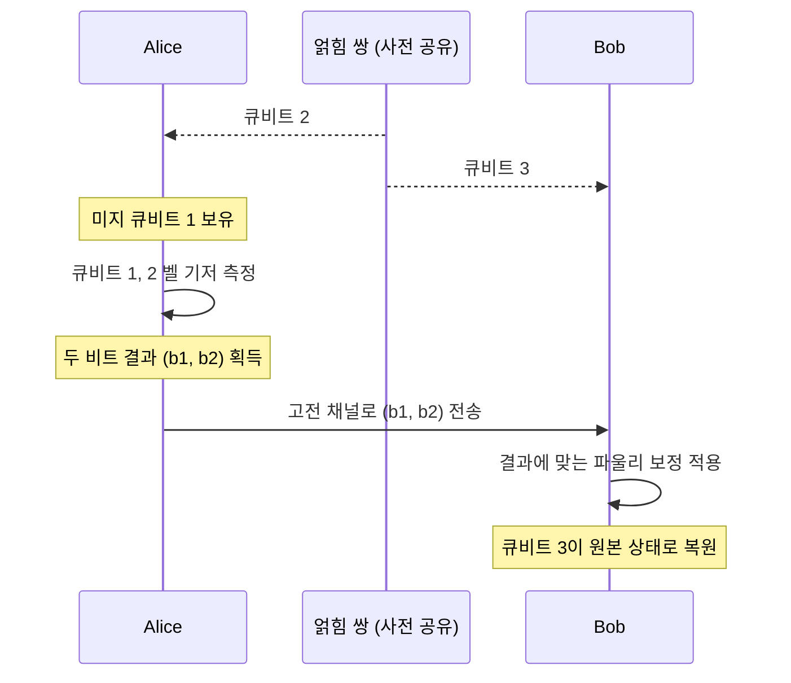

# Quantum Teleportation

> 미리 공유한 얽힘 쌍과 두 비트의 고전 통신만으로 미지의 큐비트 상태를 한 위치에서 다른 위치로 옮기는 프로토콜로, 양자 상태 자체를 보내지 않고도 그 상태를 원격에서 재구성한다.

## 핵심
양자 원격전송은 송신자(앨리스)가 들고 있는 미지의 단일 큐비트 상태 $\lvert \psi \rangle = \alpha \lvert 0 \rangle + \beta \lvert 1 \rangle$을 물리적으로 전송하지 않고도 수신자(밥)의 자리에 그대로 다시 세우는 절차다. 핵심 자원은 두 사람이 미리 나눠 가진 [[Bell States|벨 상태]] 한 쌍이며, 여기에 단 두 비트의 고전 정보가 더해진다.

세 큐비트로 출발한다. 앨리스의 미지 상태 큐비트 1, 그리고 앨리스와 밥이 한 알씩 나눠 가진 [[Quantum Entanglement|얽힘]] 쌍 큐비트 2와 큐비트 3이다. 얽힘 쌍을 $\lvert \Phi^{+} \rangle_{23} = \tfrac{1}{\sqrt{2}}(\lvert 00 \rangle + \lvert 11 \rangle)$로 두면 전체 초기 상태는 다음과 같다.

$$ \lvert \psi \rangle_1 \otimes \lvert \Phi^{+} \rangle_{23} = \frac{1}{\sqrt{2}} \big( \alpha \lvert 0 \rangle (\lvert 00 \rangle + \lvert 11 \rangle) + \beta \lvert 1 \rangle (\lvert 00 \rangle + \lvert 11 \rangle) \big) $$

앨리스가 자기 손에 든 큐비트 1과 큐비트 2를 [[Bell States|벨 기저]]로 함께 측정한다. 전체 상태를 큐비트 1과 2에 대한 벨 기저로 다시 묶어 적으면, 밥의 큐비트 3에 걸리는 상태가 앨리스의 측정 결과 네 가지와 일대일로 짝지어진다.

$$ \lvert \psi \rangle_1 \otimes \lvert \Phi^{+} \rangle_{23} = \frac{1}{2} \Big( \lvert \Phi^{+} \rangle_{12} \lvert \psi \rangle_3 + \lvert \Phi^{-} \rangle_{12} Z\lvert \psi \rangle_3 + \lvert \Psi^{+} \rangle_{12} X\lvert \psi \rangle_3 + \lvert \Psi^{-} \rangle_{12} XZ\lvert \psi \rangle_3 \Big) $$

측정 직후 밥의 큐비트는 원래 상태 $\lvert \psi \rangle$에 [[Pauli Matrices|파울리 연산자]] 중 하나가 곱해진 꼴로 붕괴한다. 어느 연산자가 걸렸는지는 전적으로 앨리스의 두 비트 측정 결과 $(b_1, b_2)$가 알려 준다. 앨리스가 이 두 비트를 고전 채널로 밥에게 보내면, 밥은 거기에 맞춰 보정 파울리 연산을 적용해 자기 큐비트를 정확히 $\lvert \psi \rangle$로 만든다.

| 앨리스 측정 결과 | 밥의 큐비트 상태 | 밥의 보정 연산 |
|---|---|---|
| $\lvert \Phi^{+} \rangle$ | $\lvert \psi \rangle$ | $I$ |
| $\lvert \Phi^{-} \rangle$ | $Z\lvert \psi \rangle$ | $Z$ |
| $\lvert \Psi^{+} \rangle$ | $X\lvert \psi \rangle$ | $X$ |
| $\lvert \Psi^{-} \rangle$ | $XZ\lvert \psi \rangle$ | $XZ$ |

## 흐름

## 복제가 아니라 이동
양자 원격전송은 [[No-Cloning Theorem|복제 불가 정리]]와 충돌하지 않는다. 앨리스가 큐비트 1과 2를 벨 기저로 측정하는 순간 원본 큐비트 1의 미지 상태는 측정으로 파괴되며, 측정 직후 앨리스의 손에는 $\lvert \psi \rangle$에 대한 어떤 정보도 남지 않는다. 같은 상태가 두 벌로 늘어나는 복제가 아니라, 한 벌이 다른 자리로 자리를 옮기는 이동이라는 점이 핵심이다. 전송이 끝나면 $\lvert \psi \rangle$은 오직 밥의 큐비트에만 존재한다.

신호 불가 원칙과도 양립한다. 밥은 앨리스의 두 비트를 받기 전까지 자기 큐비트가 네 가지 파울리 보정 중 어느 경우인지 알 수 없고, 보정을 적용하기 전 그의 큐비트는 최대 혼합 상태처럼 보여 아무 정보도 흘리지 않는다. 따라서 전송의 완성에는 광속을 넘지 못하는 고전 통신이 반드시 필요하며, 얽힘만으로 정보가 즉시 전달되는 일은 일어나지 않는다.

## 왜 중요한가
양자 원격전송은 얽힘이 통신에서 소모 가능한 자원임을 가장 또렷하게 보여 주는 프로토콜이다. 미지 상태를 알아내려 측정하면 [[No-Cloning Theorem|복제 불가]]와 측정 붕괴 때문에 정보 대부분이 사라지지만, 원격전송은 상태를 직접 들여다보지 않고도 그것을 온전히 다른 곳으로 옮긴다. 이 성질은 양자 네트워크에서 노드 사이로 양자 정보를 실어 나르는 기본 동작이 되며, 먼 거리 얽힘을 단계적으로 이어 붙이는 [[Quantum Repeater|양자 중계기]]의 얽힘 교환(entanglement swapping)이 바로 두 얽힘 쌍에 대한 벨 측정으로 작동하는 원격전송의 변형이다.

계산 모형에서도 같은 발상이 쓰인다. 측정 기반 양자계산과 게이트 텔레포테이션은 자원 상태와 적응적 측정만으로 원하는 게이트를 구현하는데, 그 근간이 원격전송이다. 또한 같은 벨 쌍 자원을 반대 방향으로 활용해 한 큐비트로 두 고전 비트를 보내는 [[Superdense Coding|초고밀도 부호화]]와 짝을 이루어, 얽힘과 고전 채널이 양자 정보와 고전 정보를 서로 교환하는 두 얼굴임을 드러낸다.

## 연결
- [[Bell States]] 사전 공유 자원이자 앨리스의 측정 기저로, 원격전송이 소모하고 측정하는 표준 얽힘 쌍
- [[Quantum Entanglement]] 송수신자가 미리 나눠 가져 상태 이동의 통로가 되는 핵심 자원이며, 원격전송은 이를 소모하는 대표 응용
- [[No-Cloning Theorem]] 원본이 측정으로 파괴되어 사본이 늘지 않으므로 복제 금지와 충돌하지 않음을 보이는 맥락
- [[Superdense Coding]] 같은 벨 쌍을 반대로 활용해 큐비트로 고전 비트를 보내는 쌍대 프로토콜
- [[Pauli Matrices]] 측정 결과에 따라 밥이 적용하는 보정 연산의 집합
- [[Entanglement Swapping]] 옮길 상태가 다른 입자와 얽힌 절반인 경우에 해당하는 원격전송의 특수 사례
