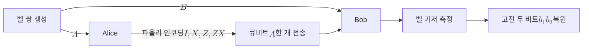

# Superdense Coding

> 미리 공유한 벨 쌍을 자원으로 써서, 단 하나의 큐비트만 전송하고도 두 비트의 고전 정보를 전달하는 양자통신 프로토콜이다.

## 핵심
초고밀도 부호화는 송신자 앨리스와 수신자 밥이 사전에 [[Bell States|벨 쌍]] 하나를 나눠 가졌다는 전제에서 출발한다. 둘이 공유하는 상태를 표준 벨 상태 $\lvert \Phi^{+} \rangle$로 두자.

$$ \lvert \Phi^{+} \rangle_{AB} = \frac{1}{\sqrt{2}} \big( \lvert 00 \rangle + \lvert 11 \rangle \big) $$

앞 큐비트 $A$는 앨리스가, 뒤 큐비트 $B$는 밥이 보관한다. 앨리스가 보내고 싶은 고전 메시지는 두 비트 $b_1 b_2 \in \{00, 01, 10, 11\}$ 중 하나다.

### 인코딩: 국소 파울리 연산
앨리스는 자신의 큐비트 $A$에만 [[Pauli Matrices|파울리 연산]] 하나를 가한다. 어떤 연산을 고르느냐가 두 비트를 부호화한다.

$$ b_1 b_2 = 00 \to I, \qquad 01 \to X, \qquad 10 \to Z, \qquad 11 \to ZX $$

각 연산은 공유 상태를 서로 다른 벨 상태로 옮긴다. 핵심은 앨리스가 오직 자기 손안의 한 큐비트에만 손을 댔는데도, 두 큐비트 전체의 합동 상태가 네 벨 상태 중 하나로 결정된다는 점이다.

$$ (I \otimes I)\lvert \Phi^{+} \rangle = \lvert \Phi^{+} \rangle, \qquad (X \otimes I)\lvert \Phi^{+} \rangle = \lvert \Psi^{+} \rangle $$

$$ (Z \otimes I)\lvert \Phi^{+} \rangle = \lvert \Phi^{-} \rangle, \qquad (ZX \otimes I)\lvert \Phi^{+} \rangle = \lvert \Psi^{-} \rangle $$

네 결과 $\{\, \lvert \Phi^{+} \rangle,\ \lvert \Psi^{+} \rangle,\ \lvert \Phi^{-} \rangle,\ \lvert \Psi^{-} \rangle \,\}$는 서로 정규직교한 벨 기저를 이룬다. 즉 두 비트의 메시지가 네 직교 상태에 일대일로 새겨진다.

### 전송과 디코딩: 벨 기저 측정
앨리스는 부호화를 마친 자기 큐비트 $A$ 하나만 밥에게 보낸다. 이제 밥은 두 큐비트를 모두 손에 쥐었으므로, 둘을 합쳐 [[Bell States|벨 기저]]로 측정한다. 벨 기저 측정은 [[CNOT Gate|CNOT 게이트]]와 [[Hadamard Gate|아다마르 게이트]]로 네 벨 상태를 계산 기저로 되돌린 다음 측정하는 것과 같다. 측정 결과 두 비트가 곧 앨리스가 보낸 $b_1 b_2$다. 네 벨 상태가 완전히 구별되므로 디코딩은 오류 없이 결정적이다.

## 흐름

## 자원 회계와 홀레보 한계
초고밀도 부호화가 두 비트를 큐비트 하나로 보낸다고 해서 큐비트 하나가 두 고전 비트를 담는다는 뜻은 아니다. [[Holevo Bound|홀레보 한계]]는 큐비트 하나에서 추출 가능한 고전 정보를 최대 한 비트로 제한한다. 모순이 없는 이유는 자원을 정직하게 세면 드러난다. 앨리스가 보내는 큐비트 한 개와, 프로토콜 이전에 분배된 얽힘 큐비트 한 개를 합쳐 큐비트 두 개가 쓰였기 때문이다. 즉 미리 분배해 둔 [[Quantum Entanglement|얽힘]]이라는 자원을 통신 시점의 전송 비용으로 바꿔치기한 셈이다. 얽힘이 없으면 큐비트 하나로는 한 비트만 보낼 수 있다.

## 왜 중요한가
초고밀도 부호화는 얽힘이 단순한 신기한 현상이 아니라 통신 용량을 실제로 늘리는 소모성 자원임을 가장 간결하게 증명한 프로토콜이다. 1992년 베넷과 위스너가 제안했으며, 사전에 공유한 얽힘이 통신 채널의 고전 용량을 두 배로 높일 수 있음을 보였다. 이 결과는 양자정보이론에서 얽힘 보조 통신 용량(entanglement-assisted capacity)이라는 일반 이론으로 발전했다.

또한 초고밀도 부호화는 [[Quantum Teleportation|양자 원격전송]]과 정확히 쌍대 관계에 있다. 원격전송은 두 고전 비트와 얽힘 한 쌍을 소모해 미지의 큐비트 하나를 보내고, 초고밀도 부호화는 큐비트 한 개와 얽힘 한 쌍을 소모해 두 고전 비트를 보낸다. 두 프로토콜이 같은 자원을 반대 방향으로 교환한다는 사실은 고전 정보와 양자 정보, 그리고 얽힘이 서로 환산 가능한 자원이라는 양자정보이론의 통합적 관점을 보여 준다. 응용으로는 얽힘 기반 통신과 일부 양자네트워크 프로토콜의 정보 전달 효율을 높이는 기법으로 다뤄진다.

## 연결
- [[Bell States]] 인코딩의 출발 자원이자 디코딩 측정 기저로, 네 벨 상태가 두 비트 메시지를 일대일로 담는다
- [[Quantum Entanglement]] 사전 분배한 얽힘을 통신 비용으로 환산해 채널 용량을 늘리는 자원적 토대
- [[Pauli Matrices]] 앨리스가 자기 큐비트에 가하는 네 가지 국소 인코딩 연산
- [[Quantum Teleportation]] 같은 자원을 반대 방향으로 교환하는 쌍대 프로토콜
- [[Holevo Bound]] 큐비트 하나의 고전 정보 한계와 모순되지 않음을 설명하는 정보론적 상한
